* Table of Contents
{:toc}

--------------------------------------------------------------------------------------------------------------------

## **Acknowledgements**

* {list here sources of all reused/adapted ideas, code, documentation, and third-party libraries -- include links to the original source as well}

--------------------------------------------------------------------------------------------------------------------

## **Setting up, getting started**

Refer to the guide [_Setting up and getting started_](SettingUp.md).

--------------------------------------------------------------------------------------------------------------------

## **Design**

<div markdown="span" class="alert alert-primary">

:bulb: **Tip:** The `.puml` files used to create diagrams in this document `docs/diagrams` folder. Refer to the [_PlantUML Tutorial_ at se-edu/guides](https://se-education.org/guides/tutorials/plantUml.html) to learn how to create and edit diagrams.
</div>

### Architecture


The ***Architecture Diagram*** given above explains the high-level design of the App.

Given below is a quick overview of main components and how they interact with each other.

**Main components of the architecture**

**`Main`** (consisting of classes [`Main`](https://github.com/se-edu/addressbook-level3/tree/master/src/main/java/seedu/address/Main.java) and [`MainApp`](https://github.com/se-edu/addressbook-level3/tree/master/src/main/java/seedu/address/MainApp.java)) is in charge of the app launch and shut down.
* At app launch, it initializes the other components in the correct sequence, and connects them up with each other.
* At shut down, it shuts down the other components and invokes cleanup methods where necessary.

The bulk of the app's work is done by the following four components:

* [**`UI`**](#ui-component): The UI of the App.
* [**`Logic`**](#logic-component): The command executor.
* [**`Model`**](#model-component): Holds the data of the App in memory.
* [**`Storage`**](#storage-component): Reads data from, and writes data to, the hard disk.

[**`Commons`**](#common-classes) represents a collection of classes used by multiple other components.

**How the architecture components interact with each other**

The *Sequence Diagram* below shows how the components interact with each other for the scenario where the user issues the command `/delete ; name : Poochie`.

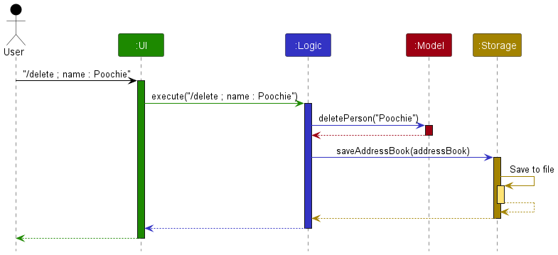

Each of the five main components (also shown in the diagram above),

* defines its *API* in an `interface` with the same name as the Component.
* implements its functionality using a concrete `{Component Name}Manager` class (which follows the corresponding API `interface` mentioned in the previous point.

For example, the `Logic` component defines its API in the `Logic.java` interface and implements its functionality using the `LogicManager.java` class which follows the `Logic` interface. Other components interact with a given component through its interface rather than the concrete class (reason: to prevent outside component's being coupled to the implementation of a component), as illustrated in the (partial) class diagram below.


The sections below give more details of each component.

### UI component

The **API** of this component is specified in [`Ui.java`](https://github.com/se-edu/addressbook-level3/tree/master/src/main/java/seedu/address/ui/Ui.java)

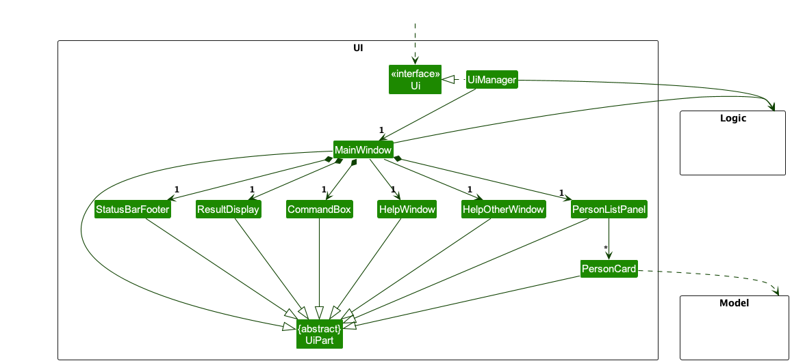

The UI consists of a `MainWindow` that is made up of parts e.g.`CommandBox`, `ResultDisplay`, `PersonListPanel`, `StatusBarFooter` etc. All these, including the `MainWindow`, inherit from the abstract `UiPart` class which captures the commonalities between classes that represent parts of the visible GUI.
Note that `HelpWindow` refers to a window that provides general help for all commands. `HelpOtherWindow` refers to a window which offers help for specific commands.
The `UI` component uses the JavaFx UI framework. The layout of these UI parts are defined in matching `.fxml` files that are in the `src/main/resources/view` folder. For example, the layout of the [`MainWindow`](https://github.com/se-edu/addressbook-level3/tree/master/src/main/java/seedu/address/ui/MainWindow.java) is specified in [`MainWindow.fxml`](https://github.com/se-edu/addressbook-level3/tree/master/src/main/resources/view/MainWindow.fxml)

The `UI` component,

* executes user commands using the `Logic` component.
* listens for changes to `Model` data so that the UI can be updated with the modified data.
* keeps a reference to the `Logic` component, because the `UI` relies on the `Logic` to execute commands.
* depends on some classes in the `Model` component, as it displays `Person` object residing in the `Model`.

### Logic component

**API** : [`Logic.java`](https://github.com/se-edu/addressbook-level3/tree/master/src/main/java/seedu/address/logic/Logic.java)

Here's a (partial) class diagram of the `Logic` component:

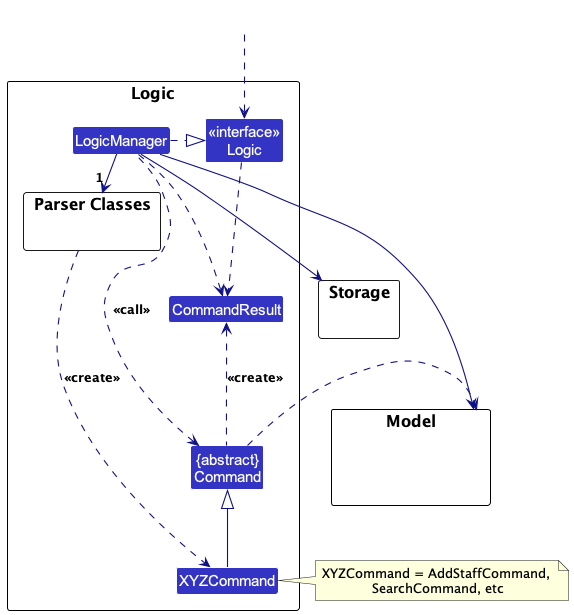

The sequence diagram below illustrates the interactions within the `Logic` component, taking `execute("/delete ; name : Poochie")` API call as an example.


<div markdown="span" class="alert alert-info">:information_source: **Note:** The lifeline for `DeleteCommandParser` should end at the destroy marker (X) but due to a limitation of PlantUML, the lifeline continues till the end of diagram.
</div>

How the `Logic` component works:

1. When `Logic` is called upon to execute a command, it is passed to an `AddressBookParser` object which in turn creates a parser that matches the command (e.g., `DeleteCommandParser`) and uses it to parse the command.
1. This results in a `Command` object (more precisely, an object of one of its subclasses e.g., `DeleteCommand`) which is executed by the `LogicManager`.
1. The command can communicate with the `Model` when it is executed (e.g. to delete a person).<br>
   Note that although this is shown as a single step in the diagram above (for simplicity), in the code it can take several interactions (between the command object and the `Model`) to achieve.
1. The result of the command execution is encapsulated as a `CommandResult` object which is returned back from `Logic`.

Here are the other classes in `Logic` (omitted from the class diagram above) that are used for parsing a user command:


How the parsing works:
* When called upon to parse a user command, the `AddressBookParser` class creates an `XYZCommandParser` (`XYZ` is a placeholder for the specific command name e.g., `AddCommandParser`) which uses the other classes shown above to parse the user command and create a `XYZCommand` object (e.g., `AddCommand`) which the `AddressBookParser` returns back as a `Command` object.
* All `XYZCommandParser` classes (e.g., `AddCommandParser`, `DeleteCommandParser`, ...) inherit from the `Parser` interface so that they can be treated similarly where possible e.g, during testing.

### Model component
**API** : [`Model.java`](https://github.com/se-edu/addressbook-level3/tree/master/src/main/java/seedu/address/model/Model.java)

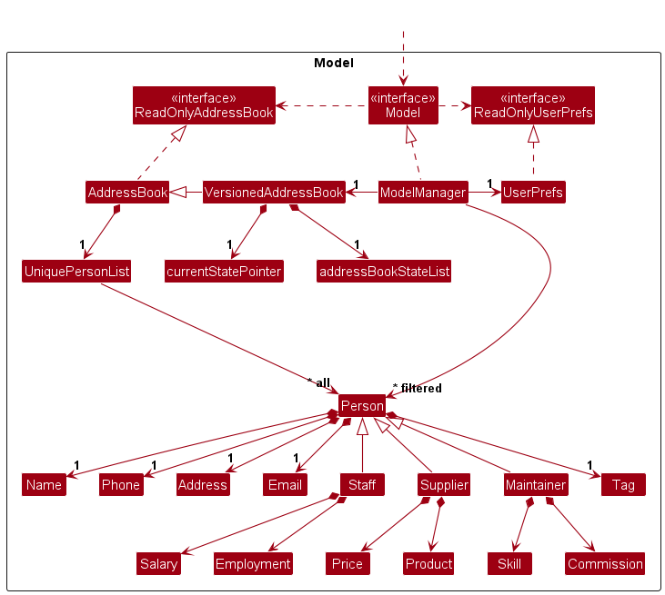


The `Model` component,

* stores different states of address book inside versioned address book.
* stores the address book data i.e., all `Person` objects (which are contained in a `UniquePersonList` object).
* stores the currently 'selected' `Person` objects (e.g., results of a search query) as a separate _filtered_ list which is exposed to outsiders as an unmodifiable `ObservableList<Person>` that can be 'observed' e.g. the UI can be bound to this list so that the UI automatically updates when the data in the list change.
* stores a `UserPref` object that represents the user’s preferences. This is exposed to the outside as a `ReadOnlyUserPref` objects.
* does not depend on any of the other three components (as the `Model` represents data entities of the domain, they should make sense on their own without depending on other components)

### Storage component

**API** : [`Storage.java`](https://github.com/se-edu/addressbook-level3/tree/master/src/main/java/seedu/address/storage/Storage.java)

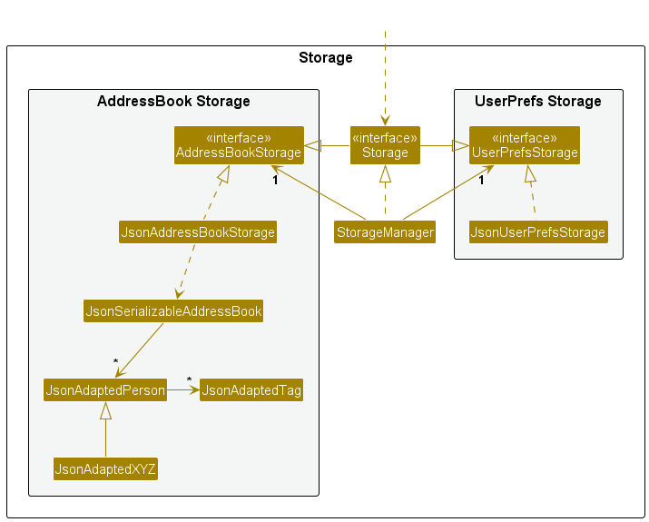

The `Storage` component,
* can save both address book data and user preference data in JSON format, and read them back into corresponding objects.
* inherits from both `AddressBookStorage` and `UserPrefStorage`, which means it can be treated as either one (if only the functionality of only one is needed).
* depends on some classes in the `Model` component (because the `Storage` component's job is to save/retrieve objects that belong to the `Model`)

### Common classes

Classes used by multiple components are in the `seedu.addressbook.commons` package.

--------------------------------------------------------------------------------------------------------------------

## **Implementation**

This section describes some noteworthy details on how certain features are implemented.

### Search feature

#### Overview

The `search` command enables users to find contacts in PoochPlanner that match the input search queries.

The following sequence diagram models the interactions between the different components of PoochPlanner for the execution of the `search` command.

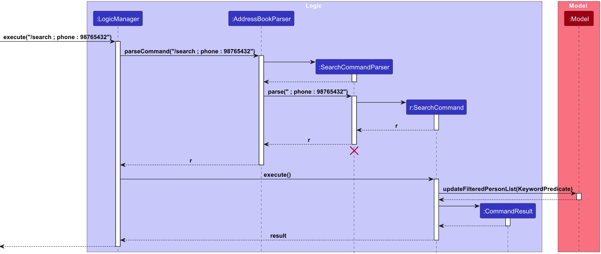

#### Details

1. The user inputs the command to search for contacts with the specified search queries.
2. `SearchCommandParser`  invokes the `parse` method which parses the user input by storing the prefixes and their respective values in an `ArgumentMultimap` object, and using this object to create an instance of `KeywordPredicate`.
3. `SearchCommandParser` then creates a new instance of `SearchCommand` containing the aforementioned `KeywordPredicate`.
4. `LogicManager` invokes the `execute` method of `SearchCommand`.
5. This invokes the `updateFilteredPersonList` method in `Model` property, taking in `KeywordPredicate` as a parameter to filter and update `UniquePersonList`.
6. The `execute` method of `SearchCommand` returns a `CommandResult` object which stores the data regarding the completion of the `Search` command.

#### Example Usage

1. The user launches the application.
2. The user inputs `/search ; name : Poochie` into the CLI.
3. The address book is updated to display all contact cards that match the search queries.

### Sort feature

#### Overview

The `sort` command enables users to sort contacts in PoochPlanner by a target field.

The following sequence diagram models the interactions between the different components of PoochPlanner for the execution of the `sort` command.

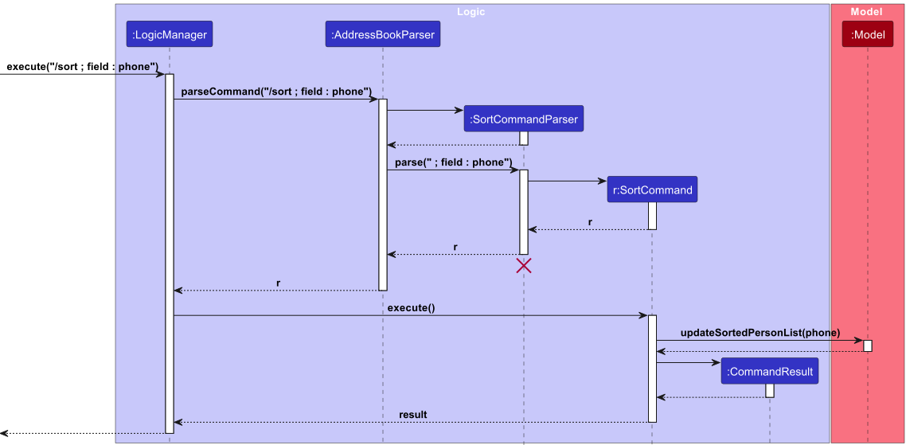

#### Details

1. The user inputs the command to sort contacts with the target field.
2. `SortCommandParser` invokes the `parse` method which parses the user input through `ArgumentMultimap` and `mapName`, creating a new `Prefix` object.
3. `SortCommandParser` then creates a new `SortCommand` object with the target `prefix`, returning this object.
4. The `LogicManager` invokes the `execute` method of `SortCommand`, which invokes the `updateSortedPersonList` method in `Model` property with the target `prefix` to update the interface of PoochPlanner to sort`UniquePersonList` by the target field.
5. The `execute` method of `SortCommand` returns a `CommandResult` object which stores the data regarding the completion of the `Sort` command.

#### Example Usage

1. The user launches the application.
2. The user inputs `/sort ; field : phone` into the CLI.
3. The address book is updated to sort all the contact cards by ascending phone number.

### Note feature

#### Overview

The note command enables users to add notes to existing contacts in PoochPlanner.

The following sequence diagram models the interactions between the different components of PoochPlanner for the execution of the `note` command.

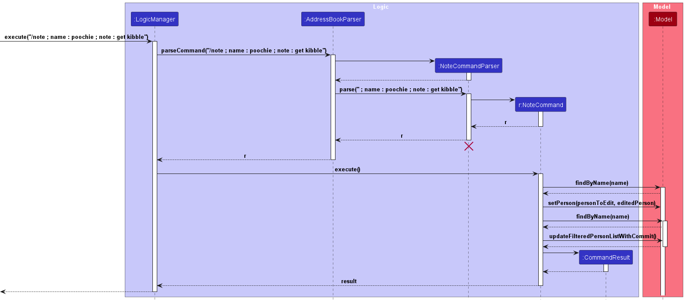

#### Details

1. The user inputs the command to add a note a specified contact by first stating the target name of the contact they want to add a note to. This is followed by the respective fields and new values they want to modify.
2. `NoteCommandParser` invokes the `parse` method which parses the user input by storing the prefixes and their respective values as an `ArgumentMultimap` object.
 A `NoteCommand` object is created with the parsed name, note and optional deadline field.
3. The `NoteCommandParser` returns the `NoteCommand` object.
4. `LogicManager` invokes the `execute` method of `NoteCommand`. 
5. The `execute` method of `NoteCommand` invokes the `findByName` method in `Model` property to find the person with the specified name. 
6. The `execute` method of `NoteCommand` invokes the `setPerson` method in `Model` property to set the person in the existing contact list to the new `Person` object which has been edited the `execute` method of `NoteCommand`. 
7. The `execute` method of `NoteCommand` invokes the `updateFilteredPersonList` method in `Model` property to update the view of PoochPlanner to show all contacts. 
8. The `execute` method of `NoteCommand` returns a `CommandResult` object which stores the data regarding the completion of the `Note` command.

#### Example Usage

1. The user launches the application.
2. The user inputs `/note ; name : Janna ; note : get kibble` into the CLI.
3. The given note will be added to the description of the contact with the given name.

**Aspect: How to store note field in Persons class and subclasses:**

* **Alternative 1 (current choice)**: Add note field to all 4 constructors (Person, Staff, Maintainer, Supplier).
    * Pros: Maintains OOP. As in real life, each person has a note description, having each class containing
  a note field models this and preserves OOP.
    * Cons: Changing the constructors of 4 classes is a tedious task.

* **Alternative 2**: Add note field to the Parent person constructor and use a setter to set new notes.
    * Pros: Much simpler implementation that will require less refactoring of code.
    * Cons: Violates OOP, specifically encapsulation as the other classes would be able to manipulate the
  inner details of the Person classes.

### Rate feature

#### Overview

The rate command enables users to rate a specific contact from PoochPlanner.

The following sequence diagram models the interactions between the different components of PoochPlanner for the
execution of the `rate` command.

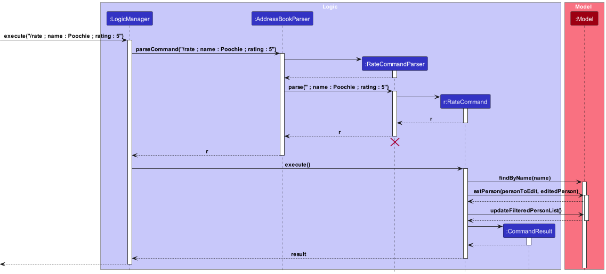

#### Details

**1**: The user inputs the command to add a rating to a specific contact by first stating the target name of the
contact they want to rate. This is followed by the rating to be given to the user.

**2**: `RateCommandParser` invokes the `parse` method which parses the user input by storing the name and its
prefix in an `ArgumentMultimap`. A `RateCommand` object is created with the parsed name, and rating.

**3**: `LogicManager` invokes the `execute` method of `RateCommand`.

**4**: The `execute` method of `RateCommand` invokes the `findByName` method in `Model` property to find the
contact with the specified name.

**5**: The `execute` method of `RateCommand` invokes the `setPerson` method in `Model` property to set the contact
in the existing contact list to the new `Person` object which has been edited the `execute` method of `RateCommand`.

**6**: The `execute` method of `RateCommand` invokes the `updateFilteredPersonList` method in `Model` property to
update the view of PoochPlanner to show all contacts.

**7**: The `execute` method of `RateCommand` returns a `CommandResult` object which stores the data regarding the
completion of the `Rate` command.

#### Example Usage

**1**: The user launches the PoochPlanner application.

**2**: The user inputs `/delete ; name : Poochie` into the CLI.

**3**: The contact with the name `Poochie` is removed from PoochPlanner.

### Delete feature

#### Overview

The delete command enables users to delete a specific contact from PoochPlanner.

The following sequence diagram models the interactions between the different components of PoochPlanner for the
execution of the `delete` command.

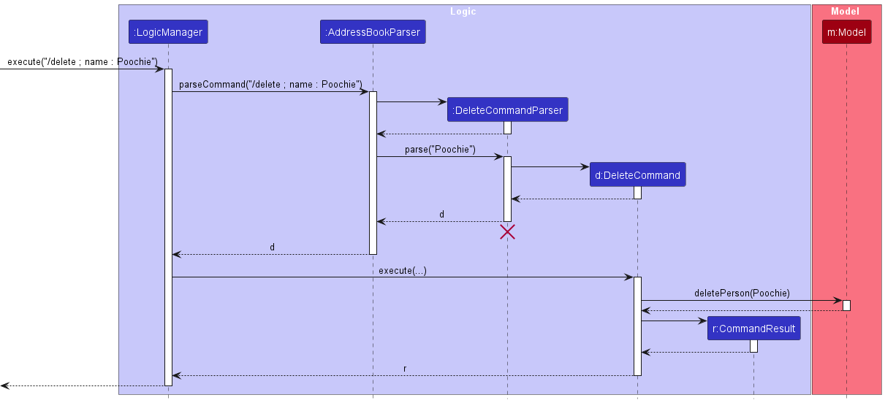

#### Details

**1**: The user inputs the command to delete a contact by stating the target name of the contact they want to delete.

**2**: `CommandParser` invokes the `parse` method which parses the user input by storing the prefixes and their
respective values as an `ArgumentMultimap` object.
**3**: A `DeleteCommand` object is created with the name of the contact to delete.

**4**: The `DeleteCommandParser` returns the `DeleteCommand` object.

**5**: The `LogicManager` invokes the `execute` method of `DeleteCommand`.

**6**: The `execute` method of `DeleteCommand` invokes the `deletePerson` method in the 'Model` property to remove the
specified contact from the `addressBook` property in `ModelManager`.

**7**: The `execute` method of `DeleteCommand` returns a `CommandResult` object which stores the data regarding the
completion of the `Delete` command.

#### Example Usage

**1**: The user launches the application.

**2**: The user inputs `/delete ; name : Poochie` into the CLI.

**3**: The contact with the name ‘Poochie’ will be deleted from PoochPlanner.


### Help feature

The help feature receive help for all commands.

#### Overview

The help command enables users to view help for all.

The following sequence diagram models the interactions between the different components of PoochPlanner for the execution of the `help` command.

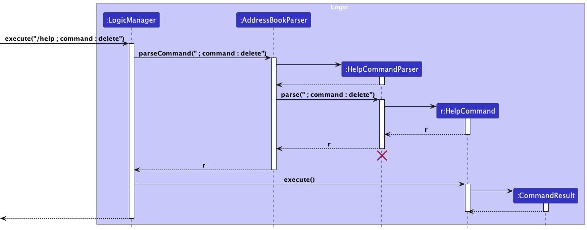

#### Details

1. The user inputs the command to view help for a specific command. This is followed by the command field specifying the command they want to view help for.
2. `HelpCommandParser` invokes the `parse` method which parses the user input by storing the prefix of its respective values as an `ArgumentMultimap` object.
   A `HelpCommand` object is created with the command type specified in the command field. 
3. The `HelpCommandParser` returns the `HelpCommand` object.
4. `LogicManager` invokes the `execute` method of `HelpCommand`. 
5. The `execute` method of `HelpCommand` returns a `CommandResult` object which stores the data regarding the completion of the `Help` command.

#### Example Usage

1. The user launches the application.
2. The user inputs `/help ; command : delete` into the CLI.
3. Help for the delete command will be displayed.

**Aspect: How to display different help command windows:**

* **Alternative 1 (current choice)**: Use only 1 help window to display help for specific commands. Difference
 in messages is created by displaying different strings.
    * Pros: Code is made much more concise.
    * Cons: Lengthy if-else statements are required to displayed the correct string.

* **Alternative 2**: Create a different window for each type of command.
    * Pros: All details relating to a single command is within its own page. Can be perceived as neater.
    * Cons: Highly repetitive code. Even small mistakes made, would have to be fixed in over 10 windows.

### Remind feature

The remind command enables users to view all contacts with note deadlines from today onwards.

The following sequence diagram models the interactions between the different components of PoochPlanner for the execution of the `remind` command.

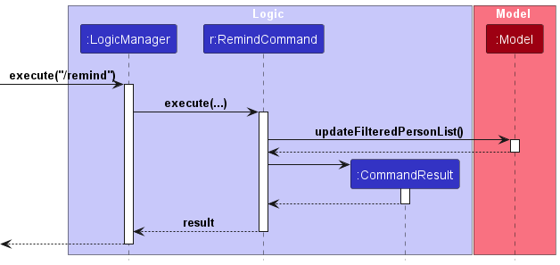


#### Details

1. The user inputs the command to view reminders.
2. `LogicManager` invokes the `execute` method of `RemindCommand`. 
3. The `execute` method of `RemindCommand` invokes the `updateFilteredPersonList` method in `Model` property to update the view of the application to show contacts
   with note deadlines from today onwards. 
4. The `execute` method of `NoteCommand` returns a `CommandResult` object which stores the data regarding the completion of the `remind` command.

#### Example Usage

1. The user launches the application.
2. The user inputs `/remind` into the CLI.
3. Contacts that have deadline notes from today onwards will be displayed.


### Clear feature

The clear command enables users to remove all existing contacts from PoochPlanner.

The following sequence diagram models the interactions between the different components of PoochPlanner for the execution of the `clear` command.

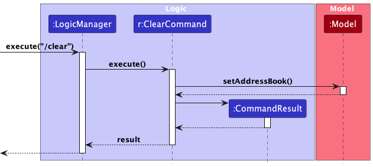

#### Details

1. The user inputs the command to clear all contacts.
2. `LogicManager` invokes the `execute` method of `ClearCommand`.
3. The `execute` method of `ClearCommand` method invokes the `setAddressBook` method in `Model` property with a new `AddressBook` object which contains an empty `UniquePersonList`.
4. The `execute` method of `ClearCommand` returns a `CommandResult` object which stores the data regarding the completion of the `Clear` command.

#### Example Usage

1. The user launches the application.
2. The user inputs `/clear` into the CLI.
3. The address book is emptied.

### List feature

The list command enables users to view all existing contacts from PoochPlanner.

The following sequence diagram models the interactions between the different components of PoochPlanner for the execution of the `list` command.

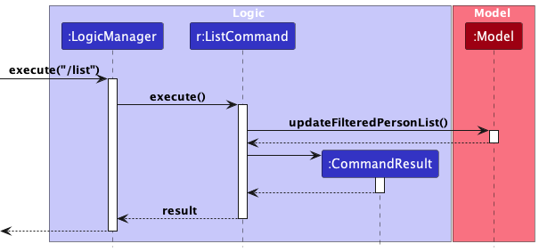

#### Details

1. The user inputs the command to list all contacts.
2. `LogicManager` invokes the `execute` method of `ListCommand`.
3. The `execute` method of `ListCommand` invokes the `updateFilteredPersonList` method in `Model` property to update the view of the application to show all contacts.
4. The `execute` method of `ListCommand` returns a `CommandResult` object which stores the data regarding the completion of the `List` command.

#### Example Usage

1. The user launches the application.
2. The user inputs `/list` into the CLI.
3. All contacts in PoochPlanner are displayed.


### Undo/redo feature

#### Implementation

The undo/redo mechanism is facilitated by `VersionedAddressBook`. It extends `AddressBook` with an undo/redo history, stored internally as an `addressBookStateList` and `currentStatePointer`. Additionally, it implements the following operations:

* `VersionedAddressBook#commit()` — Saves the current address book state in its history.
* `VersionedAddressBook#undo()` — Restores the previous address book state from its history.
* `VersionedAddressBook#redo()` — Restores a previously undone address book state from its history.

These operations are exposed in the `Model` interface as `Model#commitAddressBook()`, `Model#undoAddressBook()` and `Model#redoAddressBook()` respectively.

Given below is an example usage scenario and how the undo/redo mechanism behaves at each step.

Step 1. The user launches the application for the first time. The `VersionedAddressBook` will be initialized with the initial address book state, and the `currentStatePointer` pointing to that single address book state.


Step 2. The user executes `/delete ; name : Poochie` command to delete the Person named Poochie in the address book. The `delete` command calls `Model#commitAddressBook()`, causing the modified state of the address book after the `/delete ; name : Poochie` command executes to be saved in the `addressBookStateList`, and the `currentStatePointer` is shifted to the newly inserted address book state.

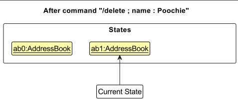

Step 3. The user executes `/add-person ; name : John …​` to add a new person. The `/add-person` command also calls `Model#commitAddressBook()`, causing another modified address book state to be saved into the `addressBookStateList`.

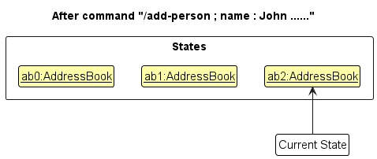

<div markdown="span" class="alert alert-info">:information_source: **Note:** If a command fails its execution, it will not call `Model#commitAddressBook()`, so the address book state will not be saved into the `addressBookStateList`.

</div>

Step 4. The user now decides that adding the person was a mistake, and decides to undo that action by executing the `undo` command. The `undo` command will call `Model#undoAddressBook()`, which will shift the `currentStatePointer` once to the left, pointing it to the previous address book state, and restores the address book to that state.

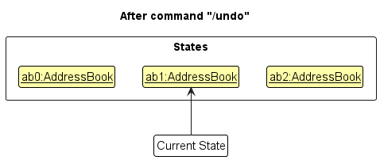

<div markdown="span" class="alert alert-info">:information_source: **Note:** If the `currentStatePointer` is at index 0, pointing to the initial AddressBook state, then there are no previous AddressBook states to restore. The `undo` command uses `Model#canUndoAddressBook()` to check if this is the case. If so, it will return an error to the user rather
than attempting to perform the undo.

</div>

The following sequence diagram shows how an undo operation goes through the `Logic` component:

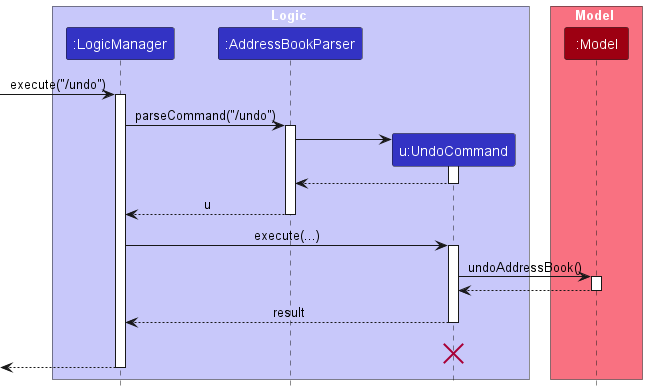

<div markdown="span" class="alert alert-info">:information_source: **Note:** The lifeline for `UndoCommand` should end at the destroy marker (X) but due to a limitation of PlantUML, the lifeline reaches the end of diagram.

</div>

Similarly, how an undo operation goes through the `Model` component is shown below:


The `redo` command does the opposite — it calls `Model#redoAddressBook()`, which shifts the `currentStatePointer` once to the right, pointing to the previously undone state, and restores the address book to that state.

<div markdown="span" class="alert alert-info">:information_source: **Note:** If the `currentStatePointer` is at index `addressBookStateList.size() - 1`, pointing to the latest address book state, then there are no undone AddressBook states to restore. The `redo` command uses `Model#canRedoAddressBook()` to check if this is the case. If so, it will return an error to the user rather than attempting to perform the redo.

</div>

Step 5. The user then decides to execute the command `/list`. Commands that do not modify the address book, such as `/list`, will usually not call `Model#commitAddressBook()`, `Model#undoAddressBook()` or `Model#redoAddressBook()`. Thus, the `addressBookStateList` remains unchanged.

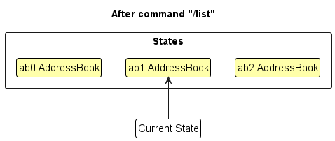

Step 6. The user executes `/clear`, which calls `Model#commitAddressBook()`. Since the `currentStatePointer` is not pointing at the end of the `addressBookStateList`, all address book states after the `currentStatePointer` will be purged. Reason: It no longer makes sense to redo the `/add-person ; name : John...` command. This is the behavior that most modern desktop applications follow.

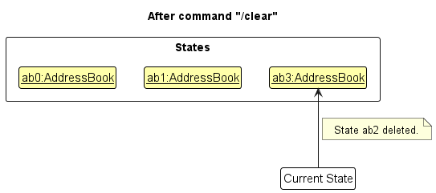

The following activity diagram summarizes what happens when a user executes a new command:


#### Design considerations:

**Aspect: How undo & redo executes:**

* Saves the entire address book.
  * Pros: Easy to implement.
  * Cons: May have performance issues in terms of memory usage.

### Edit feature

#### Overview

The edit-XYZ command enables users to modify a specified field of an existing contact from PoochPlanner.

The following sequence diagram models the interactions between the different components of PoochPlanner for the execution of the `edit-XYZ` command.

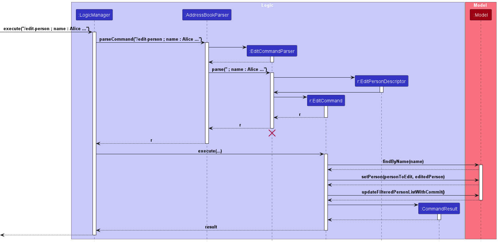

<div class="callout callout-important" markdown="span" style="margin-bottom: 20px;">
**Note:** The implementation for person, staff, suppliers, maintainers are similar and only differ in the accepted attributes. `XYZ` can refer to `person`, `staff`, `suppliers`, `maintainers`. 
</div>

#### Details

1. The user inputs the command to edit a specified contact by first stating the target name of the contact they want to edit. This is followed by the respective fields and new values the user wants to modify. 
2. `EditCommandParser` parses the user input and creates an `editPersonDescriptor` object which contains the new values to be edited for the specified contact.
3. An `EditCommand` object is created with the name of the contact to edit and the`editPersonDescriptor` object. 
4. The `EditCommandParser` returns the `EditCommand` object. 
5. The `LogicManager` invokes the `execute` method of `EditCommand`.
6. The `execute` method of `EditCommand` finds the specified contact by `name`. The `execute` method then calls `createEditedPerson` of `EditCommand` which creates a new `Person` object that contains the updated values of the contact.
7. The `execute` method of `EditCommand` invokes the `setPerson` method in `Model` property to replace the specified contact with the new `Person` object. 
8. The `execute` method of `EditCommand` invokes the `updateFilteredPersonList` method in `Model` property to update the view of PoochPlanner to show all contacts. 
9. The `execute` method of `EditCommand` returns a `CommandResult` object which stores the data regarding the completion of the `Edit` command.

#### Example Usage
1. The user launches the application. 
2. The user inputs `/edit-person ; name : Alice Tan ; field : { phone : 9990520 ; email : impooch@gmail12.com }`
3. The contact card for `Alice Tan` is updated for the `phone` and `email` field respectively. This change should be reflected on the contact list page on PoochPlanner.


### Pin / Unpin feature

#### Overview

The `pin`/`unpin` command enables users to pin/unpin any existing contacts in PoochPlanner.

The following sequence diagram models the interactions between the different components of PoochPlanner for the execution of the `pin` command.

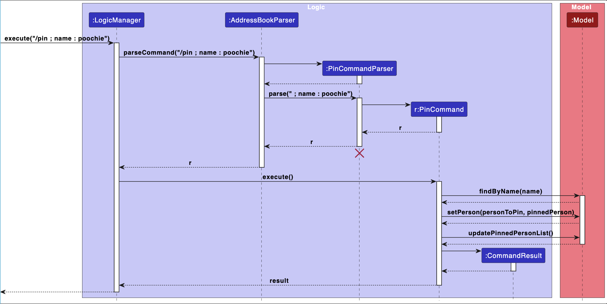

The following sequence diagram models the interactions between the different components of PoochPlanner for the execution of the `unpin` command.

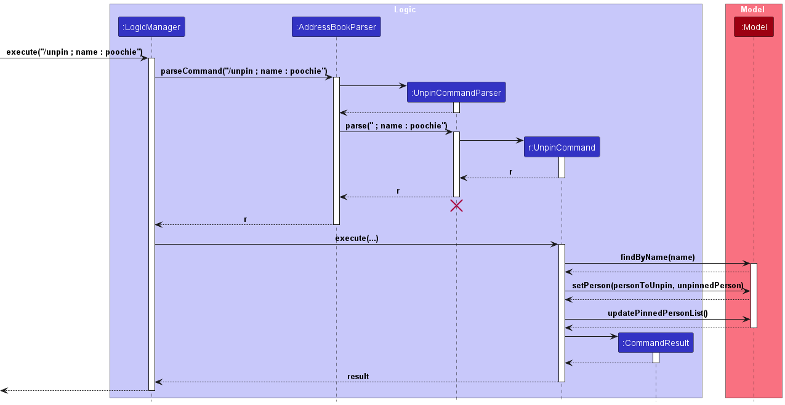

<div class="callout callout-important" markdown="span" style="margin-bottom: 20px;">
**Note:** The implementation for person, staff, suppliers, maintainers are the same. Pin and Unpin are also implemented similarly as seen in the sequence diagrams. 
</div>

#### Details

1. The user inputs the command to pin/unpin a specified contact by stating the target name of the contact they want to pin/unpin.
2. `PinCommandParser`/`UnpinCommandParser` invokes the `parse` method which parses the user input by storing the prefixes and their respective values as an `ArgumentMultimap` object. 
3. A `PinCommand`/`UnpinCommand` object is created with the name of the contact to pin/unpin.
4. The `PinCommandParser`/`UnpinCommandParser` returns the `PinCommand`/`UnpinCommand` object.
5. The `LogicManager` invokes the `execute` method of `PinCommand`/`UnpinCommand`.
6. The `execute` method of `PinCommand`/`UnpinCommand` finds the specified contact by `name`. The `updateToPinned`/`updateToUnpinned` method of `Person` which creates a new `Person` object that contains the updated pin boolean of the contact.
7. The `execute` method of `PinCommand`/`UnpinCommand` invokes the `setPerson` method in `Model` property to replace the specified contact with the new `Person` object. 
8. The `execute` method of `PinCommand`/`UnpinCommand` invokes the `updatePinnedPersonList` method in `Model` property to update the view of PoochPlanner to show all contacts. 
9. The `execute` method of `PinCommand`/`UnpinCommand` returns a `CommandResult` object which stores the data regarding the completion of the `Pin`/`Unpin` command.


#### Example Usage
1. The user launches the application.
2. The user inputs `/pin ; name : Alice Tan` or `unpin ; name : Alice Tan` into the CLI.
3. The contact card for `Alice Tan` is now pinned / unpinned. This change should be reflected on the contact list page on PoochPlanner.


### \[Proposed\] Data archiving

_{Explain here how the data archiving feature will be implemented}_


--------------------------------------------------------------------------------------------------------------------

## **Documentation, logging, testing, configuration, dev-ops**

* [Documentation guide](Documentation.md)
* [Testing guide](Testing.md)
* [Logging guide](Logging.md)
* [Configuration guide](Configuration.md)
* [DevOps guide](DevOps.md)

--------------------------------------------------------------------------------------------------------------------

## **Appendix: Requirements**

### Product scope

**Target user profile**:

* Dog cafe owners who need to manage a team of staff, F&B vendors & a dog maintainence team.
* Prefer typing over other types and is comfortable using CLI applications.

**Value proposition**: PoochPlanner is a desktop application to track details of various groups (vendors, staff, dog maintainence) that dog cafe owners have to regularly interact with.
The app is optimised for use using Command Line Interface (CLI) while still encompassing a user-friendly Graphical User Interface (GUI).


### User stories

Priorities: High (must have) - `* * *`, Medium (nice to have) - `* *`, Low (unlikely to have) - `*`

| Priority      | <div style="width:50px">As a …​</div> | I want to …​                                                 | So that I can…​                                                                             |
|---------------|---------------------------------------|--------------------------------------------------------------|---------------------------------------------------------------------------------------------|
| `* * *`       | well connected user                   | search through my many contacts by different specific fields | find my contacts efficiently                                                                |
| `* * *`       | well connected user                   | add new contacts to my contact list                          | have the contact of all new people in my contact list                                       |
| `* * *`       | cafe owner user                       | delete contacts                                              | remove outdated contacts such as fired staff                                                |
| `* * *`       | cafe owner user                       | edit contacts                                                | update contact information such as the new phone number of my staff member                  |
| `* * *`       | first-time user                       | get help about what commands to use                          | easily know how to navigate the system                                                      |
| `**`          | frugal user                           | sort vendors in ascending order of price                     | view the vendors selling the cheapest products easily                                       |
| `**`          | careless user                         | undo my commands                                             | reverse my accidental commands easily                                                       |
| `**`          | forgetful user                        | star contacts that are important                             | remember to contact them easily                                                             |
| `**`          | careless user                         | redo my commands                                             | reverse my accidental undo commands easily                                                  |
| `**`          | well connected user                   | pin contacts                                                 | easily view frequent contacts                                                               |
| `**`          | well connected user                   | unpin contacts                                               | remove my less frequent contacts from the top of my list                                    |
| `**`          | profit-maximising user                | rate the efficiency of contacts                              | view the efficiency of my contacts easily and only conduct business with efficient contacts |
| `**`          | forgetful user                        | note down all details about my contacts                      | track and remember of all important details and deadlines easily                            |
| `**`          | forgetful user                        | be reminded of my deadlines                                  | complete all my tasks on time                                                               |


### Use cases

---
**System**: `PoochPlanner`

**Use case**: `UC01 - Add a contact`

**Actor**: `User`

**Guarantee**: `If MSS reach step 3, a new contact is added into list.`

**MSS**:

1.  User requests to add the contact of a person.
2.  PoochPlanner updates list of persons.
3.  PoochPlanner confirms success update.

    Use case ends.

**Extensions**:

* 1a. PoochPlanner detects a missing field in the entered input.

   * 1a1. PoochPlanner displays the error message.
   * 1a2. User re-enters a new command with the required field.
   * Steps 1a1 - 1a2 are repeated until the input entered are correct.
   * Use case resumes from step 2.

* 1b. PoochPlanner detects a duplicate name entry.

   * 1b1. PoochPlanner displays the error message.
   * 1b2. User re-enters a new command with another name.
   * Steps 1b1 - 1b2 are repeated until there is no duplicate entry in input.
   * Use case resumes from step 2.

* 1c. PoochPlanner detects wrong format for email.

   * 1c1. PoochPlanner displays the error message.
   * 1c2. User re-enters a new command with correct email format.
   * Steps 1c1 - 1c2 are repeated until there is no error in input.
   * Use case resumes from step 2.

* 1d. PoochPlanner detects unknown input for employment.

  * 1d1. PoochPlanner displays the error message.
  * 1d2. User re-enters a new command with correct input for employment.
  * Steps 1d1 - 1d2 are repeated until there is no error in input.
  * Use case resumes from step 2.

---
**System**: `PoochPlanner`

**Use case**: `UC02 - Delete a contact`

**Actor**: `User`

**Guarantee**: `If MSS reach step 3, the contact is deleted from list.`

**MSS**:

1.  User requests to delete contact of a person.
2.  PoochPlanner removes person and updates list of persons.
3.  PoochPlanner confirms successful deletion.

    Use case ends.

**Extensions**:

* 1a. PoochPlanner detects a missing name field in the entered input.

   * 1a1. PoochPlanner displays the error message.
   * 1a2. User re-enters a new command with the name field.
   * Steps 1a1 - 1a2 are repeated until the input entered are correct.
   * Use case resumes from step 2.

* 1b. PoochPlanner is unable to find the contact.

   * 1b1. PoochPlanner displays the error message.
   * 1b2. User re-enters a new command with another name.
   * Steps 1b1 - 1b2 are repeated until the input references a contact that exists in PoochPlanner.
   * Use case resumes from step 2.

---
**System**: `PoochPlanner`

**Use case**: `UC03 - Edit a contact`

**Actor**: `User`

**Guarantee**: `If MSS reach step 3, the contact is edited successfully in the list.`

**MSS**:

1.  User requests to edit the field of a person.
2.  PoochPlanner updates the field of specified person.
3.  PoochPlanner confirms successful edit.

    Use case ends.

**Extensions**:

* 1a. PoochPlanner detects a missing name field in the entered input.

   * 1a1. PoochPlanner displays the error message.
   * 1a2. User re-enters a new command with the name field.
   * Steps 1a1 - 1a2 are repeated until the input entered are correct.
   * Use case resumes from step 2.

* 1b. PoochPlanner is unable to find the contact.

   * 1b1. PoochPlanner displays the error message.
   * 1b2. User re-enters a new command with another name.
   * Steps 1b1 - 1b2 are repeated until the input references a contact that exists in PoochPlanner.
   * Use case resumes from step 2.

* 1c. User requests to edit the name field to a name that already exists in PoochPlanner.

   * 1c1. PoochPlanner displays the error message.
   * 1c2. User re-enters a new command with a different name.
   * Steps 1c1 - 1c2 are repeated until the new name field is valid.
   * Use case resumes from step 2.

* 1d. PoochPlanner detects empty field in the entered input.

   * 1d1. PoochPlanner displays the error message.
   * 1d2. User re-enters a new command and specify the field/s to edit.
   * Steps 1d1 - 1d2 are repeated until there exist a specified field to edit.
   * Use case resumes from step 2.

* 1e. User specifies an invalid field.

   * 1e1. PoochPlanner displays the error message.
   * 1e2. User re-enters a new command and edits a different field.
   * Steps 1e1 - 1e2 are repeated until there exist a valid field in the input.
   * Use case resumes from step 2.

* 1f. PoochPlanner detects wrong format for email.

    * 1f1. PoochPlanner displays the error message.
    * 1f2. User re-enters a new command with a correct email format.
    * Steps 1f1 - 1f2 are repeated until there is no error in input.
    * Use case resumes from step 2.

---
**System**: `PoochPlanner`

**Use case**: `UC04 - Search for a contact`

**Actor**: `User`

**MSS**:

1.  User requests to search for the contact of a person with a keyword for a specified field.
2.  PoochPlanner confirms successful search.
3.  PoochPlanner returns the sublist of contacts that contains the keyword specified by the user.

    Use case ends.

**Extensions**:

* 1a. PoochPlanner detects a missing field in the entered input.

   * 1a1. PoochPlanner displays the error message.
   * 1a2. User re-enters a new command with a specified field.
   * Steps 1a1 - 1a2 are repeated until a valid field is inputted by the User.
   * Use case resumes from step 2.

* 1b. PoochPlanner detects multiple fields in the entered input.

   * 1b1. PoochPlanner displays the error message.
   * 1b2. User re-enters a new command with only one field.
   * Steps 1b1 - 1b2 are repeated until the input references a contact that exists in PoochPlanner.
   * Use case resumes from step 2.

* 1c. PoochPlanner detects invalid field in the entered input.

   * 1c1. PoochPlanner displays the error message.
   * 1c2. User re-enters a new command with another field.
   * Steps 1c1 - 1c2 are repeated until a valid field is inputted by the User.
   * Use case resumes from step 2.

---
**System**: `PoochPlanner`

**Use case**: `UC05 - Add a rating to a contact`

**Actor**: `User`

**Guarantee**: `If MSS reach step 3, a rating for the contact is updated successfully in the list.`

**MSS**:

1.  User requests to rate the contact of a person with the specified rating.
2.  PoochPlanner updates the contact rating with the rating provided.
3.  PoochPlanner confirms the successful rating of the contact.

    Use case ends.

**Extensions**:

* 1a. PoochPlanner detects a missing name in the entered input.

   * 1a1. PoochPlanner displays the error message.
   * 1a2. User re-enters a new command with a specified name.
   * Steps 1a1 - 1a2 are repeated until a valid name is inputted by the User.
   * Use case resumes from step 2.

* 1b. PoochPlanner detects an invalid rating in the entered input.

   * 1b1. PoochPlanner displays the error message.
   * 1b2. User re-enters a new command with a new rating value.
   * Steps 1b1 - 1b2 are repeated until the rating provided is an integer between 1 and 5 inclusive.
   * Use case resumes from step 2.

---
**System**: `PoochPlanner`

**Use case**: `UC06 - Help`

**Actor**: `User`

**MSS**:

1.  User requests to learn more about the commands.
2.  PoochPlanner displays a details relating to this command.

    Use case ends.

**Extensions**:

* 1a. User requests to learn about an invalid command(a command not offered by PoochPlanner).
   * 1a1. PoochPlanner displays the error message.
   * 1a2. User re-enters a new command and request to learn about a valid command.
   * Steps 1a1 - 1a2 are repeated until a valid command is inputted by the User.
   * Use case resumes from step 2.

---
**System**: `PoochPlanner`

**Use case**: `UC07 - Undo a command`

**Actor**: `User`

**MSS**:

1.  User requests to undo previous command.
2.  PoochPlanner retrieves previous record of address book.

    Use case ends.

**Extensions**:

* 1a. PoochPlanner detects no previous state of address book.

    * 1a1. PoochPlanner displays the error message.
    * Use case ends.

---
**System**: `PoochPlanner`

**Use case**: `UC08 - Redo a command`

**Actor**: `User`

**MSS**:

1.  User requests to redo previous command.
2.  PoochPlanner retrieves future record of address book.

    Use case ends.

**Extensions**:

* 1a. PoochPlanner detects no next record of address book.

    * 1a1. PoochPlanner displays the error message.
    * Use case ends.

---
**System**: `PoochPlanner`

**Use case**: `UC09 - Pin a contact`

**Actor**: `User`

**MSS**:

1.  User requests to pin a contact.
2.  PoochPlanner displays a list of contact with pinned contact at the top.

    Use case ends.

* 1a. PoochPlanner detects a missing name field in the entered input.

   * 1a1. PoochPlanner displays the error message.
   * 1a2. User re-enters a new command with a specified name field.
   * Steps 1a1 - 1a2 are repeated until the input entered are correct.
   * Use case resumes from step 2.

* 1b. PoochPlanner fails to find the person.

   * 1b1. PoochPlanner displays the error message.
   * 1b2. User re-enters a new command with another name.
   * Steps 1b1 - 1b2 are repeated until the input references a contact that exists in PoochPlanner.
   * Use case resumes from step 2.

---
**System**: `PoochPlanner`

**Use case**: `UC10 - Unpin a contact`

**Actor**: `User`

**MSS**:

1.  User requests to unpin a contact.
2.  PoochPlanner displays a list of contact with the remaining pinned contact at the top.

    Use case ends.

**Extensions**:

* 1a. PoochPlanner detects a missing name field in the entered input.

   * 1a1. PoochPlanner displays the error message.
   * 1a2. User re-enters a new command with a specified name field.
   * Steps 1a1 - 1a2 are repeated until the input entered are correct.
   * Use case resumes from step 2.

* 1b. PoochPlanner fails to find the person.

   * 1b1. PoochPlanner displays the error message.
   * 1b2. User re-enters a new command with another name.
   * Steps 1b1 - 1b2 are repeated until the input references a contact that exists in PoochPlanner.
   * Use case resumes from step 2.

---
**System**: `PoochPlanner`

**Use case**: `UC11 - Add a note to a contact`

**Actor**: `User`

**Guarantee**: `If MSS reach step 3, a note for the contact is updated successfully in the list.`

**MSS**:

1.  User requests to add note to the contact of a person.
2.  PoochPlanner updates the contact with the specified note.
3.  PoochPlanner confirms that the note has been successfully added.

    Use case ends.

**Extensions**:

* 1a. PoochPlanner detects a missing/invalid name in the entered input.

    * 1a1. PoochPlanner displays the error message.
    * 1a2. User re-enters a new command with a specified name.
    * Steps 1a1 - 1a2 are repeated until a valid name is inputted by the User.
    * Use case resumes from step 2.

* 1b. PoochPlanner detects an missing/invalid note in the entered input.

    * 1b1. PoochPlanner displays the error message.
    * 1b2. User re-enters a new command with a new note value.
    * Steps 1b1 - 1b2 are repeated until the rating provided is valid (non-null/non-empty).
    * Use case resumes from step 2.

* 1c. PoochPlanner detects an additional deadline field.

    * 1b1. PoochPlanner identifies note as a special note, a deadline note.
    * 1b2. PoochPlanner updates the contact with the specified deadline note.
    * Use case resumes from step 3.

---
**System**: `PoochPlanner`

**Use case**: `UC12 - View reminders for contact list`

**Actor**: `User`

**Guarantee**: `If MSS reach step 2, contacts will be displayed only if their note deadlines are on and after today's current date.`

**MSS**:

1.  User requests to receive reminders.
2.  PoochPlanner displays all relevant contacts.

    Use case ends.

---
**System**: `PoochPlanner`

**Use case**: `UC13 - Sort contact list`

**Actor**: `User`

**MSS**:

1.  User requests to sort the address book by a specified field.
2.  PoochPlanner updates the addrees book in the sorted order.
3.  PoochPlanner confirms that the addressbook has been successfully sorted.

    Use case ends.

**Extensions**:

* 1a. PoochPlanner detects a missing/invalid name in the entered input.

    * 1a1. PoochPlanner displays the error message.
    * 1a2. User re-enters a new command with a specified name.
    * Steps 1a1 - 1a2 are repeated until a valid name is inputted by the User.
    * Use case resumes from step 2.

---
**System**: `PoochPlanner`

**Use case**: `UC14 - Clear contact list`

**Actor**: `User`

**MSS**:

1.  User requests to clear the address book.
2.  PoochPlanner updates the address book.
3.  PoochPlanner confirms that the addressbook has been cleared.

    Use case ends.

---
**System**: `PoochPlanner`

**Use case**: `UC15 - List contact list`

**Actor**: `User`

**MSS**:

1.  User requests to list the contact books.
2.  PoochPlanner displays all relevant contacts.
3.  PoochPlanner confirms that all relevant contacts has been successfully listed.

    Use case ends.

---

*{More to be added}*

### Non-Functional Requirements

1. The application needs to be compatible across major operating systems, including Windows, MacOS, and Linux, supporting at least Java 11.
2. User-managed transactions and budgets should be locally saved and backed up, ensuring restoration in subsequent sessions unless the data integrity is compromised.
3. Thorough documentation of all non-private methods is imperative to ensure the maintainability of the codebase.
4. The application should function completely offline. 
5. Should be able to hold up to 1000 persons without a noticeable sluggishness in performance for typical usage. 
6. A user with above average typing speed for regular English text (i.e. not code, not system admin commands) should be able to accomplish most of the tasks faster using commands than using the mouse. 
7. All code snippets presented in the developer guides shall follow a consistent coding style and formatting, adhering to the company's coding standards and best practices. 
8. The developer guides shall undergo regular content audits, with outdated or deprecated information flagged for removal or revision, and new features or updates documented within one week of release. 
9. The system should respond within 2 seconds. 
10. The data should store locally and not accessible from other device for privacy issue. 
11. The project is expected to adhere to schedule closely to deliver new feature.

### Glossary

* **PoochPlanner**: An address book CLI software that stores contacts.
* **Pooch Contact**: A contact that is stored in PoochPlanner.
* **Pooch Owner**: The target user of PoochPlanner; Dog Cafe owners.
* **Pooch Client**: Patrons of the Dog Cafe.
* **Pooch Supplier**: External suppliers that sell the logistics required for the sustenance of Dog Cafe operations, for example Pooch Food, to the Pooch Cafe Owners at a fixed price.
* **Pooch Staff**: Employees of the Dog Cafe that handle the running of the cafe.
* **Pooch Maintainer**: Specialised external workers that take special care and maintenance of dogs.
* **CLI**: Command Line Interface.
* **GUI**: Graphical User Interface.
* **MSS**: Main Success Scenario.
* **JSON**: JavaScript Object Notation.
* **API**: Application Programming Interface.

--------------------------------------------------------------------------------------------------------------------

## **Appendix: Planned Enhancement**

1. `parse` for all command parsers
   1. Currently, we do not allow for incorrect spacing in commands. 
   2. ```/add-person ; name : Person1 ;phone :98883888;address:Pooch Street 32 ; email : impooch@gmail.com``` 
   3. The above example will be considered as invalid since there is no spacing before the `phone` and `address` prefixes and are not parsed as valid prefixes. 
   4. We plan to extend PoochPlanner to accept this alternative possible input to cater to fast typists.

2. `parseXYZ` for all paramters
   1. Currently, we have stricter parameter validation for all parameters such as `name`, `phone number`. 
   2. These functions includes `parseName` etc.
   3. Paramters that do not satisfy validation checks will not be accepted by PoochPlanner.
   4. We plan to add a warning rather than an error message to improve usability for users. 

--------------------------------------------------------------------------------------------------------------------

## **Appendix: Instructions for manual testing**

Below are instructions to test the app manually.

<div markdown="span" class="alert alert-info">:information_source: **Note:** These instructions only provide a starting point for testers to work on;
testers are expected to do more *exploratory* testing.

</div>

### Launch and shutdown

1. Initial launch

   1. Download the jar file and copy into an empty folder

   2. Double-click the jar file Expected: Shows the GUI with a set of sample contacts. The window size may not be optimum.

2. Saving window preferences

   1. Resize the window to an optimum size. Move the window to a different location. Close the window.

   2. Re-launch the app by double-clicking the jar file.<br>
       Expected: The most recent window size and location is retained.

### Editing a contact

1. Edting a `Person` contact

   1. Prerequisites: The contact to be edited must exist and should have been added as a `Person` type. You can run the following command to add in a contact to edit:
      ```
      /add-person ; name : Person1 ; phone : 98883888 ; address : Pooch Street 32 ; email : impooch@gmail.com
      ```
   2. Test case: `/edit ; name : Person1 ; field : { phone : 99820520 }`<br>
      Expected: The phone field of contact named 'Person1' is edited to `99820520`. Details of the edited contact shown in the status message.

   3. Test case: `/edit ; name : Person1 ; field : { address : Pooch Street 31 }`<br>
      Expected: The address field of contact named 'Person1' is edited to `Pooch Street 31`. Details of the edited contact shown in the status message.

   4. Test case: `/edit ; name : Person1 ; field : { phone : 99990520 ; email : impooch@gmail13.com }`<br>
      Expected: The phone and email field of contact named 'Person1' is edited to `99990520` and `impooch@gmail13.com` respectively. Details of the edited contact shown in the status message.

2. Edting a `Staff` contact

   1. Prerequisites: The contact to be edited must exist and should have been added as a `Staff` type. You can run the following command to add in a contact to edit:
      ```
      /add-staff ; name : Staff1 ; phone : 98765435 ; address : Poochie Street 21 ; email : ilovecatstoo@gmail.com ; salary : $50/hr ; employment : part-time
      ```
   2. Test case: `/edit-staff ; name : Staff1 ; field : { phone : 99820520 }`<br>
      Expected: The phone field of contact named 'Staff1' is edited to `99820520`. Details of the edited contact shown in the status message.

   3. Test case: `/edit-staff ; name : Staff1 ; field : { salary : $55/hr }`<br>
      Expected: The salary field of contact named 'Staff1' is edited to `$55/hr`. Details of the edited contact shown in the status message.

   4. Test case: `/edit-staff ; name : Staff1 ; field : { employment : full-time }`<br>
      Expected: The employment field of contact named 'Staff1' is edited to `full-time`. Details of the edited contact shown in the status message.

   5. Test case: `/edit-staff ; name : Staff1 ; field : { salary : $40/hr ; employment : part-time }`<br>
      Expected: The salary and employment field of contact named 'Staff1' is edited to `40/hr` and `part-time` respectively. Details of the edited contact shown in the status message.

3. Edting a `Supplier` contact

   1. Prerequisites: The contact to be edited must exist and should have been added as a `Supplier` type. You can run the following command to add in a contact to edit:
      ```
      /add-supplier ; name : Supplier1 ; phone : 98673098 ; address : Meow Street 24 ; email : ilovewombatstoo@gmail.com ; product : kibble ; price : $98/bag
      ```
   2. Test case: `/edit-supplier ; name : Supplier1 ; field : { phone : 9994555 }`<br>
      Expected: The phone field of contact named 'Supplier1' is edited to `9994555`. Details of the edited contact shown in the status message.

   3. Test case: `/edit-supplier ; name : Supplier1 ; field : { product : dogdiapers }`<br>
      Expected: The product field of contact named 'Supplier1' is edited to `dogdiapers`. Details of the edited contact shown in the status message.

   4. Test case: `/edit-supplier ; name : Supplier1 ; field : { price : $10/bag }`<br>
      Expected: The price field of contact named 'Supplier1' is edited to `$10/bag`. Details of the edited contact shown in the status message.

   5. Test case: `/edit-supplier ; name : Supplier1 ; field : { product : kibbles ; price : $75/bag }`<br>
      Expected: The product and price field of contact named 'Supplier1' is edited to `kibbles` and `$75/bag` respectively. Details of the edited contact shown in the status message.

4. Edting a `Maintainer` contact

   1. Prerequisites: The contact to be edited must exist and should have been added as a `Maintainer` type. You can run the following command to add in a contact to edit:
      ```
      /add-maintainer ; name : Maintainer1  ; phone : 98765435 ; address : Poochie Street 24 ; email : ihelppooches@gmail.com ; skill : trainer ; commission : $60/hr
      ```
   2. Test case: `/edit-maintainer ; name : Maintainer1 ; field : { phone : 84444555 }`<br>
      Expected: The phone field of contact named 'Maintainer1' is edited to `84444555`. Details of the edited contact shown in the status message.

   3. Test case: `/edit-maintainer ; name : Maintainer1 ; field : { commission : $10/hr }`<br>
      Expected: The commission field of contact named 'Maintainer1' is edited to `$10/hr`. Details of the edited contact shown in the status message.

   4. Test case: `/edit-maintainer ; name : Maintainer1 ; field : { skill : cleaner }`<br>
      Expected: The skill field of contact named 'Maintainer1' is edited to `cleaner`. Details of the edited contact shown in the status message.

   5. Test case: `/edit-maintainer ; name : Maintainer1 ; field : { commission : $12/hr ; skill : janitor }`<br>
      Expected: The commission and skill field of contact named 'Maintainer1' is edited to `$12/hr` and `janitor` respectively. Details of the edited contact shown in the status message.

### Deleting a contact

1. Deleting a person while all persons are being shown

   1. Prerequisites: only **one** contact with the name **_Poochie_** should exist in PoochPlanner. If not, run the following command to ensure add **_Poochie_** into PoochPlanner.
      ```
      /add-person ; name : Poochie ; phone : 98883888 ; address : Pooch Street 32 ; email : impoochie@gmail.com
      ```

   2. Test case: `/delete ; name : Poochie`<br>
      Expected: Contact named **_Poochie_** is deleted from the list. Contact type and name of the deleted contact is shown in the status message. Timestamp in the status bar is updated.

   3. Test case: `/delete ; name : Moochie`<br>
      Expected: No contact is deleted. Error details shown in the status message. Status bar remains the same.

   4. Test case: `/delete`<br>
      Expected: No contact is deleted. Error details shown in the status message. Status bar remains the same.

   5. Other incorrect delete commands to try: `/delete`, `delete ; name :`<br>
      Expected: Similar to previous.

### Pinning a person

1. Pinning a person while all persons are being shown

   1. Prerequisites: only **one** contact with the name **_Poochie_** should exist in PoochPlanner. If not, run the following command to ensure add **_Poochie_** into PoochPlanner.
      ```
      /add-person ; name : Poochie ; phone : 98883888 ; address : Pooch Street 32 ; email : impoochie@gmail.com
      ```

   2. Test case: `/pin ; name : Poochie`<br>
      Expected: Contact named **_Poochie_** is pinned at the top of the contact list.

### Unpinning a person

1. Unpinning a person while all persons are being shown

   1. Prerequisites: only **one** contact with the name **_Poochie_** should exist in PoochPlanner. If not, run the following command to ensure add **_Poochie_** into PoochPlanner.
      ```
      /add-person ; name : Poochie ; phone : 98883888 ; address : Pooch Street 32 ; email : impoochie@gmail.com
      /pin ; name : Poochie
      ```

   2. Test case: `/unpin ; name : Poochie`<br>
      Expected: Contact named **_Poochie_** is no longer pinned at the top of the contact list.

### Rating a person

1. Rates a person while all persons are being shown

   1. Prerequisites: only **one** contact with the name **_Poochie_** should exist in PoochPlanner. If not, run the following command to ensure add **_Poochie_** into PoochPlanner.
      ```
      /add-person ; name : Poochie ; phone : 98883888 ; address : Pooch Street 32 ; email : impoochie@gmail.com
      ```

   2. Test case: `/rate ; name : Poochie ; rating : 5`<br>
      Expected: Contact named **_Poochie_** is updated with a rating of 5. Contact type and name of the rated contact is shown in the status message. Timestamp in the status bar is updated.

   3. Test case: `/rate ; name : Moochie ; rating : 5`<br>
      Expected: No contact is rated. Error details shown in the status message. Status bar remains the same.

   4. Test case: `/rate ; name : Poochie ; rating : 6`<br>
      Expected: No contact is rated. Error details shown in the status message. Status bar remains the same.

### Adding a note to a contact

1. Adding a note(no deadline) to a contact

  1. Prerequisites: The contact to add a note to must exist. This contact can be of `Person`/`Supplier`/`Staff`/`Maintainer` type. You can run the following command to add a note to a contact:
     ```
     /add-person ; name : Poochie ; phone : 98883888 ; address : Pooch Street 32 ; email : impoochie@gmail.com
     ```
  2. Test case: `/note ; name : Poochie ; note : get kibble`<br>
     Expected: Woof! Added note to Pooch Contact Other Contact Janna successfully! 🐶
  3. Test case: `/note ; name : ; note : get kibble`<br>
     Expected : Names should only contain alphanumeric characters and spaces, and it should not be blank
  4. Test case: `/note ; name : Poochie ; note : `<br>
     Expected : Failed to add note to Pooch Contact - Note is not specified 🐾


2. Adding a note(with deadline) to a contact

  1. Prerequisites: The contact to add a note to must exist. This contact can be of `Person`/`Supplier`/`Staff`/`Maintainer` type. You can run the following command to add a note to a contact:
     ```
     /add-person ; name : Poochie ; phone : 98883888 ; address : Pooch Street 32 ; email : impoochie@gmail.com
     ```
  2. Test case: `/note ; name : Poochie ; note : get kibble ; deadline : 2020-10-10`<br>
     Expected: Woof! Added note to Pooch Contact Supplier PetCo successfully! 🐶

### Saving data

1. Dealing with missing/corrupted data files

   1. _{explain how to simulate a missing/corrupted file, and the expected behavior}_

1. _{ more test cases …​ }_
