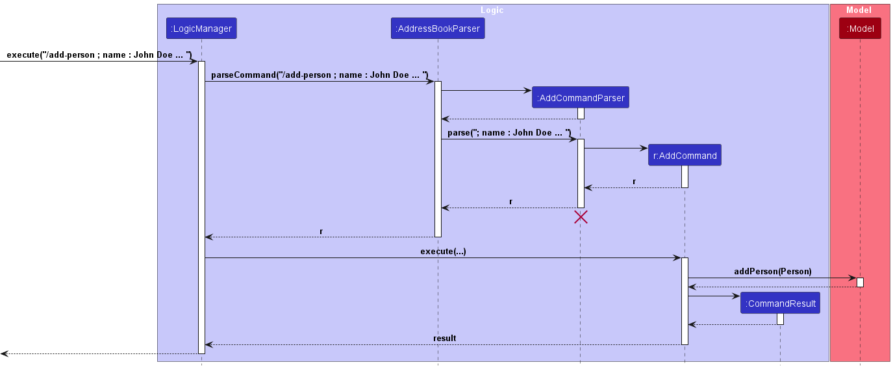
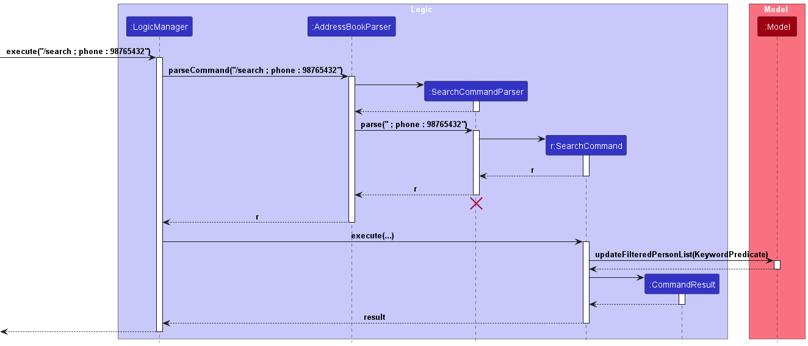
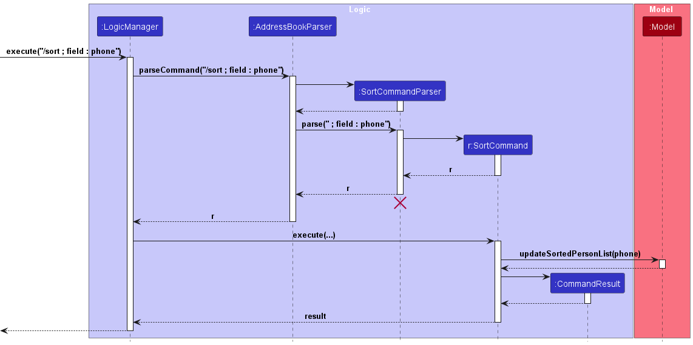

* Table of Contents
{:toc}

## **Setting up, getting started**

Refer to the guide [_Setting up and getting started_](SettingUp.md).

--------------------------------------------------------------------------------------------------------------------

## **Design**

:bulb: **Tip:** The `.puml` files used to create diagrams in this document `docs/diagrams` folder. Refer to the [_PlantUML Tutorial_ at se-edu/guides](https://se-education.org/guides/tutorials/plantUml.html) to learn how to create and edit diagrams.

### Architecture

The ***Architecture Diagram*** given above explains the high-level design of the application.

Below is a quick overview of the main components and how they interact with each other.

**Main components of the architecture**

**`Main`** (consisting of classes [`Main`](https://github.com/AY2324S2-CS2103T-W10-2/tp/blob/master/src/main/java/seedu/address/Main.java) and [`MainApp`](https://github.com/AY2324S2-CS2103T-W10-2/tp/blob/master/src/main/java/seedu/address/MainApp.java)) is in charge of the application launch and shut down.
* On application launch, it initializes the other components in the correct sequence, and connects them up with each other.
* On shut down, it shuts down the other components and invokes cleanup methods where necessary.

The bulk of the application's work is done by the following four components:

* [**`UI`**](#ui-component): The UI of the application.
* [**`Logic`**](#logic-component): The command executor.
* [**`Model`**](#model-component): Holds the application data in memory.
* [**`Storage`**](#storage-component): Reads data from, and writes data to, the hard disk.

[**`Commons`**](#common-classes) represents a collection of classes used by multiple other components.

**How the architecture components interact with each other**

The *Sequence Diagram* below shows how the components interact with each other for the scenario where the user issues the command `/delete ; name : Poochie`.

Each of the four main components (also shown in the diagram above),

* defines its *API* in an `interface` with the same name as the component.
* implements its functionality using a concrete `{Component Name} Manager` class which follows the corresponding API `interface` mentioned in the previous point.

For example, the `Logic` component defines its API in the `Logic.java` interface and implements its functionality using the `LogicManager.java` class which follows the `Logic` interface. Other components interact with a given component through its interface rather than the concrete class (reason: to prevent outside components from being coupled to the implementation of a component), as illustrated in the (partial) class diagram below.

### UI component

The **API** of this component is specified in [`Ui.java`](https://github.com/AY2324S2-CS2103T-W10-2/tp/blob/master/src/main/java/seedu/address/ui/Ui.java)

Below is a class diagram of the `UI` component:

 

The UI consists of a `MainWindow` that is made up of parts e.g.`CommandBox`, `ResultDisplay`, `PersonListPanel`, `StatusBarFooter` etc. All these, including the `MainWindow`, inherit from the abstract `UiPart` class which captures the commonalities between classes that represent parts of the visible GUI.
The `UI` component uses the JavaFX UI framework. The layout of these UI parts are defined in matching `.fxml` files that are in the `src/main/resources/view` folder. For example, the layout of the [`MainWindow`](https://github.com/AY2324S2-CS2103T-W10-2/tp/blob/master/src/main/java/seedu/address/ui/MainWindow.java) is specified in [`MainWindow.fxml`](https://github.com/AY2324S2-CS2103T-W10-2/tp/blob/master/src/main/resources/view/MainWindow.fxml)

The `UI` component:

* executes user commands using the `Logic` component.
* listens for changes to `Model` data so that the UI can be updated with the modified data.
* keeps a reference to the `Logic` component, because the `UI` component relies on the `Logic` component to execute commands.
* depends on some classes in the `Model` component, as it displays the `Person` object residing in the `Model`.

### Logic component

The **API** of this component is specified in [`Logic.java`](https://github.com/AY2324S2-CS2103T-W10-2/tp/blob/master/src/main/java/seedu/address/logic/Logic.java)

Below is a (partial) class diagram of the `Logic` component:

 

The sequence diagram below illustrates the interactions within the `Logic` component, taking `execute("/delete ; name : Poochie")` API call as an example.

:information_source: **Note:** The lifeline for `DeleteCommandParser` should end at the destroy marker (X) but due to a limitation of PlantUML, the lifeline continues till the end of diagram.

The `Logic` component:

1. When `Logic` is called upon to execute a command, it is passed to an `AddressBookParser` object which in turn creates a parser that matches the command (e.g., `DeleteCommandParser`) and uses it to parse the command.
2. This results in a `Command` object (more precisely, an object of one of its subclasses e.g., `DeleteCommand`) which is executed by the `LogicManager`.
3. The command can communicate with the `Model` when it is executed (e.g. to delete a person). 
   Note that although this is shown as a single step in the diagram above (for simplicity), in the code it can take several interactions (between the command object and the `Model`) to achieve.
4. The result of the command execution is encapsulated as a `CommandResult` object which is returned back from `Logic`.

Illustrated below are the other classes in `Logic` (omitted from the class diagram above) that are used for parsing a user command:

How the parsing works:
1. When called upon to parse a user command, the `AddressBookParser` class creates an `XYZCommandParser` (`XYZ` is a placeholder for the specific command name e.g. `AddCommandParser`). `XYZCommandParser` uses the other classes as shown above to parse the user command and create a `XYZCommand` object (e.g., `AddCommand`) which the `AddressBookParser` returns back as a `Command` object.
2. All `XYZCommandParser` classes (e.g., `AddCommandParser`, `DeleteCommandParser`, ...) inherit from the `Parser` interface so that they can be treated similarly where possible e.g, during testing.

### Model component

The **API** of this component is specified in [`Model.java`](https://github.com/AY2324S2-CS2103T-W10-2/tp/blob/master/src/main/java/seedu/address/model/Model.java)

Below is a class diagram of the `Model` component:

 

The `Model` component:

* stores different states of AddressBook inside VersionedAddressBook.
* stores all data from PoochPlanner i.e., all `Person` objects (which are contained in a `UniquePersonList` object).
* stores the currently 'selected' `Person` objects (e.g., results of a search query) as a separate _filtered_ list which is exposed to outsiders as an unmodifiable `ObservableList<Person>` that can be 'observed' e.g. the UI can be bound to this list so that the UI automatically updates when the data in the list changes.
* stores a `UserPref` object that represents the user’s preferences. This is exposed to the outside as a `ReadOnlyUserPref` object.
* does not depend on any of the other three components (as the `Model` represents data entities of the domain, they should make sense on their own without depending on other components).

### Storage component

The **API** of this component is specified in [`Storage.java`](https://github.com/AY2324S2-CS2103T-W10-2/tp/blob/master/src/main/java/seedu/address/storage/Storage.java)

Below is a class diagram of the `Storage` component:

 

The `Storage` component:

* saves both PoochPlanner data and user preference data in JSON format, which is read during the bootup of PoochPlanner.
* inherits from both `AddressBookStorage` and `UserPrefStorage`, which means it can be treated as either one (if only the functionality of only one is needed).
* depends on some classes in the `Model` component (because the `Storage` component's job is to save/retrieve objects that belong to the `Model`).

### Common classes

Classes used by multiple components are in the `seedu.addressbook.commons` package.

## **Implementation**

This section describes some noteworthy details on how certain features are implemented.

### Add feature

#### Overview

The `add-XYZ` command enables users to add a new contact to PoochPlanner.

The following sequence diagram models the interactions between the different components of PoochPlanner for the execution of the `add-person` command.

**Note:** The implementation for person, staff, suppliers, maintainers are similar and only differ in the accepted attributes. `XYZ` can refer to `person`, `staff`, `supplier`, `maintainer`. 

#### Details

1. The user inputs the command to add a new contact.
2. `AddCommandParser` parses the user input.
3. An `AddCommand` object is created.
4. The `AddCommandParser` returns the `AddCommand` object.
5. The `LogicManager` invokes the `execute` method of `AddCommand`.
6. The `execute` method of `AddCommand` invokes the `addPerson` method in `Model` property to create new contact with the new `Person` object.
7. The `execute` method of `AddCommand` returns a `CommandResult` object which stores the data regarding the completion of the `add-XYZ` command.

#### Example Usage
1. The user launches the application.
2. The user inputs `/add-person ; name : John Doe ; phone : 98765432 ; email : johnd@example.com ; address : 311, Clementi Ave 2, #02-25`
3. The contact card for `John Doe` is created. This change should be reflected on the contacts list on PoochPlanner.

### Edit feature

#### Overview

The `edit-XYZ` command enables users to modify a specified field of an existing contact from PoochPlanner.

The following sequence diagram models the interactions between the different components of PoochPlanner for the execution of the `edit-XYZ` command.

**Note:** The implementation for person, staff, suppliers, maintainers are similar and only differ in the accepted attributes. `XYZ` can refer to `person`, `staff`, `supplier`, `maintainer`. 

#### Details

1. The user inputs the command to edit a specified contact by first stating the target name of the contact they want to edit. This is followed by the respective fields and new values the user wants to modify.
2. `EditCommandParser` parses the user input and creates an `EditPersonDescriptor` object which contains the new values to be edited for the specified contact.
3. An `EditCommand` object is created with the name of the contact to edit and the`EditPersonDescriptor` object.
4. The `EditCommandParser` returns the `EditCommand` object.
5. The `LogicManager` invokes the `execute` method of `EditCommand`.
6. The `execute` method of `EditCommand` finds the specified contact by `name`. The `execute` method then calls the `createEditedPerson` method of `EditCommand` which creates a new `Person` object that contains the updated values of the contact.
7. The `execute` method of `EditCommand` invokes the `setPerson` method in `Model` property to replace the specified contact with the new `Person` object.
8. The `execute` method of `EditCommand` invokes the `updateFilteredPersonList` method in `Model` property to update the view of PoochPlanner to show all contacts.
9. The `execute` method of `EditCommand` returns a `CommandResult` object which stores the data regarding the completion of the `edit-XYZ` command.

#### Example Usage
1. The user launches the application.
2. The user inputs `/edit-person ; name : Alice Tan ; field : { phone : 9990520 ; email : impooch@gmail12.com }`
3. The contact card for `Alice Tan` is updated for the `phone` and `email` fields respectively. This change should be reflected on the contacts list on PoochPlanner.

**Aspect: How to implement edit command**

* **Alternative 1 (current choice)**: Create 4 different edit commands for the 4 contact types (Person, Staff, Maintainer, Supplier).
    * Pros: User-friendly. Users will be less prone to error that involves trying to edit a field that does not exist for the specific contact type.
    * Cons: Steeper learning curve for the users due to the greater number of commands.

* **Alternative 2**: Combining edit command into using only one edit command across all classes.
    * Pros: Much simpler suite of features for users, which makes it easier for users to start using PoochPlanner.
    * Cons: Complex to implement due to the need to check the contact type at the point of parsing before splitting into the different edit commands to handle the modification separately. This will violate the intended abstract implementation of MVC (Model-View-Controller) as the model will have to be accessible from within the parser class in order for the type checking to be done. 

### Search feature

#### Overview

The `search` command enables users to find contacts in PoochPlanner that match the input search queries.

The following sequence diagram models the interactions between the different components of PoochPlanner for the execution of the `search` command.

#### Details

1. The user inputs the command to search for contacts with the specified search queries.
2. `SearchCommandParser`  invokes the `parse` method which parses the user input by storing the prefixes and their respective values in an `ArgumentMultimap` object, and using this object to create an instance of `KeywordPredicate`.
3. `SearchCommandParser` then creates a new instance of a `SearchCommand` object containing the aforementioned `KeywordPredicate`.
4. `LogicManager` invokes the `execute` method of `SearchCommand`.
5. This invokes the `updateFilteredPersonList` method in `Model` property, taking in `KeywordPredicate` as a parameter to filter and update `UniquePersonList`.
6. The `execute` method of `SearchCommand` returns a `CommandResult` object which stores the data regarding the completion of the `search` command.

#### Example Usage

1. The user launches the application.
2. The user inputs `/search ; name : Poochie` into the CLI.
3. PoochPlanner is updated to display all contact cards that match the name "Poochie".

**Aspect: How to implement search command using multiple field inputs**

* **Alternative 1 (current choice)**: Accept multiple search fields in search query.
  * Pros: More user-friendly as users can search using multiple fields at once, allowing for a more targeted search.
  * Cons: More prone to errors due to broader search scope over multiple fields.

* **Alternative 2**: Only accept one field in search query.
  * Pros: Less prone to errors due to stricter search only over one field.
  * Cons: Less user-friendly since users will not be able to search using multiple fields at once.

### Delete feature

#### Overview

The delete command enables users to delete a specific contact from PoochPlanner.

The following sequence diagram models the interactions between the different components of PoochPlanner for the
execution of the `delete` command.

#### Details

1. The user inputs the command to delete a contact by stating the target name of the contact they want to delete.
2. `CommandParser` invokes the `parse` method which parses the user input by storing the prefixes and their respective values as an `ArgumentMultimap` object.
3. A `DeleteCommand` object is created with the name of the contact to delete.
4. The `DeleteCommandParser` returns the `DeleteCommand` object.
5. The `LogicManager` invokes the `execute` method of `DeleteCommand`.
6. The `execute` method of `DeleteCommand` invokes the `deletePerson` method in the `Model` property to remove the specified contact from the `addressBook` property in `ModelManager`.
7. The `execute` method of `DeleteCommand` returns a `CommandResult` object which stores the data regarding the
completion of the `delete` command.

#### Example Usage

1. The user launches the application.
2. The user inputs `/delete ; name : Poochie` into the CLI.
3. The contact with the name ‘Poochie’ will be deleted from PoochPlanner.

**Aspect: How to implement delete command**

* **Alternative 1 (current choice)**: Only accept the name field, where only the last name field will be taken.
  * Pros: User-friendly. Users can easily correct the name field without deleting the previous name field entered.
  * Cons: Less rigorous validation check on name as users may not intentionally enter a second name field.

* **Alternative 2**: Accept only one name field.
  * Pros: Less prone to possible errors due to stricter validation checks on name fields.
  * Cons: Less user-friendly since users will have to put in more effort to fix their commands.

### Rate feature

#### Overview

The rate command enables users to rate a specific contact from PoochPlanner.

The following sequence diagram models the interactions between the different components of PoochPlanner for the
execution of the `rate` command.

#### Details

1. The user inputs the command to add a rating to a specific contact by first stating the target name of the
   contact they want to rate. This is followed by the rating to be given to the user.
2. `RateCommandParser` invokes the `parse` method which parses the user input by storing the name and its
   prefix in an `ArgumentMultimap`. A `RateCommand` object is created with the parsed name, and rating.
3. `LogicManager` invokes the `execute` method of `RateCommand`.
4. The `execute` method of `RateCommand` invokes the `findByName` method in `Model` property to find the
   contact with the specified name.
5. The `execute` method of `RateCommand` invokes the `setPerson` method in `Model` property to set the contact
   in the existing contacts list to the new `Person` object which has been edited by the `execute` method of `RateCommand`.
6. The `execute` method of `RateCommand` invokes the `updateFilteredPersonList` method in `Model` property to
   update the view of PoochPlanner to show all contacts.
7. The `execute` method of `RateCommand` returns a `CommandResult` object which stores the data regarding the
   completion of the `rate` command.

#### Example Usage

1. The user launches the application.
2. The user inputs `/rate ; name : Poochie ; rating : 5` into the CLI.
3. The contact with the name `Poochie` is rated with "5" as the rating.

**Aspect: How to store rating field in Person class and subclasses**

* **Alternative 1 (current choice)**: Add rating field to all 4 constructors (Person, Staff, Maintainer, Supplier).
  * Pros: Leverages inheritance, thus reducing repeated code and adheres to OOP.
  * Cons: Changing the constructors of the 4 classes is a tedious task.

* **Alternative 2**: Add rating field to the parent person constructor and use a setter to set new ratings.
  * Pros: Much simpler implementation that will require less refactoring of code.
  * Cons: Violates OOP, specifically encapsulation as the other classes would be able to manipulate the
    ratings of the `Person` objects directly.

### Pin / Unpin feature

#### Overview

The `pin`/`unpin` commands enable users to pin/unpin any existing contacts in PoochPlanner.

The following sequence diagram models the interactions between the different components of PoochPlanner for the execution of the `pin` command.

The following sequence diagram models the interactions between the different components of PoochPlanner for the execution of the `unpin` command.

:information_source: **Note:** The implementation for person, staff, suppliers, maintainers are the same. Pin and Unpin are also implemented similarly as seen above in the sequence diagrams. 

#### Details

1. The user inputs the command to pin/unpin a specified contact by stating the target name of the contact that they want to pin/unpin.
2. `PinCommandParser`/`UnpinCommandParser` invokes the `parse` method which parses the user input by storing the prefixes and their respective values as an `ArgumentMultimap` object.
3. A `PinCommand`/`UnpinCommand` object is created with the name of the contact to pin/unpin.
4. The `PinCommandParser`/`UnpinCommandParser` returns the `PinCommand`/`UnpinCommand` object.
5. The `LogicManager` invokes the `execute` method of `PinCommand`/`UnpinCommand`.
6. The `execute` method of `PinCommand`/`UnpinCommand` finds the specified contact by `name`. The `updateToPinned`/`updateToUnpinned` method of `Person` creates a new `Person` object that contains the updated pin boolean of the contact.
7. The `execute` method of `PinCommand`/`UnpinCommand` invokes the `setPerson` method in `Model` property to replace the specified contact with the new `Person` object.
8. The `execute` method of `PinCommand`/`UnpinCommand` invokes the `updatePinnedPersonList` method in `Model` property to update the view of PoochPlanner to show all contacts.
9. The `execute` method of `PinCommand`/`UnpinCommand` returns a `CommandResult` object which stores the data regarding the completion of the `Pin`/`Unpin` command.

#### Example Usage

1. The user launches the application.
2. The user inputs `/pin ; name : Alice Tan` or `/unpin ; name : Alice Tan` into the CLI.
3. The contact card for `Alice Tan` is now pinned / unpinned. This change should be reflected on the contact list page on PoochPlanner.

**Aspect: How to implement pin/unpin command**

* **Alternative 1 (current choice)**: Accept multiple name fields, where only the last name field will be taken.
  * Pros: User-friendly. Users can easily correct the name field without deleting the previously incorrect name field entered.
  * Cons: Less rigorous validation check on name as users may not intentionally enter a second name field.

* **Alternative 2**: Accept only one name field.
  * Pros: Less prone to possible errors due to stricter validation checks on name fields.
  * Cons: Less user-friendly since users will have to put in more effort to fix their commands.

### Sort feature

#### Overview

The `sort` command enables users to sort contacts in PoochPlanner by a target field.

The following sequence diagram models the interactions between the different components of PoochPlanner for the execution of the `sort` command.

#### Details

1. The user inputs the command to sort contacts with the target field.
2. `SortCommandParser` invokes the `parse` method which parses the user input through `ArgumentMultimap` and `mapName`, creating a new `Prefix` object.
3. `SortCommandParser` then creates a new `SortCommand` object with the target `prefix`, returning this object.
4. The `LogicManager` invokes the `execute` method of `SortCommand`, which invokes the `updateSortedPersonList` method in `Model` property with the target `prefix` to update the interface of PoochPlanner to sort`UniquePersonList` by the target field.
5. The `execute` method of `SortCommand` returns a `CommandResult` object which stores the data regarding the completion of the `sort` command.

#### Example Usage

1. The user launches the application.
2. The user inputs `/sort ; field : phone` into the CLI.
3. PoochPlanner is updated to sort all the contact cards by ascending phone number.

**Aspect: How to use sort command**

* **Alternative 1 (current choice)**: Sorts only by ascending order, alphabetically and numerically.
  * Pros: Straight forward to key in command. Users can just key in the field they want to sort by without having to indicate whether to sort either in ascending or descending order.
  * Cons: Less flexible in sorting as later alphabets and larger values will take longer to find.

* **Alternative 2**: Sorts by both ascending and descending order depending on user indication.
  * Pros: More flexible in sorting for users to sort in either way to find what they need.
  * Cons: Longer command, another field required to specify either ascending or descending sorting order.

### Note feature

#### Overview

The note command enables users to add notes to existing contacts in PoochPlanner.

The following sequence diagram models the interactions between the different components of PoochPlanner for the execution of the `note` command.

#### Details

1. The user inputs the command to add a note to a specified contact by first stating the target name of the contact they want to add a note to. This is followed by the respective fields and the new values they want to modify.
2. `NoteCommandParser` invokes the `parse` method which parses the user input by storing the prefixes and their respective values as an `ArgumentMultimap` object. 
3. A `NoteCommand` object is created with the parsed name, note and optional deadline field.
4. The `NoteCommandParser` returns the `NoteCommand` object.
5. `LogicManager` invokes the `execute` method of `NoteCommand`. 
6. The `execute` method of `NoteCommand` invokes the `findByName` method in `Model` property to find the person with the specified name. 
7. The `execute` method of `NoteCommand` invokes the `setPerson` method in `Model` property to set the person in the existing contacts list to the new `Person` object which has been edited in the `execute` method of `NoteCommand`. 
8. The `execute` method of `NoteCommand` invokes the `updateFilteredPersonList` method in `Model` property to update the view of PoochPlanner to show all contacts. 
9. The `execute` method of `NoteCommand` returns a `CommandResult` object which stores the data regarding the completion of the `note` command.

#### Example Usage

1. The user launches the application.
2. The user inputs `/note ; name : Janna ; note : get kibble` into the CLI.
3. The given note will be added to the description of the contact with the given name.

**Aspect: How to store note field in Person class and subclasses**

* **Alternative 1 (current choice)**: Add note field to all 4 constructors (Person, Staff, Maintainer, Supplier).
    * Pros: Leverages inheritance, thus reducing repeated code and adheres to OOP.
    * Cons: Changing the constructors of the 4 classes is a tedious task.

* **Alternative 2**: Add note field to the parent person constructor and use a setter to set new notes.
    * Pros: Much simpler implementation that will require less refactoring of code.
    * Cons: Violates OOP, specifically encapsulation as the other classes would be able to manipulate the
  inner details of the `Person` classes directly.

### Undo/redo feature

#### Overview

The `undo/redo` commands enable users to undo/redo previous actions made by the user in PoochPlanner.

 

As the implementation of `undo/redo` command is more complicated, the mechanism is fully explained with the corresponding implementation as described below.

#### Implementation

The undo/redo mechanism is facilitated by `VersionedAddressBook`. It extends `AddressBook` with an undo/redo history, stored internally as an `addressBookStateList` and `currentStatePointer`. Additionally, it implements the following operations:

* `VersionedAddressBook#commit()` — Saves the current address book state in its history.
* `VersionedAddressBook#undo()` — Restores the previous address book state from its history.
* `VersionedAddressBook#redo()` — Restores a previously undone address book state from its history.

These operations are exposed in the `Model` interface as `Model#commitAddressBook()`, `Model#undoAddressBook()` and `Model#redoAddressBook()` respectively.

Given below is an example usage scenario and how the undo/redo mechanism behaves at each step.

Step 1. The user launches the application for the first time. The `VersionedAddressBook` will be initialized with the initial AddressBook state, and the `currentStatePointer` pointing to that single address book state.

Step 2. The user executes `/delete ; name : Poochie` command to delete the Person named Poochie in PoochPlanner. The `delete` command calls `Model#commitAddressBook()`, causing the modified state of the address book after the `/delete ; name : Poochie` command executes to be saved in the `addressBookStateList`, and the `currentStatePointer` is shifted to the newly inserted address book state.

Step 3. The user executes `/add-person ; name : John …​` to add a new person. The `/add-person` command also calls `Model#commitAddressBook()`, causing another modified address book state to be saved into the `addressBookStateList`.

:information_source: **Note:** If a command fails its execution, it will not call `Model#commitAddressBook()`, so the address book state will not be saved into the `addressBookStateList`.

Step 4. The user now decides that adding the person was a mistake, and decides to undo that action by executing the `undo` command. The `undo` command will call `Model#undoAddressBook()`, which will shift the `currentStatePointer` once to the left, pointing it to the previous address book state, and restores the address book to that state.

:information_source: **Note:** If the `currentStatePointer` is at index 0, pointing to the initial AddressBook state, then there are no previous AddressBook states to restore. The `undo` command uses `Model#canUndoAddressBook()` to check if this is the case. If so, it will return an error to the user rather
than attempt to perform the undo.

The following sequence diagram shows how an undo operation goes through the `Logic` component:

:information_source: **Note:** The lifeline for `UndoCommand` should end at the destroy marker (X) but due to a limitation of PlantUML, the lifeline reaches the end of diagram.

Similarly, how an undo operation goes through the `Model` component is shown below:

The `redo` command does the opposite — it calls `Model#redoAddressBook()`, which shifts the `currentStatePointer` once to the right, pointing to the previously undone state, and restores the address book to that state.

:information_source: **Note:** If the `currentStatePointer` is at index `addressBookStateList.size() - 1`, pointing to the latest address book state, then there are no undone AddressBook states to restore. The `redo` command uses `Model#canRedoAddressBook()` to check if this is the case. If so, it will return an error to the user rather than attempting to perform the redo.

Step 5. The user then decides to execute the command `/list`. Commands that do not modify the address book, such as `/list`, will not call `Model#commitAddressBook()`. Thus, the `addressBookStateList` remains unchanged.

Step 6. The user executes `/clear`, which calls `Model#commitAddressBook()`. Since the `currentStatePointer` is not pointing at the end of the `addressBookStateList`, all address book states after the `currentStatePointer` will be purged. Reason: It no longer makes sense to redo the `/add-person ; name : John...` command. This is the behavior that most modern desktop applications follow.

The following activity diagram summarizes what happens when a user executes a new command:

### Design considerations:

#### Aspect: How undo & redo executes :

**Alternative 1 (current choice)** : Saves the entire address book.
  * Pros: Easy to implement.
  * Cons: May have performance issues in terms of memory usage.

**Alternative 2** : Individual command knows how to undo/redo by itself.
* Pros: Will use less memory(e.g. for delete, just save the person being deleted).
* Cons: We must ensure that the implementation of each individual command are correct.

### Help feature

#### Overview

The help command enables users to view help for all commands.

The following sequence diagram models the interactions between the different components of PoochPlanner for the execution of the `help` command.

#### Details

1. The user inputs the command to view help for a specific command. This is followed by the command field specifying the command they want to view help for.
2. `HelpCommandParser` invokes the `parse` method which parses the user input by storing the prefix of its respective values as an `ArgumentMultimap` object.
3. A `HelpCommand` object is created with the command type that was specified in the command field.
4. The `HelpCommandParser` returns the `HelpCommand` object.
5. `LogicManager` invokes the `execute` method of `HelpCommand`.
6. The `execute` method of `HelpCommand` returns a `CommandResult` object which stores the data regarding the completion of the `help` command.

#### Example Usage

1. The user launches the application.
2. The user inputs `/help ; command : delete` into the CLI.
3. Help for the delete command will be displayed.

**Aspect: How to display different help command windows**

* **Alternative 1 (current choice)**: Use only 1 help window to display help for specific commands. Different contents are displayed by passing in different strings.
  * Pros: Code is made much more concise.
  * Cons: Lengthy if-else statements are required to display the correct string.

* **Alternative 2**: Create a different help window for each type of command.
  * Pros: All details relating to a single command is within its own file. Can be perceived as neater.
  * Cons: Highly repetitive code. Even small mistakes made, would have to be fixed in over 10 windows.

### Remind feature

#### Overview

The remind command enables users to view all contacts with note deadlines from today onwards.

The following sequence diagram models the interactions between the different components of PoochPlanner for the execution of the `remind` command.

#### Details

1. The user inputs the command to view reminders.
2. `LogicManager` invokes the `execute` method of `RemindCommand`.
3. The `execute` method of `RemindCommand` invokes the `updateFilteredPersonList` method in `Model` property to update the view of the application to show contacts
   with note deadlines from today onwards.
4. The `execute` method of `NoteCommand` returns a `CommandResult` object which stores the data regarding the completion of the `remind` command.

#### Example Usage

1. The user launches the application.
2. The user inputs `/remind` into the CLI.
3. Contacts that have deadline notes from today onwards will be displayed.

### Clear feature

#### Overview

The clear command enables users to remove all existing contacts from PoochPlanner.

The following sequence diagram models the interactions between the different components of PoochPlanner for the execution of the `clear` command.

#### Details

1. The user inputs the command to clear all contacts.
2. `LogicManager` invokes the `execute` method of `ClearCommand`.
3. The `execute` method of `ClearCommand` invokes the `setAddressBook` method in `Model` property with a new `AddressBook` object which contains an empty `UniquePersonList`.
4. The `execute` method of `ClearCommand` returns a `CommandResult` object which stores the data regarding the completion of the `clear` command.

#### Example Usage

1. The user launches the application.
2. The user inputs `/clear` into the CLI.
3. The data in PoochPlanner is emptied.

### List feature

#### Overview

The list command enables users to view all existing contacts from PoochPlanner.

The following sequence diagram models the interactions between the different components of PoochPlanner for the execution of the `list` command.

#### Details

1. The user inputs the command to list all contacts.
2. `LogicManager` invokes the `execute` method of `ListCommand`.
3. The `execute` method of `ListCommand` invokes the `updateFilteredPersonList` method in `Model` property to update the view of the application to show all contacts.
4. The `execute` method of `ListCommand` returns a `CommandResult` object which stores the data regarding the completion of the `list` command.

#### Example Usage

1. The user launches the application.
2. The user inputs `/list` into the CLI.
3. All contacts in PoochPlanner are displayed.

## **Documentation, logging, testing, configuration, dev-ops**

* [Documentation guide](Documentation.md)
* [Testing guide](Testing.md)
* [Logging guide](Logging.md)
* [Configuration guide](Configuration.md)
* [DevOps guide](DevOps.md)

## **Appendix: Requirements**

### Product scope

**Target user profile**:

* Dog cafe owners who need to manage a team of staff, F&B vendors, and a dog maintenance team.
* Users who prefer typing to other forms of input and is comfortable using CLI applications.

**Value proposition**: PoochPlanner is a desktop application to track details of various groups (supplier, maintainer, staff) that dog cafe owners have to regularly interact with. The app is optimised for use using Command Line Interface (CLI) while still encompassing a user-friendly Graphical User Interface (GUI).

### User stories

Priorities: High (must have) - `* * *`, Medium (nice to have) - `* *`, Low (unlikely to have) - `*`

| Priority | As a …​                | I want to …​                                                          | So that I can…​                                                                             |
|----------|------------------------|-----------------------------------------------------------------------|---------------------------------------------------------------------------------------------|
| `* * *`  | well connected user    | add new contacts to my contacts list                                  | have the contact of all new people in my contacts list                                      |
| `* * *`  | cafe owner user        | edit contacts                                                         | update contact information such as the new phone number of my staff member                  |
| `* * *`  | cafe owner user        | delete contacts                                                       | remove outdated contacts such as retrenched staff                                           |
| `* * *`  | well connected user    | search through my long list of contacts by different specified fields | find my contacts efficiently                                                                |
| `* * *`  | first-time user        | get help about what commands to use                                   | easily know how to navigate the system                                                      |
| `* *`    | frugal user            | sort vendors in ascending order of price                              | view the vendors selling the cheapest products easily                                       |
| `* *`    | careless user          | undo my commands                                                      | revert my accidental commands easily                                                        |
| `* *`    | careless user          | redo my commands                                                      | revert my accidental undo commands easily                                                   |
| `* *`    | well connected user    | pin contacts                                                          | easily view frequent contacts                                                               |
| `* *`    | well connected user    | unpin contacts                                                        | remove my less frequent contacts from the top of my list                                    |
| `* *`    | profit-maximising user | rate the efficiency of contacts                                       | view the efficiency of my contacts easily and only conduct business with efficient contacts |
| `* *`    | forgetful user         | note down all details about my contacts                               | track and remember important details and deadlines easily                                   |
| `* *`    | forgetful user         | be reminded of my deadlines                                           | complete all my tasks on time                                                               |

### Use cases

**System**: `PoochPlanner`

**Use case**: `UC01 - Adding a contact`

**Actor**: `User`

**Guarantee**: `If MSS reaches step 3, a new contact is added into the contacts list.`

**MSS**:

1.  User requests to add the contact of a person.
2.  PoochPlanner updates the contacts list.
3.  PoochPlanner confirms successful update.

    Use case ends.

**Extensions**:

* 1a. PoochPlanner detects a missing field in the entered input.
   * 1a1. PoochPlanner displays the error message.
   * 1a2. User re-enters a new command with the required field.
   * Steps 1a1 - 1a2 are repeated until the input entered are correct.
   * Use case resumes from step 2.

* 1b. PoochPlanner detects a duplicate name entry.
   * 1b1. PoochPlanner displays the error message.
   * 1b2. User re-enters a new command with another name.
   * Steps 1b1 - 1b2 are repeated until there is no duplicate entry in input.
   * Use case resumes from step 2.

* 1c. PoochPlanner detects wrong format for email.
   * 1c1. PoochPlanner displays the error message.
   * 1c2. User re-enters a new command with correct email format.
   * Steps 1c1 - 1c2 are repeated until there is no error in input.
   * Use case resumes from step 2.

* 1d. PoochPlanner detects unknown input for employment.
  * 1d1. PoochPlanner displays the error message.
  * 1d2. User re-enters a new command with correct input for employment.
  * Steps 1d1 - 1d2 are repeated until there is no error in input.
  * Use case resumes from step 2.

**System**: `PoochPlanner`

**Use case**: `UC02 - Editing a contact`

**Actor**: `User`

**Guarantee**: `If MSS reaches step 3, the contact is successfully edited in the contacts list.`

**MSS**:

1.  User requests to edit the field of a person.
2.  PoochPlanner updates the field of specified person.
3.  PoochPlanner confirms successful edit.

    Use case ends.

**Extensions**:

* 1a. PoochPlanner detects a missing name field in the entered input.
   * 1a1. PoochPlanner displays the error message.
   * 1a2. User re-enters a new command with the name field.
   * Steps 1a1 - 1a2 are repeated until the input entered are correct.
   * Use case resumes from step 2.

* 1b. PoochPlanner is unable to find the contact.
   * 1b1. PoochPlanner displays the error message.
   * 1b2. User re-enters a new command with another name.
   * Steps 1b1 - 1b2 are repeated until the input references a contact that exists in PoochPlanner.
   * Use case resumes from step 2.

* 1c. User requests to edit the name field to a name that already exists in PoochPlanner.
   * 1c1. PoochPlanner displays the error message.
   * 1c2. User re-enters a new command with a different name.
   * Steps 1c1 - 1c2 are repeated until the new name field is valid.
   * Use case resumes from step 2.

* 1d. PoochPlanner detects empty field in the entered input.
   * 1d1. PoochPlanner displays the error message.
   * 1d2. User re-enters a new command and specifies the field(s) to edit.
   * Steps 1d1 - 1d2 are repeated until a valid field is specified.
   * Use case resumes from step 2.

* 1e. User specifies an invalid field.
   * 1e1. PoochPlanner displays the error message.
   * 1e2. User re-enters a new command and edits a different field.
   * Steps 1e1 - 1e2 are repeated until a valid field is specified.
   * Use case resumes from step 2.

* 1f. PoochPlanner detects wrong format for email.
    * 1f1. PoochPlanner displays the error message.
    * 1f2. User re-enters a new command with a correct email format.
    * Steps 1f1 - 1f2 are repeated until there is no error in input.
    * Use case resumes from step 2.

**System**: `PoochPlanner`

**Use case**: `UC03 - Searching for a contact`

**Actor**: `User`

**Guarantee**: `If MSS reaches step 3, the contacts list is filtered successfully.`

**MSS**:

1.  User requests to search for the contact of a person with a keyword for a specified field.
2.  PoochPlanner confirms successful search.
3.  PoochPlanner returns the filtered list of contacts that matches the keyword as specified by the user.

    Use case ends.

**Extensions**:

* 1a. PoochPlanner detects a missing field in the entered input.
   * 1a1. PoochPlanner displays the error message.
   * 1a2. User re-enters a new command with a specified field.
   * Steps 1a1 - 1a2 are repeated until a valid field is keyed in by the user.
   * Use case resumes from step 2.

* 1b. PoochPlanner detects duplicate fields in the entered input.
  * 1b1. PoochPlanner displays the error message.
  * 1b2. User re-enters a new command with a specified field.
  * Steps 1a1 - 1a2 are repeated until the command does not contain any duplicate fields.
  * Use case resumes from step 2.

**System**: `PoochPlanner`

**Use case**: `UC04 - Deleting a contact`

**Actor**: `User`

**Guarantee**: `If MSS reaches step 3, the contact is deleted from the contacts list.`

**MSS**:

1.  User requests to delete contact of a person.
2.  PoochPlanner removes person and updates the contacts list.
3.  PoochPlanner confirms successful deletion.

    Use case ends.

**Extensions**:

* 1a. PoochPlanner detects a missing name field in the entered input.
  * 1a1. PoochPlanner displays the error message.
  * 1a2. User re-enters a new command with the name field.
  * Steps 1a1 - 1a2 are repeated until the input entered are correct.
  * Use case resumes from step 2.

* 1b. PoochPlanner is unable to find the contact.
  * 1b1. PoochPlanner displays the error message.
  * 1b2. User re-enters a new command with another name.
  * Steps 1b1 - 1b2 are repeated until the input references a contact that exists in PoochPlanner.
  * Use case resumes from step 2.

**System**: `PoochPlanner`

**Use case**: `UC05 - Adding a rating to a contact`

**Actor**: `User`

**Guarantee**: `If MSS reaches step 3, a rating for the contact is updated successfully in the contacts list.`

**MSS**:

1.  User requests to rate the contact of a person with the specified rating.
2.  PoochPlanner updates the contact rating with the rating provided.
3.  PoochPlanner confirms the successful rating of the contact.

    Use case ends.

**Extensions**:

* 1a. PoochPlanner detects a missing name in the entered input.
   * 1a1. PoochPlanner displays the error message.
   * 1a2. User re-enters a new command with a specified name.
   * Steps 1a1 - 1a2 are repeated until a valid name is inputted by the User.
   * Use case resumes from step 2.

* 1b. PoochPlanner detects invalid name in the entered input.
   * 1b1. PoochPlanner displays the error message.
   * 1b2. User re-enters a new command with a specified name.
   * Steps 1b1 - 1b2 are repeated until a valid name is inputted by the User.
   * Use case resumes from step 2.

* 1c. PoochPlanner detects a missing rating in the entered input.
   * 1c1. PoochPlanner displays the error message.
   * 1c2. User re-enters a new command with a new rating value.
   * Steps 1c1 - 1c2 are repeated until the rating provided is an integer between 1 and 5 inclusive.
   * Use case resumes from step 2.

* 1d. PoochPlanner detects an invalid rating in the entered input.
   * 1d1. PoochPlanner displays the error message.
   * 1d2. User re-enters a new command with a new rating value.
   * Steps 1d1 - 1d2 are repeated until the rating provided is an integer between 1 and 5 inclusive.
   * Use case resumes from step 2.

**System**: `PoochPlanner`

**Use case**: `UC06 - Pinning a contact`

**Actor**: `User`

**Guarantee**: `If MSS reaches step 3, the user has successfully pinned the contact.`

**MSS**:

1. User requests to pin a contact.
2. The specified contact is pinned successfully.
3. PoochPlanner displayed the contacts list with the pinned contacts at the top.

   Use case ends.

* 1a. PoochPlanner detects a missing name field in the entered input.
  * 1a1. PoochPlanner displays the error message.
  * 1a2. User re-enters a new command with a specified name field.
  * Steps 1a1 - 1a2 are repeated until the input entered are correct.
  * Use case resumes from step 2.

* 1b. PoochPlanner detects an invalid name field in the entered input.
  * 1b1. PoochPlanner displays the error message.
  * 1a2. User re-enters a new command with a specified name field.
  * Steps 1b1 - 1b2 are repeated until the input entered are correct.
  * Use case resumes from step 2.

* 1c. PoochPlanner fails to find the person.
  * 1c1. PoochPlanner displays the error message.
  * 1c2. User re-enters a new command with another name.
  * Steps 1c1 - 1c2 are repeated until the input references a contact that exists in PoochPlanner.
  * Use case resumes from step 2.

**System**: `PoochPlanner`

**Use case**: `UC07 - Unpinning a contact`

**Actor**: `User`

**Guarantee**: `If MSS reaches step 3, the user has successfully unpinned the contact.`

**MSS**:

1. User requests to unpin a contact.
2. The specified contact is unpinned successfully.
3. PoochPlanner updates the contacts list with the rest of the pinned contacts at the top.

   Use case ends.

**Extensions**:

* 1a. PoochPlanner detects a missing name field in the entered input.
  * 1a1. PoochPlanner displays the error message.
  * 1a2. User re-enters a new command with a specified name field.
  * Steps 1a1 - 1a2 are repeated until the input entered are correct.
  * Use case resumes from step 2.

* 1b. PoochPlanner detects an invalid name field in the entered input.
  * 1b1. PoochPlanner displays the error message.
  * 1a2. User re-enters a new command with a specified name field.
  * Steps 1b1 - 1b2 are repeated until the input entered are correct.
  * Use case resumes from step 2.

* 1b. PoochPlanner fails to find the person.
  * 1b1. PoochPlanner displays the error message.
  * 1b2. User re-enters a new command with another name.
  * Steps 1b1 - 1b2 are repeated until the input references a contact that exists in PoochPlanner.
  * Use case resumes from step 2.

**System**: `PoochPlanner`

**Use case**: `UC08 - Sorting the contacts list`

**Actor**: `User`

**Guarantee**: `If MSS reaches step 3, the user has successfully sorted the contacts list by a specified field.`

**MSS**:

1.  User requests to sort PoochPlanner by a specified field.
2.  PoochPlanner updates the address book in the sorted order.
3.  PoochPlanner confirms that the address book has been successfully sorted.

    Use case ends.

**Extensions**:

* 1a. PoochPlanner detects a missing field in the entered input.
  * 1a1. PoochPlanner displays the error message.
  * 1a2. User re-enters a new command with a specified name.
  * Steps 1a1 - 1a2 are repeated until a valid name is inputted by the User.
  * Use case resumes from step 2.

* 1b. PoochPlanner detects an invalid field in the entered input.
  * 1b1. PoochPlanner displays the error message.
  * 1b2. User re-enters a new command with a specified name.
  * Steps 1b1 - 1b2 are repeated until a valid name is inputted by the User.
  * Use case resumes from step 2.

**System**: `PoochPlanner`

**Use case**: `UC09 - Adding a note to a contact`

**Actor**: `User`

**Guarantee**: `If MSS reaches step 3, a note for the contact specified is updated successfully in the contacts list.`

**MSS**:

1.  User requests to add a note to the contact of a person.
2.  PoochPlanner updates the contact with the specified note.
3.  PoochPlanner confirms that the note has been successfully added.

    Use case ends.

**Extensions**:

* 1a. PoochPlanner detects a missing name in the entered input.

  * 1a1. PoochPlanner displays the error message.
  * 1a2. User re-enters a new command with a name value.
  * Steps 1a1 - 1a2 are repeated until a name value is inputted by the user.
  * Use case resumes from step 2.

* 1b. PoochPlanner detects an invalid name in the entered input.

  * 1b1. PoochPlanner displays the error message.
  * 1b2. User re-enters a new command with a new name value.
  * Steps 1b1 - 1b2 are repeated until a valid name is inputted by the user.
  * Use case resumes from step 2.

* 1c. PoochPlanner detects a missing note in the entered input.

  * 1c1. PoochPlanner displays the error message.
  * 1c2. User re-enters a new command with a note value.
  * Steps 1c1 - 1c2 are repeated until the a note value is provided (non-null/non-empty).
  * Use case resumes from step 2.

* 1d. PoochPlanner detects an invalid note in the entered input.

  * 1d1. PoochPlanner displays the error message.
  * 1d2. User re-enters a new command with a new note value.
  * Steps 1d1 - 1d2 are repeated until the note provided is valid (non-null/non-empty).
  * Use case resumes from step 2.

**System**: `PoochPlanner`

**Use case**: `UC10 - Adding a deadline note to a contact`

**Actor**: `User`

**Guarantee**: `If MSS reaches step 3, a note with a deadline for the specified contact will be updated successfully in the contacts list.`

**MSS**:

1.  User requests to add a deadline note to the contact of a person.
2.  PoochPlanner updates the contact with the specified deadline note.
3.  PoochPlanner confirms that the deadline note has been successfully added.

    Use case ends.

**Extensions**:

* 1a. PoochPlanner detects a missing name in the entered input.

  * 1a1. PoochPlanner displays the error message.
  * 1a2. User re-enters a new command with a name value.
  * Steps 1a1 - 1a2 are repeated until a name is inputted by the user.
  * Use case resumes from step 2.

* 1b. PoochPlanner detects an invalid name in the entered input.

  * 1b1. PoochPlanner displays the error message.
  * 1b2. User re-enters a new command with a new name value.
  * Steps 1b1 - 1b2 are repeated until a valid name is inputted by the user.
  * Use case resumes from step 2.

* 1c. PoochPlanner detects a missing note in the entered input.

  * 1c1. PoochPlanner displays the error message.
  * 1c2. User re-enters a new command with a note value.
  * Steps 1c1 - 1c2 are repeated until the a note value is provided (non-null/non-empty).
  * Use case resumes from step 2.

* 1d. PoochPlanner detects an invalid note in the entered input.

  * 1d1. PoochPlanner displays the error message.
  * 1d2. User re-enters a new command with a new note value.
  * Steps 1d1 - 1d2 are repeated until the note provided is valid (non-null/non-empty).
  * Use case resumes from step 2.

* 1e. PoochPlanner detects an invalid deadline in the entered input.

  * 1e1. PoochPlanner displays the error message.
  * 1e2. User re-enters a new command with a new deadline value.
  * Steps 1e1 - 1e2 are repeated until the deadline provided is valid (non-null/non-empty).
  * Use case resumes from step 2.

**System**: `PoochPlanner`

**Use case**: `UC11 - Undoing a command`

**Actor**: `User`

**Guarantee**: `If MSS reaches step 2, the user has successfully reverted back to the previous command.`

**MSS**:

1.  User requests to undo previous command.
2.  PoochPlanner retrieves previous record of the address book data.

    Use case ends.

**Extensions**:

* 1a. PoochPlanner detects no previous record of the address book data.
    * 1a1. PoochPlanner displays the error message.
    * Use case ends.

**System**: `PoochPlanner`

**Use case**: `UC12 - Redoing a command`

**Actor**: `User`

**Guarantee**: `If MSS reaches step 2, the user has successfully reverted back the undo command.`

**MSS**:

1.  User requests to redo previous command.
2.  PoochPlanner retrieves future record of the address book data.

    Use case ends.

**Extensions**:

* 1a. PoochPlanner detects no future record of the address book data.
    * 1a1. PoochPlanner displays the error message.
    * Use case ends.

**System**: `PoochPlanner`

**Use case**: `UC13 - Help`

**Actor**: `User`

**Guarantee**: `If MSS reaches step 2, the help window for the corresponding command pops up.`

**MSS**:

1.  User requests to learn more about the commands.
2.  PoochPlanner displays help details relating to this command.

    Use case ends.

**Extensions**:

* 1a. User requests to learn about an invalid command (a command that is not offered by PoochPlanner).
  * 1a1. PoochPlanner displays the error message.
  * 1a2. User re-enters a new command and request to learn about a new command.
  * Steps 1a1 - 1a2 are repeated until a valid command is keyed in by the user.
  * Use case resumes from step 2.

**System**: `PoochPlanner`

**Use case**: `UC14 - Viewing reminders for the contacts list`

**Actor**: `User`

**Guarantee**: `If MSS reaches step 2, contacts will be displayed only if their note deadlines are on or after today's current date.`

**MSS**:

1.  User requests to receive reminders.
2.  PoochPlanner displays all relevant contacts.

    Use case ends.

**System**: `PoochPlanner`

**Use case**: `UC15 - Clearing the contacts list`

**Actor**: `User`

**Guarantee**: `If MSS reaches step 3, the user has successfully cleared the contacts list.`

**MSS**:

1.  User requests to clear the data in the contacts list.
2.  PoochPlanner updates the data in the contacts list.
3.  PoochPlanner confirms that the data in the contacts list has been cleared.

    Use case ends.

**System**: `PoochPlanner`

**Use case**: `UC16 - Listing all contacts`

**Actor**: `User`

**Guarantee**: `If MSS reaches step 3, the user has successfully listed all the contacts.`

**MSS**:

1.  User requests to list all contacts.
2.  PoochPlanner displays all relevant contacts.
3.  PoochPlanner confirms that all relevant contacts has been successfully listed.

    Use case ends.

### Non-Functional Requirements

1. PoochPlanner needs to be compatible across major operating systems, including Windows, MacOS, and Linux, supporting only Java 11.
2. User-managed transactions and budgets should be locally saved and backed up, ensuring restoration in subsequent sessions unless the data integrity is compromised.
3. Thorough documentation of all non-private methods is essential to ensure the maintainability of the codebase.
4. PoochPlanner should function completely offline. 
5. PoochPlanner should be able to hold up to 1000 persons without a noticeable sluggishness in performance for typical usage. 
6. A user with above average typing speed should be able to accomplish most of the tasks faster using commands than using the mouse. 
7. All code snippets presented in the developer guide shall follow a consistent coding style and formatting, adhering to the module's coding standards and best practices. 
8. The developer guide shall undergo regular content audits, with outdated or deprecated information flagged for removal or revision, and new features or updates documented within one week of release. 
9. The system should respond within 2 seconds. 
10. The data should be stored locally and should not accessible from other devices due to privacy issues.

### Glossary

* **PoochPlanner**: An address book CLI software that stores contacts.
* **Contact**: A contact that is stored in PoochPlanner.
* **Supplier**: External suppliers that sell the logistics required for the sustenance of Dog Cafe operations, for example Pooch Food, to the Pooch Cafe Owners at a fixed price.
* **Staff**: Employees of the Dog Cafe that handle the running of the cafe.
* **Maintainer**: Specialised external workers that take special care and maintenance of dogs.
* **CLI**: Command Line Interface
* **GUI**: Graphical User Interface
* **MSS**: Main Success Scenario
* **JSON**: JavaScript Object Notation
* **API**: Application Programming Interface

## **Appendix: Planned Enhancement**

1. Enhance command to be space insensitive
   1. Currently, we do not allow for incorrect spacings in commands. 
   2. `/add-person ; name : Person1 ;phone :98883888;address:Pooch Street 32 ; email : impooch@gmail.com`.
   3. The above example will be considered as invalid since there is no spacing before the `phone` prefix and before the `address` prefix. The lack of spacing causes `phone` and `address` to not be parsed as valid prefixes.
   4. We plan to extend PoochPlanner to accept alternative possible inputs with incorrect spacings to cater to fast typists.

2. Enhance command to fix multiple white spacings in user's input
   1. Currently, we do not have any checker to verify if there are multiple white spacings in user's input. 
   2. We take any input values `John Doe` with multiple number of spacing as different inputs as it is.
   3. We plan to parse all inputs to remove additional spacings to cater fast typists as additional spacings are likely to occur due to typo errors.

3. Enhance price to allow for decimal places
   1. Currently, we do not allow decimal places for prices.
   2. We plan to allow decimal places for prices to allow for greater flexibility in recording prices.

4. Enhance salary to allow for storage in different units
   1. Currently, we only allow storing salary with unit `/hr`.
   2. We plan to allow for more flexible units such as `/day`, `/month` and `/event`.

5. Enhance validation on input fields for search command
   1. Currently, we do not have any validation on input fields such as salary and phone in search commands.
   2. If users insert a random word in salary field, the execution will not throw any error.
   3. We plan to do validation checks on all fields to ensure that users are inserting the correct type of value in the field.

6. Enhance post-search status
   1. Currently, after a search command, the contact book will only display the filtered contacts list.
   2. Execution of delete, pin, unpin, undo and redo will not return to the full contacts list.
   3. We plan to enhance the commands by returning to the full list after every command execution.

7. Enhance commission to allow for decimal places
   1. Currently, we do not allow decimal places for commission.
   2. We plan to allow decimal places for commission to allow for greater flexibility in recording commission. 

8. Enhance commission to allow for storage in different units
   1. Currently, we only allow storing commission with unit `/hr`.
   2. We plan to allow for more flexible units such as `/day`, `/month` and `/event`.

9. Enhance phone number storage
   1. Currently, we only allow users to add one phone number to one contact.
   2. We plan to allow users to add more than one phone number to allow for greater flexibility in storing contacts.

10. Enhance undo command upon pinning or unpinning
    1. Currently, when using pin command two or more times, calling undo once will not revert the pin operation. This is similar for unpin since they both share the same implementation.
    2. We plan to allow users to use undo only once to undo all repeated and consecutive pin/unpin attempts.

## **Appendix: Instructions for manual testing**

Below are instructions to test the app manually. Before each test, run `/clear` to reset the data in PoochPlanner.
Also, take caution when copying the commands to the input box as our commands are space sensitive. Line breaks may result
in spaces being omitted.

:information_source: **Note:** These instructions only provide a starting point for testers to work on;
testers are expected to do more *exploratory* testing.

### Launch and shutdown

1. Initial launch

   1. Download poochplanner.jar file and copy into an empty folder

   2. Double-click the poochplanner.jar file. 
       Expected: Shows the GUI with an empty contacts list.

2. Saving window preferences

   1. Resize the window to an optimum size. Move the window to a different location. Close the window.

   2. Re-launch the app by double-clicking the jar file. 
       Expected: The most recent window size and location is retained.

### Adding a contact

1. Adding a `Person` contact

   1. Prerequisites: The specified name of the contact must not already exist in the contacts list.

   2. Test case: `/add-person ; name : Person1 ; phone : 98883888 ; address : Pooch Street 32 ; email : impooch@gmail.com` 
     Expected: Adds a person named 'Person1' into the contacts list. Details of the added contact shown in the status message.

2. Adding a `Staff` contact

   1. Prerequisites: The specified name of the contact must not already exist in the contacts list.

   2. Test case: `/add-staff ; name : Staff1 ; phone : 98765435 ; address : Poochie Street 21 ; email : ilovecatstoo@gmail.com ; salary : $50/hr ; employment : part-time` 
     Expected: Adds a staff named 'Staff1' into the contacts list. Details of the added contact shown in the status message.

3. Adding a `Supplier` contact

   1. Prerequisites: The specified name of the contact must not already exist in the contacts list.

   2. Test case: `/add-supplier ; name : Supplier1 ; phone : 98673098 ; address : Meow Street 24 ; email : ilovewombatstoo@gmail.com ; product : kibble ; price : $98/bag` 
     Expected: Adds a supplier named 'Supplier1' into the contacts list. Details of the added contact shown in the status message.

4. Adding a `Maintainer` contact

   1. Prerequisites: The specified name of the contact must not already exist in the contacts list.

   2. Test case: ` /add-maintainer ; name : Maintainer1 ; phone : 98765435 ; address : Poochie Street 24 ; email : ihelppooches@gmail.com ; skill : trainer ; commission : $60/hr` 
     Expected: Adds a maintainer named 'Maintainer1' into the contacts list. Details of the added contact shown in the status message.

### Editing a contact

1. Editing a `Person` contact

   1. Prerequisites: The contact to be edited must exist and should have been added as a `Person` type. You can run the following command to add in a contact to edit: 
      `/add-person ; name : Person1 ; phone : 98883888 ; address : Pooch Street 32 ; email : impooch@gmail.com`
   
   2. Test case: `/edit-person ; name : Person1 ; field : { phone : 99820520 }` 
      Expected: The phone field of contact named 'Person1' is edited to `99820520`. Details of the edited contact shown in the status message.

   3. Test case: `/edit-person ; name : Person1 ; field : { address : Pooch Street 31 }` 
      Expected: The address field of contact named 'Person1' is edited to `Pooch Street 31`. Details of the edited contact shown in the status message.

   4. Test case: `/edit-person ; name : Person1 ; field : { phone : 99990520 ; email : impooch@gmail13.com }` 
      Expected: The phone and email field of contact named 'Person1' is edited to `99990520` and `impooch@gmail13.com` respectively. Details of the edited contact shown in the status message.

2. Editing a `Staff` contact

   1. Prerequisites: The contact to be edited must exist and should have been added as a `Staff` type. You can run the following command to add in a contact to edit: 
      `/add-staff ; name : Staff1 ; phone : 98765435 ; address : Poochie Street 21 ; email : ilovecatstoo@gmail.com ; salary : $50/hr ; employment : part-time`

   2. Test case: `/edit-staff ; name : Staff1 ; field : { phone : 99820520 }` 
      Expected: The phone field of contact named 'Staff1' is edited to `99820520`. Details of the edited contact shown in the status message.

   3. Test case: `/edit-staff ; name : Staff1 ; field : { salary : $55/hr }` 
      Expected: The salary field of contact named 'Staff1' is edited to `$55/hr`. Details of the edited contact shown in the status message.

   4. Test case: `/edit-staff ; name : Staff1 ; field : { employment : full-time }` 
      Expected: The employment field of contact named 'Staff1' is edited to `full-time`. Details of the edited contact shown in the status message.

   5. Test case: `/edit-staff ; name : Staff1 ; field : { salary : $40/hr ; employment : part-time }` 
      Expected: The salary and employment field of contact named 'Staff1' is edited to `40/hr` and `part-time` respectively. Details of the edited contact shown in the status message.

3. Editing a `Supplier` contact

   1. Prerequisites: The contact to be edited must exist and should have been added as a `Supplier` type. You can run the following command to add in a contact to edit: 
      `/add-supplier ; name : Supplier1 ; phone : 98673098 ; address : Meow Street 24 ; email : ilovewombatstoo@gmail.com ; product : kibble ; price : $98/bag`

   2. Test case: `/edit-supplier ; name : Supplier1 ; field : { phone : 9994555 }` 
      Expected: The phone field of contact named 'Supplier1' is edited to `9994555`. Details of the edited contact shown in the status message.

   3. Test case: `/edit-supplier ; name : Supplier1 ; field : { product : dogdiapers }` 
      Expected: The product field of contact named 'Supplier1' is edited to `dogdiapers`. Details of the edited contact shown in the status message.

   4. Test case: `/edit-supplier ; name : Supplier1 ; field : { price : $10/bag }` 
      Expected: The price field of contact named 'Supplier1' is edited to `$10/bag`. Details of the edited contact shown in the status message.

   5. Test case: `/edit-supplier ; name : Supplier1 ; field : { product : kibbles ; price : $75/bag }` 
      Expected: The product and price field of contact named 'Supplier1' is edited to `kibbles` and `$75/bag` respectively. Details of the edited contact shown in the status message.

4. Editing a `Maintainer` contact

   1. Prerequisites: The contact to be edited must exist and should have been added as a `Maintainer` type. You can run the following command to add in a contact to edit: 
      `/add-maintainer ; name : Maintainer1  ; phone : 98765435 ; address : Poochie Street 24 ; email : ihelppooches@gmail.com ; skill : trainer ; commission : $60/hr`

   2. Test case: `/edit-maintainer ; name : Maintainer1 ; field : { phone : 84444555 }` 
      Expected: The phone field of contact named 'Maintainer1' is edited to `84444555`. Details of the edited contact shown in the status message.

   3. Test case: `/edit-maintainer ; name : Maintainer1 ; field : { commission : $10/hr }` 
      Expected: The commission field of contact named 'Maintainer1' is edited to `$10/hr`. Details of the edited contact shown in the status message.

   4. Test case: `/edit-maintainer ; name : Maintainer1 ; field : { skill : cleaner }` 
      Expected: The skill field of contact named 'Maintainer1' is edited to `cleaner`. Details of the edited contact shown in the status message.

   5. Test case: `/edit-maintainer ; name : Maintainer1 ; field : { commission : $12/hr ; skill : janitor }` 
      Expected: The commission and skill field of contact named 'Maintainer1' is edited to `$12/hr` and `janitor` respectively. Details of the edited contact shown in the status message.

### Searching a contact

1. Searching contacts by name

   1. Prerequisites: The contact list must have some contacts for testing purposes. You may run the following commands to help in testing: 
     `/add-person ; name : Poochie ; phone : 12345678 ; address : Pooch Street 32 ; email : impoochie@gmail.com` 
     `/add-person ; name : John Doe ; phone : 88888888 ; address : Pooch Street 32 ; email : imjohndoe@gmail.com` 
     `/add-person ; name : John ; phone : 23452345 ; address : Pooch Street 32 ; email : imjohn@gmail.com`

   2. Test case: `/search ; name : John` 
     Expected: Displays contacts with the names `John` and `John Doe`.

2. Searching contacts by phone number

   1. Prerequisites: The contact list must have some contacts for testing purposes. You may run the following commands to help in testing: 
     `/add-person ; name : Poochie ; phone : 12345678 ; address : Pooch Street 32 ; email : impoochie@gmail.com` 
     `/add-person ; name : John Doe ; phone : 8888888 ; address : Pooch Street 32 ; email : imjohndoe@gmail.com` 
     `/add-person ; name : John ; phone : 23452345 ; address : Pooch Street 32 ; email : imjohn@gmail.com` 

   2. Test case: `/search ; phone : 12345678` 
     Expected: Displays only one contact named **_Poochie_** with the phone number `12345678`.

### Deleting a contact

1. Deleting a contact while all contacts are being shown

   1. Prerequisites: Only **one** contact with the name **_Poochie_** should exist in PoochPlanner. If not, run the following command to ensure add **_Poochie_** into PoochPlanner. PoochPlanner does not accept duplicate names so there will not be an instance where there is more than one contact with the name **_Poochie_** that exist in the contact list. 
      `/add-person ; name : Poochie ; phone : 98883888 ; address : Pooch Street 32 ; email : impoochie@gmail.com`

   2. Test case: `/delete ; name : Poochie` 
      Expected: Contact named **_Poochie_** is deleted from the list. Contact type and name of the deleted contact is shown in the status message. Timestamp in the status bar is updated.

   3. Test case: `/delete ; name : Moochie` 
      Expected: No contact is deleted. Error details shown in the status message. Status bar remains the same.

   4. Test case: `/delete` 
      Expected: No contact is deleted. Error details shown in the status message. Status bar remains the same.

   5. Other incorrect delete commands to try: `/delete`, `delete ; name :` 
      Expected: Similar to previous.

### Rating a contact

1. Rating a contact while all contacts are being shown

   1. Prerequisites: Only **one** contact with the name **_Poochie_** should exist in PoochPlanner. If not, run the following command to ensure add **_Poochie_** into PoochPlanner. oochPlanner does not accept duplicate names so there will not be an instance where there is more than one contact with the name **_Poochie_** that exist in the contact list. 
     `/add-person ; name : Poochie ; phone : 98883888 ; address : Pooch Street 32 ; email : impoochie@gmail.com`

   2. Test case: `/rate ; name : Poochie ; rating : 5` 
     Expected: Contact named **_Poochie_** is updated with a rating of 5. Contact type and name of the rated contact is shown in the status message. Timestamp in the status bar is updated.

   3. Test case: `/rate ; name : Moochie ; rating : 5` 
     Expected: No contact is rated. Error details shown in the status message. Status bar remains the same.

   4. Test case: `/rate ; name : Poochie ; rating : 6` 
     Expected: No contact is rated. Error details shown in the status message. Status bar remains the same.

### Pinning a contact
  
1. Pinning a contact while all contacts are being shown
  
   1. Prerequisites: Only **one** contact with the name **_Poochie_** should exist in PoochPlanner. If not, run the following command to ensure add **_Poochie_** into PoochPlanner. oochPlanner does not accept duplicate names so there will not be an instance where there is more than one contact with the name **_Poochie_** that exist in the contact list. 
      `/add-person ; name : Poochie ; phone : 98883888 ; address : Pooch Street 32 ; email : impoochie@gmail.com`
  
   2. Test case: `/pin ; name : Poochie` 
      Expected: Contact named **_Poochie_** is pinned at the top of the contact list.

### Unpinning a contact
  
1. Unpinning a contact while all contacts are being shown
  
   1. Prerequisites: Only **one** contact with the name **_Poochie_** should exist in PoochPlanner. If not, run the following command to ensure add **_Poochie_** into PoochPlanner. oochPlanner does not accept duplicate names so there will not be an instance where there is more than one contact with the name **_Poochie_** that exist in the contact list. 
      `/add-person ; name : Poochie ; phone : 98883888 ; address : Pooch Street 32 ; email : impoochie@gmail.com` 
      `/pin ; name : Poochie`
  
   2. Test case: `/unpin ; name : Poochie` 
      Expected: Contact named **_Poochie_** is no longer pinned at the top of the contact list.

### Sorting contacts list

1. Sorting contacts by name

   1. Prerequisites: The contacts list must have some contacts for testing purposes. You may run the following commands first to help in testing: 
     `/add-person ; name : Poochie ; phone : 12345678 ; address : Pooch Street 32 ; email : impoochie@gmail.com` 
     `/add-person ; name : John Doe ; phone : 88888888 ; address : Pooch Street 32 ; email : imjohndoe@gmail.com` 
     `/add-person ; name : John ; phone : 23452345 ; address : Pooch Street 32 ; email : imjohn@gmail.com` 

   2. Test case: `/sort ; field : name` 
     Expected: Displays all contacts sorted by name in ascending order.

2. Sorting contacts by phone number

   1. Prerequisites: The contacts list must have some contacts for testing purposes. You may run the following commands first to help in testing: 
     `/add-person ; name : Poochie ; phone : 12345678 ; address : Pooch Street 32 ; email : impoochie@gmail.com` 
     `/add-person ; name : John Doe ; phone : 88888888 ; address : Pooch Street 32 ; email : imjohndoe@gmail.com` 
     `/add-person ; name : John ; phone : 23452345 ; address : Pooch Street 32 ; email : imjohn@gmail.com`

   2. Test case: `/sort ; field : phone` 
     Expected: Displays all contacts sorted by phone number in ascending order.

### Adding a note to a contact
  
1. Adding a note (no deadline) to a contact
  
   1. Prerequisites: The contact to add a note to must already exist. This contact can be of `Person`/`Supplier`/`Staff`/`Maintainer` type. You can run the following command to add a note to a contact: 
      `/add-person ; name : Poochie ; phone : 98883888 ; address : Pooch Street 32 ; email : impoochie@gmail.com`
        
   2. Test case: `/note ; name : Poochie ; note : get kibble` 
      Expected: Adds a note to a contact named **_Poochie_**.

2. Adding a note (with deadline) to a contact
  
   1. Prerequisites: The contact to add a note to must already exist. This contact can be of `Person`/`Supplier`/`Staff`/`Maintainer` type. You can run the following command to add a note to a contact: 
      `/add-person ; name : Poochie ; phone : 98883888 ; address : Pooch Street 32 ; email : impoochie@gmail.com`
        
   2. Test case: `/note ; name : Poochie ; note : get kibble ; deadline : 2020-10-10` 
      Expected: Adds a note with deadline to a contact named **_Poochie_**.

### Undoing a command
  
1. Undoing a command that modifies the contacts list
  
   1. Prerequisites: The previous command must have modified the contacts list. You may run the following command first to modify the contact book: 
      `/add-person ; name : Poochie ; phone : 98883888 ; address : Pooch Street 32 ; email : impoochie@gmail.com`
        
   2. Test case: `/undo` 
      Expected: Reverts the changes in the contacts list to just before executing the `add-person` command.

2. Undoing a command that does not modify the contacts list
   
   1.  Prerequisites: The previous command must not have made any modifications to the contacts list. You may run the following two commands, whereby the second command does not modify the contacts list: 
      `/add-person ; name : Poochie ; phone : 98883888 ; address : Pooch Street 32 ; email : impoochie@gmail.com` 
      `/search ; name : Poochie`
   
   2. Test case: `/undo` 
      Expected: In this case, as no modifications were made directly to the contacts list upon performing the `search` command, the `undo` command reverts back the changes to just before the `add-person` is executed.

### Redoing a command
1. Redoing an undo command
  
   1. Prerequisites: There must have been at least one undo command executed. You may run the following command before testing: 
      `/add-person ; name : Poochie ; phone : 98883888 ; address : Pooch Street 32 ; email : impoochie@gmail.com` 
      `/undo`
  
   2. Test case: `/redo` 
      Expected: Reverts the changes caused by the `undo` command to just right after `add-person` command is executed.

### Viewing reminders
  
1. Viewing a reminder
  
   1. Prerequisites: There must be a contact with a note that has a deadline on or after today's date. You may run the following commands to add such a contact: 
      `/add-person ; name : Poochie ; phone : 98883888 ; address : Pooch Street 32 ; email : impoochie@gmail.com` 
      `/note ; name : Poochie ; note : get kibble ; deadline : 2026-10-10`
        
   2. Test case: `/remind` 
      Expected: Displays the contact named **_Poochie_** with the note deadline after today.

### Appendix : Effort
#### Project Overview
Our project aimed to enhance the functionality of a contact management system, building upon the foundation laid by AB3 (Address Book 3). Key improvements included accommodating multiple types of contacts, refining command formats for user-friendliness, introducing dynamic search and sorting capabilities, implementing note and reminder features, integrating pin/unpin functionality, and incorporating undo/redo functionality. These enhancements aimed to provide users with a more intuitive and efficient contact management experience.

#### Difficulty Level and Challenges Faced
The project faced significant challenges due to its complexity and the need to seamlessly integrate new features with the existing AB3 framework. One major challenge was accommodating multiple types of contacts (person, staff, maintainer, supplier) while ensuring compatibility with the original AB3 data model and commands. This required thorough understanding of the project structure and meticulous modification of existing components, particularly the `JsonAdaptedPerson` classes.

Additionally, redesigning command formats and implementing new features such as dynamic search, sorting, note/reminder functionalities, and pin/unpin features demanded careful planning and detailed implementation. Adapting the undo/redo feature from AB4 to fit within the AB3 framework posed another challenge, as it necessitated significant modifications to the model manager and command execution flow while ensuring backward compatibility.

#### Effort Required
The effort required for the project was substantial, spanning analysis, design, development, testing, and documentation phases. The multidisciplinary team invested significant time and resources in understanding AB3's architecture, identifying areas for enhancement, and implementing new features while ensuring compatibility and stability. Agile methodologies were employed to iteratively address challenges and incorporate stakeholder feedback, resulting in an efficient development process.

#### Achievements
Despite the challenges, the project achieved several milestones that significantly enhanced the contact management system's functionality and user experience. Key achievements include:

1. Successful integration of multiple contact types, providing users with greater flexibility and organization capabilities.
2. Redesigning command formats for improved intuitiveness and ease of use, enhancing user interaction.
3. Implementation of dynamic search and sorting functionalities, empowering users to efficiently navigate and manage their contacts.
4. Introduction of note and reminder features, enabling users to add context and schedule tasks associated with contacts.
5. Seamless integration of pin/unpin functionality, allowing users to prioritize contacts.
6. Seamless integration of undo/redo functionality, allowing users to revert to previous states and improve data integrity.

#### Effort Saved Through Reuse:
Approximately 10% of the project effort was saved through strategic reuse of existing components and libraries. Notably, the redesign of command formats leveraged insights from previous projects and industry best practices, streamlining development and ensuring consistency. Additionally, adapting the undo/redo feature from AB4 involved reusing core concepts and methodologies, significantly reducing implementation complexity and effort.

In summary, the project's successful implementation of advanced features within the AB3 framework demonstrates our team's proficiency in software development and problem-solving. Despite the inherent challenges, our strategic approach to reuse and adaptation resulted in a robust and feature-rich contact management system that meets the evolving needs of users.

### Acknowledgements
1. PoochPlanner is based on the AddressBook-Level3 project created by the [SE-EDU initiative](https://se-education.org/).
2. The feature undo/redo (design and UML diagrams) was inspired and reused with minimal changes from [SE-addressbook](https://se-education.org/addressbook-level4/DeveloperGuide.html#undo-redo-feature).
