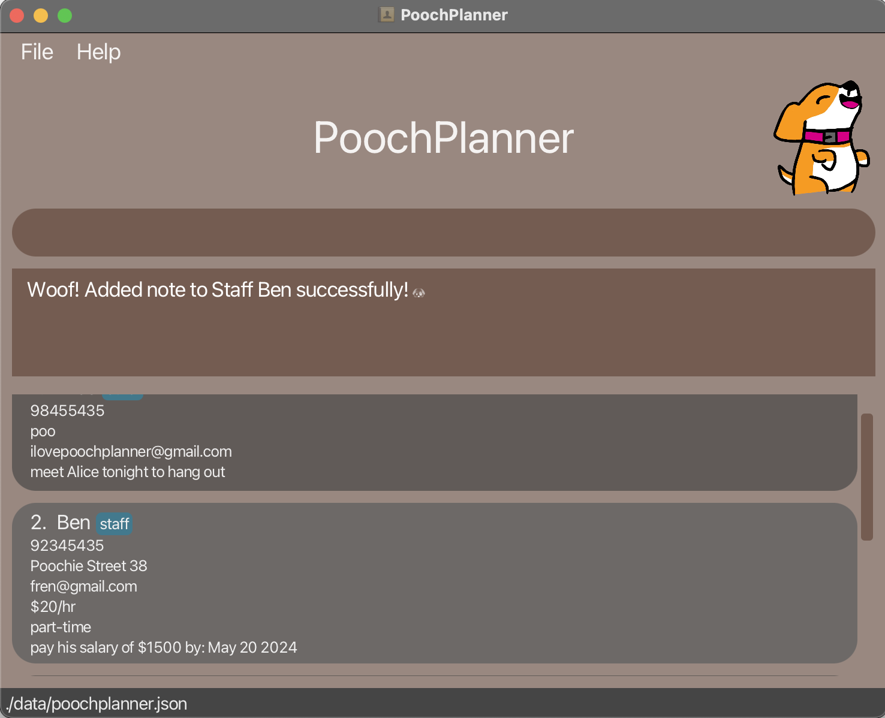
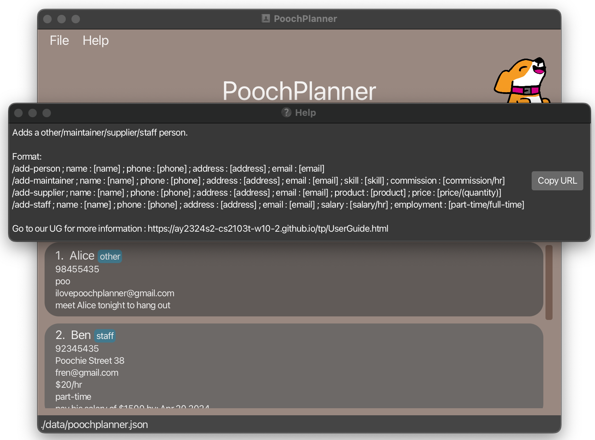

<div style="text-align:center;">
    <br>
    
    <br>
</div>

## Welcome to PoochPlanner

**PoochPlanner** is the quintessential address book crafted exclusively for ***dog cafe owners***. We understand the unique challenges you face, which is why PoochPlanner comes packed with features designed specifically to simplify contact management for dog cafe owners like you.

By seamlessly combining the efficiency of a Command Line Interface (CLI) with the intuitive interface of a Graphical User Interface (GUI), PoochPlanner empowers you to effortlessly complete your contact management tasks two times faster than traditional GUI applications.

Get started by following the steps in this user guide! Experience the difference today with PoochPlanner—the ultimate solution tailored to your needs.

## Table of Contents

* Table of Contents
{:toc}

--------------------------------------------------------------------------------------------------------------------
## Introducing PoochPlanner
PoochPlanner is your go-to address book, tailor-made for dog cafe owners like you. With four main contact types—**person, staff, supplier, maintainer**—each equipped with its own set of attributes and functions, managing your contacts has never been easier.

Contact | Definition and Examples
--------|------------------
Person | Any persons that do not hold a special relationship.<br> E.g. Neighbours, Work Friends.
Staff | Any full-time or part-time employees that do not do any specialised work.<br> E.g. Waiters, Waitresses, Dishwashers.
Supplier | Add logistics partner that supplies stocks for your dog cafe.<br> E.g. Kibbles Supplier, Coffee Beans Supplier.
Maintainer | Any externally hired specialised persons who take care of the dogs.<br> E.g. Dog Groomers, Vet.


But our commitment to improving your contact management experience doesn't end there. In addition to the essential functionalities like adding, searching, editing, deleting, undoing, and redoing, **PoochPlanner** comes loaded with extra features. You can now pin important contacts, jot down notes, set reminders, and even rate your contacts - all to ensure a seamless and efficient workflow tailored to your needs.


Feature | Purpose
--------|------------------
Pin | Pin all your important contacts so that you can easily access frequent contacts.
Note | Add additional information so that you can easily view all contact details.
Remind | Add any reminders to a contact so that you will never miss out any tasks.
Rating | Rate any of the contacts so that you can easily track their performance.

## Navigating this User Guide
This user guide is designed to help you make the most of PoochPlanner, whether you are a beginner or an experienced user.

To get started with PoochPlanner, head over to **[Quick Start](https://github.com/AY2324S2-CS2103T-W10-2/tp/blob/master/docs/UserGuide.md#quick-start)** for easy-to-follow instructions on downloading PoochPlanner.
- If you are a new user, explore the following sections to familiarise yourself with the basics:<br>
    1. **[Navigating the GUI](https://ay2324s2-cs2103t-w10-2.github.io/tp/UserGuide.html#navigating-the-gui)** : Learn about the command box and contact cards.<br>
    2. **[Features](https://ay2324s2-cs2103t-w10-2.github.io/tp/UserGuide.html#features)** : Discover the exciting features waiting for you.<br>
- If you are an advanced user, dive into our special features to further enhance your experience:
    1. **[Rate](https://ay2324s2-cs2103t-w10-2.github.io/tp/UserGuide.html#rating-a-contact--rate)** : Give performance rating to your contacts. <br>
    2. **[Pin](https://ay2324s2-cs2103t-w10-2.github.io/tp/UserGuide.html#pinning-a-contact--pin)** & **[Unpin](https://ay2324s2-cs2103t-w10-2.github.io/tp/UserGuide.html#unpinning-a-contact--unpin)** : Keep your frequent contacts accessible. <br>
    3. **[Sort](https://ay2324s2-cs2103t-w10-2.github.io/tp/UserGuide.html#sorting-the-address-book--sort)** : Organise your contacts based on your preferences.<br>
    4. **[Note](https://ay2324s2-cs2103t-w10-2.github.io/tp/UserGuide.html#adding-a-note--note)** : Add notes to your contacts.<br>

Check out our **[Command Summary](https://ay2324s2-cs2103t-w10-2.github.io/tp/UserGuide.html#command-summary)** for a quick reference to all available commands.

Encountering issues or have questions about PoochPlanner? Check out our **[FAQ](https://github.com/AY2324S2-CS2103T-W10-2/tp/blob/master/docs/UserGuide.md#faq)** for helpful troubleshooting tips and answers to common queries.


## Useful Notations and Glossary

While exploring PoochPlanner’s features with this user guide, you take note of these symbols used and what they represent.

Symbol | Meaning
--------|------------------
:information_source: | Important Information
:exclamation: | Warning or Caution
:bulb: | Additional Information such as Tips or Notes
:x: | Error Handling or Incorrect Action

The following glossary table provides clarification on commonly-used terms as well as terminology that is possibly unknown to you.

Abbreviation/Nomenclature | Meaning
--------|------------------
GUI | GUI stands for Graphical User Interface and it represents the visual display of PoochPlanner that you can see when the application is run.
GUI Component | A subsection of the GUI. For more information on specific GUI components, refer to this [section](#navigating-the-gui).
CLI | CLI stands for Command Line Interface and it represents a text-based user interface to interact with the application.
Command | An input from the user that tells PoochPlanner to perform an action. View PoochPlanner’s [Command Summary](#command-summary).
Prefix | Prefixes are like fields in a form you are required to fill up. They are information needed to be passed together with the command so that it can be executed. View PoochPlanner’s [Prefix Summary](#prefix-summary).
Case-Sensitive | The casing of the alphabetic characters matters (e.g. “good” is different from “GOOD”).
Case-Insensitive | The casing of the alphabetic characters does not matter (e.g. “good” is taken to be equal to “GOOD”).


## Quick start

1. Ensure you have Java `11` or above installed in your Computer.

1. Download the latest `poochplanner.jar` from [here](https://github.com/AY2324S2-CS2103T-W10-2/tp/releases).

1. Copy the file to the folder you want to use as the _home folder_ for your PoochPlanner.

1. Open a command terminal, `cd` into the folder you put the jar file in, and use the `java -jar poochplanner.jar` command to run the application.<br>
   A GUI similar to the below should appear in a few seconds. Note how the app contains some sample data.<br>
   

1. Type the command in the command box and press Enter to execute it. e.g. typing **`/help`** and pressing Enter will open the help window.<br>
   Some example commands you can try:

   * `/add-staff ; name : Poochie ; phone : 98765435 ; address : Poochie Street 21 ; email : ilovecatstoo@gmail.com ; salary : $50/hr ; employment : part-time`  : Adds a staff contact named `Poochie` to the Pooch Planner.

   * `/add-supplier ; name : PetCo ; phone : 98673098 ; address : Meow Street 24 ; email : ilovewombatstoo@gmail.com ; product : kibble ; price : $98/bag`  : Adds a supplier contact named `PetCo` to the Pooch Planner.

   * `/add-maintenance ; name : Tom Tan  ; phone : 98765435 ; address : Poochie Street 24 ; email : ihelppooches@gmail.com ; skill : trainer ; commission : $60/hr`  : Adds a helper contact named `Tom Tan` to the Pooch Planner.

   * `/delete ; name : Poochie` : Deletes the contact with associated contact name.

   * `/exit` : Exits the app.

1. Refer to the [Features](#features) below for details of each command.

--------------------------------------------------------------------------------------------------------------------

## Navigating the GUI

PoochPlanner has a Graphical User Interface (GUI) that gives our users a pleasant visual experience.
Here's a quick look at the different parts of our GUI and some tips on how to use it.

### Basic Orientation


### Contact Card


<div style="page-break-after: always;"></div>

--------------------------------------------------------------------------------------------------------------------

## Features

### Core Features

<div markdown="block" class="alert alert-info">

**:information_source: Notes about the command format:**<br>

* Words in `[parameter name]` are the parameters to be supplied by the user.<br>
  For example, `/add-staff ; name : [name]`, `[name]` is a parameter to be supplied by the user.
  The actual command that the user inputs can be `/add-staff ; name : Poochie`.

* Parameters can be in any order.<br>
  e.g. if the command specifies `address : [address] ; phone : [phone]`, `phone : [phone] ; address : [address]` is also acceptable.

* All command words are case-sensitive.<br>
  e.g. if the command word specifies `/add`, then `/ADD` is invalid.

* If you are using a PDF version of this document, be careful when copying and pasting commands that span multiple lines as space characters surrounding line-breaks may be omitted when copied over to the application.
</div>

#### Adding a contact: `add`

Adds a **person / staff / supplier / maintainer** contact to PoochPlanner to consistently update your planner with new contacts.

The table below summarises the add command, format and examples for each contact type.

| Adds a ...       | Format & Examples                                                                                                                                                                                                                                                                                                                                                                                                                                                                                                                                                                                     |
|------------------|-------------------------------------------------------------------------------------------------------------------------------------------------------------------------------------------------------------------------------------------------------------------------------------------------------------------------------------------------------------------------------------------------------------------------------------------------------------------------------------------------------------------------------------------------------------------------------------------------------|
| **Person**       | Format :<br>`/add-person ; name : [name] ; phone : [phone] ; address : [address] ; email : [email]` <br> <br> Example: <br>`/add-person ; name : Janna  ; phone : 98765435 ; address : Poochie Street 24 ; email : ihelppooches@gmail.com`<br> The above command adds a Person. Person's name is **_Janna_**, phone number is **_98765435_**, address is **_Poochie Street 24_**, and email is **_ihelppooches@gmail.com_**.                                                                                                                                                                          |
| **Staff**        | Format : <br>`/add-staff ; name : [name] ; phone : [phone] ; address : [address] ; email : [email] ; salary : [salary/hr]  ; employment : [part/full]` <br> <br> Example: <br>`/add-staff ; name : Poochie ; phone : 98765435 ; address : Poochie Street 21 ; email : ilovecatstoo@gmail.com ; salary : $50/hr ; employment : part-time`<br> The above command adds a Staff. Staff's name is **_Poochie_**, phone number is **_98765435_**, address is **_Poochie Street 21_**, email is **_ilovecatstoo@gmail.com_**, salary is **_$50/hr_**, and employment is **_part-time_**.                     |
| **Supplier**     | Format : <br>`/add-supplier ; name : [name] ; phone : [phone] ; address : [address] ; email : [email] ; product : [product] ; price : [price/(quantity)]` <br> <br> Example: <br>`/add-supplier ; name : PetCo ; phone : 98673098 ; address : Meow Street 24 ; email : ilovewombatstoo@gmail.com ; product : kibble ; price : $98/bag`<br> The above command adds a Supplier. Supplier's name is **_Petco_**, phone number is **_98673098_**, address is **_Meow Street 24_**, and email is **_ilovewombatstoo@gmail.com_**, product is **_kibble_**, and price of product is **_$98/bag_**.          |
| **Maintainer**   | Format : <br>`/add-maintainer ; name : [name] ; phone : [phone] ; address : [address] ; email : [email] ; skill : [skill] ; commission : [commission/hr]` <br> <br> Example: <br>`/add-maintainer ; name : Tom Tan  ; phone : 98765435 ; address : Poochie Street 24 ; email : ihelppooches@gmail.com ; skill : trainer ; commission : $60/hr`<br> The above command adds a Maintainer. Maintainer's name is **_Tom Tan_**, phone number is **_98765435_**, address is **_Poochie Street 24_**, and email is **_ihelppooches@gmail.com_**, skill is **_trainer_** and commission is **_$60/hr_**.     |

<br> 

<div style="text-align:center;">
    <br>
    
    <medium>Input: `/add-person ; name : Janna ; phone : 98765435 ; address : Poochie Street 24 ; email : ihelppooches@gmail.com` </medium>
    <br>
    <medium>Output: Adds a contact named `Janna` to the contact list. </medium>
    <br>
</div>

<br> 

<div markdown="span" class="alert alert-warning">:exclamation: **Constraints:**<br>

* Adding duplicate name will not be allowed.<br>

* Name is case-insensitive but space-sensitive.<br>

* Phone number must be in format {Number} and at least 3 digits long. 

* Only one phone number is allowed to be inserted. <br>

* Salary and commission must be in format ${Number}/hr.<br>

* Price must be in format ${Number}/{quantity}.<br>
</div>

<div markdown="span" class="alert alert-primary">:bulb: **Tips:**<br>

* You can undo an add command to revert your changes!<br>

</div>


#### Editing a contact : `edit`

Edits a **person / staff / supplier / maintainer** contact in the Pooch Planner so that you can consistently modify and update your contacts with new details.

The table below summarises the edit command, format and examples for each contact type.

| Edits a ...    | Format & Examples                                                                                                                                                                                                                                                                                                                                                                                                                      |
|----------------|----------------------------------------------------------------------------------------------------------------------------------------------------------------------------------------------------------------------------------------------------------------------------------------------------------------------------------------------------------------------------------------------------------------------------------------|
| **Person**     | Format : <br>`/edit-person ; name : [name] ; field : { phone : [phone] ; address : [address] ; email : [email] }` <br><br> Example:<br> `/edit-person ; name : Mochie ; field : { address : Pooch Street 31}`<br> The above command edits the **address** field of **_Mochie_** to **_Pooch Street 31_**.                                                                                                                                     |
| **Staff**      | Format : <br>`/edit-staff ; name : [name] ; field : { phone : [phone] ; address : [address] ; email : [email] ; salary : [salary]  ; employment : [part/full] }` <br><br> Example: <br>`/edit-staff ; name : Thomas ; field : { address : Poochie Street 25 ; employment : full-time }` <br> The above command edits the **address and employment** field of **_Thomas_** to **_Poochie Street 25_** and **_full-time_** respectively. |
| **Supplier**   | Format : <br>`/edit-supplier ; name : [name] ; field : { phone : [phone] ; address : [address] ; email : [email] ; product : [product] ; price : [price] }` <br><br> Example: <br>`/edit-supplier ; name : Supplier1 ; field : { product : kibble ; price : $75/bag}` <br>The above command edits the **product and price** field of **_Supplier1_** to **_kibble_** and **_$75/bag_** respectively.                                   |
| **Maintainer** | Format : <br>`/edit-maintainer ; name : [name] ; field : { phone : [phone] ; address : [address] ; email : [email] ; skill : [skill] ; commission : [commission] }` <br><br> Example: <br>`/edit-maintainer ; name : Maintainer1 ; field : { commission : $10/hr}`<br>The above command edits the **commission** field of **_Maintainer1_** to **_$10/hr_**.                                                                           |

<br> 

<div style="text-align:center;">
    <br>
    
    <medium>Input: `/edit-person ; name : Janna ; field : { address : Pooch Street 31 }` </medium>
    <br>
    <medium>Output: Edits the address field of the contact named `Janna` in the contact list. </medium>
    <br>
</div>

<br> 

<div markdown="span" class="alert alert-warning">:exclamation: **Constraints:**<br>

* Name is a compulsory field that is case-insensitive but space-sensitive.<br>

* Name must be present in Pooch Planner.<br>

* Contact type, i.e. Person / Staff / Supplier / Maintainer, must match command used. i.e. `/edit`, `/edit-staff`, `/edit-supplier` and `/edit-maintainer` respectively.<br>

* The field(s) to be edited must be a valid field within their contact type, i.e. Person / Staff / Supplier / Maintainer.<br>

* At least one field must be provided.<br>

* Salary and commission must be in format ${Number}/hr.<br>

* Price must be in format ${Number}/{quantity}.<br>
</div>

<div markdown="span" class="alert alert-primary">:bulb: **Tips:**<br>

* You can edit multiple fields at the same time to save time!<br>

</div>

#### Searching a contact : `search`

Filters a **person / staff / supplier / maintainer** contact in PoochPlanner so that you can locate your contacts more easily.

Format: <br>
`/search ; [target-field] : [value]`

Examples: <br>
* `/search ; phone : 98765432`

  The above command searches for all contacts with phone number **_98765432_**.


* `/search ; salary : $50/hr`

  The above command searches for all staff with salary **_$50 per hour_**.


* `/search ; name : Poochie ; phone : 98765432`

  The above command searches for all contacts with name **_Poochie_** and phone number **_98765432_**.

<br> 

<div style="text-align:center;">
    <br>
    
    <medium>Input: `/search ; name : Tom` </medium>
    <br>
    <medium>Output: Finds all contacts named `Tom` in the contact list. </medium>
    <br>
</div>

<br> 


<div markdown="span" class="alert alert-warning">:exclamation: **Constraints:**<br>

* Any valid fields, such as `name`, `phone`, `address`, `email`, `salary`, `employment`, `price`, `product`, `skill`, `commission`, `tag` or `note`, can be provided.<br>

* Only one field can be provided.<br>

* Query is case-insensitive but space-sensitive.<br>
</div>

<div markdown="span" class="alert alert-primary">:bulb: **Tips:**<br>

* You can use `/list` to see the full list again after searching for a contact! <br>

</div>

#### Deleting a contact : `delete`

Deletes a **person / staff / supplier / maintainer** contact from the Pooch Planner so that you can remove outdated contacts.

Format: <br>
`/delete ; name : [value]`

Example: <br> 
* `/delete ; name : Poochie`

  The above command deletes the contact named `Poochie`, provided `Poochie` exists in the contact list.

<br> 

<div style="text-align:center;">
    <br>
    
    <medium>Input: `/delete ; name : Janna` </medium>
    <br>
    <medium>Output: Delete the contact named `Janna` in the contact list. </medium>
    <br>
</div>

<br> 

<div markdown="span" class="alert alert-warning">:exclamation: **Constraints:**<br>

* Name is a compulsory field that is **case-insensitive** but **space-sensitive**.<br>

* Name must be present in Pooch Planner.<br>
</div>

### Special Features

#### Rating a Contact : `rate`

Gives a **person / staff / supplier / maintainer** contact from the Pooch Planner a performance rating so that cafe owners can track the performance of their contacts.

Format: <br>
`/rate ; name : [name] ; rating : [rating value from 1-5]`

Example:
* `/rate ; name : Poochie ; rating : 3`

  The above command rates the contact named `Poochie` with a rating of `3`, provided `Poochie` exists in the contact list.

<br> 

<div style="text-align:center;">
    <br>
    
    <medium>Input: `/rate ; name : Janna ; rating : 5` </medium>
    <br>
    <medium>Output: Rate the contact named `Janna` 5 in the contact list. </medium>
    <br>
</div>

<br> 

<div markdown="span" class="alert alert-warning">:exclamation: **Constraints:**<br>

* Rating can only accept whole number values from 1 to 5 inclusive.<br>

* Name must be present in Pooch Planner.<br>

* Name and Rating is a compulsory field that is **case-insensitive** but **space-sensitive**.<br>

* Rating of 0 will automatically display `No rating given yet`.<br>

</div>

<div markdown="span" class="alert alert-primary">:bulb: **Tips:**<br>

* You can set rating to '0' to reset the rating! <br>

</div>

#### Pinning a contact : `pin`

Pins the specified contact on Pooch Planner so that your important contacts will consistently appear at the top on the contact list.

Format: <br>
`/pin ; name : [name]`

Example: <br>
* `/pin ; name : Poochie`

  The above command pins the contact named `Poochie`, provided `Poochie` exists in the contact list.

<br> 

<div style="text-align:center;">
    <br>
    
    <medium>Input: `/pin ; name : Tom` </medium>
    <br>
    <medium>Output: Pins the contact named `Tom` in the contact list. </medium>
    <br>
</div>

<br> 


<div markdown="span" class="alert alert-warning">:exclamation: **Constraints:**<br>

* Name is a compulsory field that is case-insensitive but space-sensitive.<br>

* Name must be present in Pooch Planner.<br>

* Using pin command on a contact that has been pinned do not make any changes to Pooch Planner.<br>
</div>

<div markdown="span" class="alert alert-primary">:bulb: **Tips:**<br>

* Use the pin command for your frequently contacted addresses! <br>

</div>

#### Unpinning a contact : `unpin`

Unpins the specified contact on Pooch Planner so that your less important contacts can be removed from the top on the contact list.

Format: <br>
`/unpin ; name : [name]`

Example: <br>
* `/unpin ; name : Poochie`

  The above command unpins the contact named `Poochie`, provided `Poochie` exists and is pinned in the contact list.

<br> 

<div style="text-align:center;">
    <br>
    
    <medium>Input: `/unpin ; name : Tom` </medium>
    <br>
    <medium>Output: Unpins the contact named `Tom` in the contact list. </medium>
    <br>
</div>

<br> 

<div markdown="span" class="alert alert-warning">:exclamation: **Constraints:**<br>

* Name is a compulsory field that is case-insensitive but space-sensitive.<br>

* Name must be present in Pooch Planner.<br>

* Using unpin command on a contact that has been unpinned do not make any changes to Pooch Planner.<br>
</div>

#### Sorting the address book : `sort`

Sorts the address book by a target field in ascending order so that you can display your contacts neatly and locate them easily.

Format: <br>
`/sort ; field : [target-field]`

Example: <br>
* `/sort ; field : name`

  The above command sorts the contacts by name in lexicographical order.

<br> 

<div style="text-align:center;">
    <br>
    
    <medium>Input: `/sort ; field : name` </medium>
    <br>
    <medium>Output: Sorts all contacts by name in lexicographical order. </medium>
    <br>
</div>

<br> 


<div markdown="span" class="alert alert-warning">:exclamation: **Constraints:**<br>

* This command sorts the contacts in the address book in ascending lexicographical order (e.g. Alice, Bob, Charlie etc.).<br>

* Sorts by specifying a valid field, such as `name`, `phone`, `email`, `address`, `salary`, `employment`, `price`, `product`, `skill`, `commission`, `tag` or `note`.<br>

* All field input are case-insensitive.<br>
</div>

#### Adding a note : `note`

Adds a note to a specified person from the Pooch Planner so that you can keep track of any details regarding the contact.
You can specify an optional deadline for the note.

Formats: <br>
`/note ; name : [name] ; note : [note message]`
`/note ; name : [name] ; note : [note message] ; deadline : [date]`

Examples: <br>
* `/note ; name : Moochie ; note : get 10kg of matcha from moochie`

  The above command adds the note "get 10kg of matcha from moochie" to the contact with name **_Moochie_**.


* `/note ; name : Moochie ; note : get 10kg of matcha from moochie ; deadline : 2020-10-10`

  The above command adds the note "get 10kg of matcha from moochie" to the contact with name **_Moochie_**.
  It also sets a deadline of the note to Nov 10 2020.

<br> 

<div style="text-align:center;">
    <br>
    
    <medium>Input: `/note ; name : Ben ; note : pay his salary of $1500 ; deadline : 2024-04-10` </medium>
    <br>
    <medium>Output: Add a note with a deadline to the contact named `Ben` in the contact list.</medium>
    <br>
</div>

<br> 

<div markdown="span" class="alert alert-warning">:exclamation: **Constraints:**<br>

* Name and Note are compulsory fields that are case-insensitive but space-sensitive.<br>

* Name must be present in Pooch Planner.<br>

</div>

<div markdown="span" class="alert alert-primary">:bulb: **Tips:**<br>

* Notes added are intended to be short details! <br>
* To remove a note, specify in the note field "No note here". This note is case-sensitive.

</div>


<div markdown="span" class="alert alert-danger">:x: **Error Handling:**<br>

* If you receive the error message "Failed to add note to Pooch Contact - Name is not specified 🐾",
  ensure you have specified a name in the name field. <br>
* If you receive the error message "Failed to add note to Pooch Contact - Name does not exist in our address book 🐾",
  ensure you have specified a name of a contact that is already exists in the planner. <br>
* If you receive the error message "Failed to add note to Pooch Contact - Note is not specified 🐾",
  ensure you have specified a name of a non-empty note in the note field.
* If you receive the error message "Failed to add note to Pooch Contact - Deadline is not specified 🐾",
  ensure you have specified a deadline in the deadline field.
* If you receive the error message "Date must be in the format yyyy-mm-dd (e.g., 2019-10-15)",
  ensure you have specified a deadline in the correct format as stated in the error message.

</div>

#### Undoing a command : `undo`

Undoes the most recent action so that you can revert back changes easily.

Format: <br>
`/undo`

Example:
* `/undo`

    The above command undoes the most recent command.

<br> 

<div style="text-align:center;">
    <br>
    
    <medium>Input: `/add-person ; name : Tom ; phone : 99983932 ; address : Poochie Street 20 ; email : icleanpooches@gmail.com` </medium>
    <br>
    <medium>Output: Adds a contact named `Tom` to the contact list.</medium>
    <br>
</div>

<br> 

<br> 

<div style="text-align:center;">
    <br>
    
    <medium>Input: `/undo` </medium>
    <br>
    <medium>Output: Undo the add command above for the contact named `Tom`.</medium>
    <br>
</div>

<br> 

<div markdown="span" class="alert alert-warning">:exclamation: **Constraints:**<br>

* There is no field required for this command.<br>

* Any unnecessary parameter or value after /undo will simply be ignored.<br>

* This command can only be executed when at least one changes have been made.<br>
</div>

<div markdown="span" class="alert alert-primary">:bulb: **Tips:**<br>

* `Undo` works on all commands that modified the address book.
* `Undo` will not work on commands that do not modify the address book such as `Search`, `List` and `Help` commands! <br>

</div>

#### Redoing a command : `redo`

Redoes an action so that you can reverse the unintentional uses of the undo command.

Format: <br>
`/redo`

Example: <br>
* `/redo`

  The above command redoes the most recent undo command.

<br> 

<div style="text-align:center;">
    <br>
    
    <medium>Input: `/undo` </medium>
    <br>
    <medium>Output: Undo the add command for the contact named `Tom`.</medium>
    <br>
</div>

<br> 

<br> 

<div style="text-align:center;">
    <br>
    
    <medium>Input: `/redo` </medium>
    <br>
    <medium>Output: Redo the add command for the contact named `Tom`.</medium>
    <br>
</div>

<br> 

<div markdown="span" class="alert alert-warning">:exclamation: **Constraints:**<br>

* There is no field required for this command.<br>

* Any unnecessary parameter or value after /redo will simply be ignored.<br>

* This command can only be executed when at least one undo command is executed.<br>

</div>

<div markdown="span" class="alert alert-primary">:bulb: **Tips:**<br>

* `Redo` works on all commands that modified the address book.
* `Redo` will not work on commands that do not modify the address book such as `Search`, `List` and `Help` commands! <br>

</div>

#### Viewing help : `help`

Shows a help message of how to use commands so that you can get help regarding the commands easily.

Format: <br>
`/help ; command : [command type]`
<br>
Examples: <br>
* `/help ; command : delete`
  <br>
  The above command gives help for delete command.

* `/help ; command : add`
  <br>
  The above command gives help for add command.

<br> 

<div style="text-align:center;">
    <br>
    
    <medium>Input: `/help ; command : add` </medium>
    <br>
    <medium>Output: Shows a pop-up help window for add command.</medium>
    <br>
</div>

<br> 

<div markdown="span" class="alert alert-warning">:exclamation: **Constraints:**<br>

* Command must be specified.<br>

* Help is given for all commands. Valid command inputs include general, add, clear, delete, edit,
  exit, list, note, pin, unpin, undo, redo, rate, remind, search, sort.
</div>

<div markdown="span" class="alert alert-primary">:bulb: **Tips:**<br>

* If you wish to get help for all commands, enter the command input as general to be directed to a general help window.<br>

</div>

<div markdown="span" class="alert alert-danger">:x: **Error Handling:**<br>

* If you receive the error message "Failed to give help - Help requires a command field. 🐾",
  ensure you have specified a valid command in the command field <br>

</div>

#### Viewing reminders : `remind`

Shows all contacts with note deadlines from today onwards so that you can view all your coming deadlines easily.

Format: <br>
`/remind`
<br>
Example: <br>
* `/remind`
  <br>
  The above command displays all contacts with note deadlines from today onwards.

<br> 

<div style="text-align:center;">
    <br>
    
    <medium>Input: `/remind` </medium>
    <br>
    <medium>Output: Shows all contacts with reminders from the contact list.</medium>
    <br>
</div>

<br> 

<div markdown="span" class="alert alert-primary">:bulb: **Tips:**<br>

* Specifying '/remind [any text]' is equivalent to '/remind'.<br>
* To return back to full contact list, use the command '/list'.

</div>

#### Clearing contacts : `clear`

Clears all contacts in contact list so that you can delete all contacts easily.

Format: <br>
`/clear`
<br>
Example: <br>
* `/clear`
  <br>
  The above command clears all contacts in the contact list.

<br> 

<div style="text-align:center;">
    <br>
    
    <medium>Input: `/clear` </medium>
    <br>
    <medium>Output: Clears all contacts from the contact list.</medium>
    <br>
</div>

<br> 

<div markdown="span" class="alert alert-primary">:bulb: **Tips:**<br>

* To return back to full contact list, use the command '/undo'.

</div>

#### Listing contacts : `list`

Lists all contacts in contact list so that you can view all contacts at once.

Format: <br>
`/list`
<br>
Example: <br>
* `/list`
  <br>
  The above command lists all contacts in the contact list.

<br> 

<div style="text-align:center;">
    <br>
    
    <medium>Input: `/list` </medium>
    <br>
    <medium>Output: Lists all contacts from the contact list.</medium>
    <br>
</div>

<br> 

<div markdown="span" class="alert alert-primary">:bulb: **Tips:**<br>

* To go back to full contact list after using any filtering commands, i.e. `search`, use the command '/list'.

</div>


### Exiting the program : `exit`

Exits the program.

Format: `/exit`

### Saving the data

Pooch Planner data are saved in the hard disk automatically after any command that changes the data. There is no need to save manually.

### Editing the data file

Pooch Planner data are saved automatically as a JSON file `[JAR file location]/data/PoochPlanner.json`. Advanced users are welcome to update data directly by editing that data file.

<div markdown="span" class="alert alert-warning">:exclamation: **Caution:**<br>

If your changes to the data file makes its format invalid, PoochPlanner will discard all data and start with an empty data file at the next run. Hence, it is recommended to take a backup of the file before editing it.<br>
Furthermore, certain edits can cause the PoochPlanner to behave in unexpected ways (e.g., if a value entered is outside of the acceptable range). Therefore, edit the data file only if you are confident that you can update it correctly.
</div>


### Archiving data files `[coming in v2.0]`

_Details coming soon ..._

--------------------------------------------------------------------------------------------------------------------

## Common Errors

### Unknown Command


Image depicting unkown command error

Key in only valid commands as mentioned in this User Guide (eg. `/add`, `/edit`, etc.)

### Invalid Field


Image depicting invalid field error

Key in only valid field parameters within the command (e.g. `name`, `phone`, `email` etc.)

### Incorrect formatting


Image depicting incorrect phone formatting error


Image depicting incorrect salary formatting error

To fix the formatting errors, key in the appropiate syntax based on the error message

Examples:
- `Phone` field accepts only numbers that are at least 3 digits long
- `Salary` field must follow the format `$___/hr`

--------------------------------------------------------------------------------------------------------------------

## FAQ

### Launching PoochPlanner

**Q**: How can I launch PoochPlanner if clicking on the JAR file does not work?<br>
**A**: There are two possible methods to launch PoochPlanner.

**Method 1**: Using the Command Line
1. Open the command line in your operating system's terminal software.
2. Navigate to the directory where the JAR file is located.
3. Enter `java -jar PoochPlanner.jar` and the PoochPlanner Application should launch.

**Method 2**: Using `.bat/.sh` Scripts
1. Create a new text file and paste the following line into the file:
   ```
   java -jar [JAR file location]/PoochPlanner.jar
   ```
2. Save the file as `PoochPlanner.bat` (Windows) or `PoochPlanner.sh` (macOS/Linux).
3. Change the admin settings of the script to allow it to run as a program:
   - Windows: Right-click on the script and select Properties. Under General, check the box that says `Allow this file to run as a program`.
   - macOS/Linux: Open the Terminal and navigate to the directory where the script is located. Type `chmod +x [script name]` and press `Enter`.<br>Note: (`chmod +x` changes permissions of the script to allow it to be executed)
4. Double-click on the script to launch PoochPlanner.

### Checking Java Version

**Q**: How can I check my Java version?<br>
**A**: Open a command line and type `java -version`. If you do not have Java installed, you can install Java 11 using the Oracle guide [here](https://www.oracle.com/java/technologies/downloads/#java11). Alternatively, you can install the OpenJDK version. For macOS users, you may wish to follow the instructions [here](https://nus-cs2103-ay2324s1.github.io/website/admin/programmingLanguages.html).

### Loading Data from Another Computer

**Q**: How can I transfer my PoochContacts to another Computer?<br>
**A**: Install PoochPlanner in your target computer and overwrite the empty data file it creates with the file that contains the data of your previous PoochPlanner home folder by copying the contents of the `PoochPlanner.json` file from your current computer and pasting it inside the `PoochPlanner.json` file of your target computer.

### Using PoochPlanner

**Q**: What are the available commands in PoochPlanner?<br>
**A**: Please refer to the [Command Summary](#command-summary) for the list of available commands.

**Q**: Do I need an internet connection to use PoochPlanner?<br>
**A**: All of PoochPlanner’s functionality can be used offline! No internet connection is required.

**Q**: How do I save my data?<br>
**A**: Data is saved in the hard disk automatically after any command that changes the data. There is no need to save manually.

**Q**: If I have a lot of PoochContacts, is there a way for me to access my most frequently used PoochContacts easily?<br>
**A**: Yes! You may wish to make use of our `pin` feature, which keeps all of your pinned contacts at the very top of your PoochContact list, ensuring that you are always able to see them!<br><br>The syntax for the `pin` command is as follows:
```
/pin ; name : [name]
```

**Q**: How can I remove a PoochContact's rating?<br>
**A**: In PoochPlanner, a `0` rating corresponds to a non-rating (no rating is provided). Therefore, to remove a PoochContact's rating, simply give the target PoochContact a rating of `0`.<br><br>The syntax for the `rate` command is as follows:
```
/rate ; name : [name] ; rating : [rating]
```

**Q**: Can I append a note to a PoochContact when creating it?<br>
**A**: Yes you can! In fact, you may also rate PoochContacts at their time of creation. Simply enter their respective [prefixes](#prefix-summary) and you should be on your way!<br><br>
Example: Adding a new contact with a note and a rating
```
/add-person ; name : Pooch ; phone : 98883888 ; address : Pooch Street 32 ; email : impooch@gmail.com ; rating : 3 ; note : Hello my name is Pooch!
```

--------------------------------------------------------------------------------------------------------------------

## Known issues

1. **When using multiple screens**, if you move the application to a secondary screen, and later switch to using only the primary screen, the GUI will open off-screen. The remedy is to delete the `preferences.json` file created by the application before running the application again.

--------------------------------------------------------------------------------------------------------------------

## Prefix Summary

A **prefix** is an integral construct of PoochPlanner's commands that allow PoochPlanner to uniquely identify contact fields.

| Prefix           | Field                                                       | Contact Type   |
|------------------|-------------------------------------------------------------|----------------|
| `; name :`       | Specifies the name of the PoochContact                      | All            |
| `; phone :`      | Specifies the phone number of the PoochContact              | All            |
| `; address :`    | Specifies the addresss of the PoochContact                  | All            |
| `; email :`      | Specifies the email address of the PoochContact             | All            |
| `; note :`       | Specifies the note appended to the PoochContact             | All            |
| `; rating :`     | Specifies the rating given to the PoochContact              | All            |
| `; deadline :`   | Specifies the deadline of note appended to the PoochContact | All            |
| `; command :`    | Specifies the command type to give help for                 | All            |
| `; salary :`     | Specifies the salary of the PoochContact                    | Staff          |
| `; employment :` | Specifies the employment of the PoochContact                | Staff          |
| `; product :`    | Specifies the product sold by the PoochContact              | Supplier       |
| `; price :`      | Specifies the price charged by the PoochContact             | Supplier       |
| `; skill :`      | Specifies the type of service offered by the PoochContact   | Maintainer     |
| `; commission :` | Specifies the commission charged by the PoochContact        | Maintainer     |

## Command Summary

| Action                   | Format and Example                                                                                                                                                                                                                                                                                                                            |
|--------------------------|-----------------------------------------------------------------------------------------------------------------------------------------------------------------------------------------------------------------------------------------------------------------------------------------------------------------------------------------------|
| **Add General Contact**  | Format : <br>`/add-person ; name : [name] ; phone : [phone] ; address : [address] ; email : [email] ; skill : [skill] ; commission : [commission]`     <br> <br> Example : <br> `/add-person ; name : Janna  ; phone : 98765435 ; address : Poochie Street 24 ; email : iamjanna@gmail.com`                                                   |
| **Add Staff**            | Format : <br>`/add-staff ; name : [name] ; phone : [phone] ; address : [address] ; email : [email] ; salary : [salary]  ; employment : [part/full]`    <br> <br> Example : <br> `/add-staff ; name : Poochie ; phone : 98765435 ; address : Poochie Street 21 ; email : ilovecatstoo@gmail.com ; salary : $50/hr ; employment : part-time`    |
| **Add Supplier**         | Format : <br> `/add-supplier ; name : [name] ; phone : [phone] ; address : [address] ; email : [email] ; product : [product] ; price : [price]`        <br> <br> Example : <br> `/add-supplier ; name : PetCo ; phone : 98673098 ; address : Meow Street 24 ; email : ilovewombatstoo@gmail.com ; product : kibble ; price : $98/bag`         |
| **Add Maintainer**       | Format : <br>`/add-maintainer ; name : [name] ; phone : [phone] ; address : [address] ; email : [email] ; skill : [skill] ; commission : [commission]` <br> <br> Example : <br> `/add-maintainer ; name : Tom Tan  ; phone : 98765435 ; address : Poochie Street 24 ; email : ihelppooches@gmail.com ; skill : trainer ; commission : $60/hr` |
| **Edit General Contact** | Format : <br>`/edit-person ; name : [name] ; field : { target-field : [value] }`                                                                       <br> <br> Example : <br> `/edit-person ; name : Poochie ; field : { address : Poochie Street 25 }`                                                                                     |
| **Edit Staff**           | Format : <br>`/edit-staff ; name : [name] ; field : { target-field : [value] }`                                                                        <br> <br> Example : <br> `/edit-staff ; name : Poochie ; field : { salary : $40/hr ; employment : part-time }`                                                                         |
| **Edit Supplier**        | Format : <br>`/edit-supplier ; name : [name] ; field : { target-field : [value] }`                                                                     <br> <br> Example : <br> `/edit-supplier ; name : Poochie ; field : { product : kibble ; price : $75/bag }`                                                                            |
| **Edit Maintainer**      | Format : <br>`/edit-maintainer ; name : [name] ; field : { target-field : [value] }`                                                                   <br> <br> Example : <br> `/edit-maintainer ; name : Poochie ; field : { commission : $10/hr }`                                                                                         |
| **Delete**               | Format : <br>`/delete name : [name] `                                                                                                                  <br> <br> Example : <br> `/delete ; name : Poochie`                                                                                                                                    |
| **Search**               | Format : <br>`/search ; target-field : [value]`                                                                                                        <br> <br> Example : <br> `/search ; name : Poochie`                                                                                                                                    |
| **List**                 | Format : <br>`/list`                                                                                                                                   <br> <br> Example : <br> `/list`                                                                                                                                                       |
| **Help**                 | Format : <br>`/help ; command : [command type]`                                                                                                        <br> <br> Example : <br> `/help ; command : delete`                                                                                                                                    |
| **Rate**                 | Format : <br>`/rate ; name : [name] ; rating : [rating]`                                                                                               <br> <br> Example : <br> `/rate ; name : Poochie ; rating : 5`                                                                                                                         |
| **Undo**                 | Format : <br>`/undo`                                                                                                                                   <br> <br> Example : <br> `/undo`                                                                                                                                                       |
| **Redo**                 | Format : <br>`/redo`                                                                                                                                   <br> <br> Example : <br> `/redo`                                                                                                                                                       |
| **Pin**                  | Format : <br>`/pin ; name : [name]`                                                                                                                    <br> <br> Example : <br> `/pin ; name : Poochie`                                                                                                                                       |
| **Unpin**                | Format : <br>`/unpin ; name : [name]`                                                                                                                  <br> <br> Example : <br> `/unpin ; name : Poochie`                                                                                                                                     |
| **Sort**                 | Format : <br>`/sort ; target-field`                                                                                                                    <br> <br> Example : <br> `/sort ; name`                                                                                                                                                |
| **Note**                 | Format : <br>`/note ; name : [name] ; note : [note]` or `/note ; name : [name] ; note : [note] ; deadline : [deadline]`                                <br> <br> Example : <br> `/note ; name : Poochie ; note : get dog for groomers ; deadline : 2020-10-10`                                                                                |
| **Exit**                 | Format : <br>`exit`                                                                                                                                    <br> <br> Example : <br> `exit`                                                                                                                                                        |
