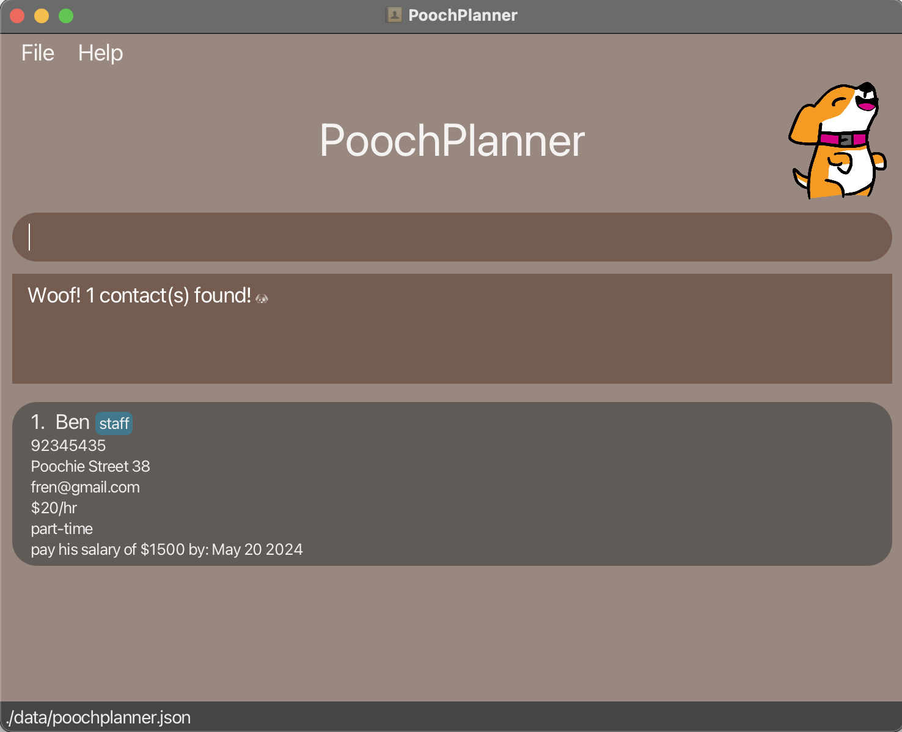

<div style="text-align:center;">
    <br>
    
    <br>
</div>

## Welcome to PoochPlanner

**PoochPlanner** is the quintessential address book, crafted exclusively for ***dog cafe owners***. We understand the unique challenges you face, which is why PoochPlanner comes packed with features designed specifically to simplify contact management for dog cafe owners like you.

By seamlessly combining the efficiency of a Command Line Interface (CLI) with an intuitive Graphical User Interface (GUI), PoochPlanner empowers you to effortlessly complete your contact management tasks two times faster than traditional GUI applications.

Get started by following the steps in this user guide! Experience the difference today with PoochPlanner — the ultimate solution tailored to your needs.

## Table of Contents

* Table of Contents
{:toc}

--------------------------------------------------------------------------------------------------------------------
## Introducing PoochPlanner
PoochPlanner is your go-to address book, tailor-made for dog cafe owners like you. With four main contact types — **person, staff, supplier, maintainer** — each equipped with its own set of attributes and functions, managing your contacts has never been easier.

Contact | Definition and Examples
--------|------------------
Person | Any persons that do not hold a special relationship.<br> E.g. neighbours, work friends
Staff | Any full-time or part-time employees.<br> E.g. waiters, waitresses, dishwashers
Supplier | Any logistics partner that supplies stock for your dog cafe.<br> E.g. kibbles suppliers, coffee beans suppliers
Maintainer | Any externally hired specialised persons who takes care of the dogs.<br> E.g. dog groomers, veterinarians


But our commitment to improving your contact management experience doesn't end there. In addition to the essential functionalities like adding contacts, searching for contacts, editing contacts, deleting contacts, viewing help menus, listing all contacts, clearing contacts lists, undoing commands, and redoing commands, **PoochPlanner** comes loaded with extra features. You can now pin important contacts, jot down notes, set reminders, rate and even sort your contacts - all to ensure a seamless and efficient workflow tailored to your needs as a busy dog cafe owner.


Feature | Purpose
--------|------------------
Pin/Unpin | Pin/Unpin contacts so that you can easily access important contacts.
Note | Add notes to contacts to keep track of any important details.
Remind | View reminders of upcoming deadlines so that you never miss a task.
Rate | Add ratings to your contacts so that you can easily track their performance.
Sort | View your contacts in a sorted list so that you can easily filter and locate your contacts.

## Navigating this User Guide
This user guide is designed to help you easily navigate the commands of PoochPlanner and make the most of this tool, whether you are a beginner or an experienced user.

- If you are eager to get started with PoochPlanner, head over to our **[Quick Start](https://ay2324s2-cs2103t-w10-2.github.io/tp/UserGuide.html#quick-start)** section for easy-to-follow instructions on downloading PoochPlanner.
- If you are a new user, explore the following sections to familiarise yourself with the basics:<br>
    1. **[Navigating the GUI](https://ay2324s2-cs2103t-w10-2.github.io/tp/UserGuide.html#navigating-the-gui)** : Learn about the inout box and contact cards.<br>
    2. **[Features](https://ay2324s2-cs2103t-w10-2.github.io/tp/UserGuide.html#features)** : Discover the exciting features waiting for you.<br>
- If you are an advanced user, dive into our special features to further enhance your experience:
    1. **[Rate](https://ay2324s2-cs2103t-w10-2.github.io/tp/UserGuide.html#rating-a-contact--rate)** : Add performance ratings to your contacts. <br>
    2. **[Pin](https://ay2324s2-cs2103t-w10-2.github.io/tp/UserGuide.html#pinning-a-contact--pin)** and **[Unpin](https://ay2324s2-cs2103t-w10-2.github.io/tp/UserGuide.html#unpinning-a-contact--unpin)** : Keep your frequent contacts accessible. <br>
    3. **[Sort](https://ay2324s2-cs2103t-w10-2.github.io/tp/UserGuide.html#sorting-the-address-book--sort)** : Organise your contacts based on your preferences.<br>
    4. **[Note](https://ay2324s2-cs2103t-w10-2.github.io/tp/UserGuide.html#adding-a-note--note)** : Add notes to your contacts.<br>
    5. **[Remind](https://ay2324s2-cs2103t-w10-2.github.io/tp/UserGuide.html#adding-a-note--note)** : View your contacts with notes containing incoming deadlines.<br>
- If you want a quick overview of our commands, check out our **[Command Summary](https://ay2324s2-cs2103t-w10-2.github.io/tp/UserGuide.html#command-summary)**.
- If you are encountering issues or have questions about PoochPlanner, Check out our **[Common Errors](https://github.com/AY2324S2-CS2103T-W10-2/tp/blob/master/docs/UserGuide.md#common-errors)** and **[FAQ](https://github.com/AY2324S2-CS2103T-W10-2/tp/blob/master/docs/UserGuide.md#faq)** for helpful troubleshooting tips and answers to common queries.


## Useful Notations and Glossary

While exploring PoochPlanner’s features with this user guide, you can take note of these symbols used and what they represent.

Symbol | Meaning
--------|------------------
:information_source: | Important information
:exclamation: | Warning or caution
:bulb: | Additional information such as tips or notes

The following glossary table provides clarification on commonly-used terminology.

Phrases | Meaning
--------|------------------
GUI | GUI stands for Graphical User Interface and it represents the visual display of PoochPlanner that you see when the application is run.
GUI component | The parts that make up a GUI. For more information on specific GUI components, refer to this [section](#navigating-the-gui).
CLI | CLI stands for Command Line Interface and it represents a text-based user interface to interact with the application.
Command | An input from the user that tells PoochPlanner to perform an action. View PoochPlanner’s [Command Summary](#command-summary).
Prefix | Prefixes are like fields in a form you are required to fill up. They capture important information that is needed to execute the command. View PoochPlanner’s [Prefix Summary](#prefix-summary).
Case-sensitive | The casing of the alphabetic characters matters (e.g. “good” is different from “GOOD”).
Case-insensitive | The casing of the alphabetic characters does not matter (e.g. “good” is taken to be equal to “GOOD”).
Space-sensitive | The number of spaces in a command matters (e.g. “happy puppy” is different from “happypuppy”).
Space-insensitive | The number of spaces in a command does not matter (e.g. “happy puppy” is taken to be equal to “happypuppy”).
Delimiter | A separator in the command input that defines the boundaries between information in a command. ";" is a delimiter for our commands.
Contact card | The box displayed for each contact, containing all their details.


## Quick start

1. Ensure that you have Java `11` installed on your computer.

2. Download the latest `poochplanner.jar` from [here](https://github.com/AY2324S2-CS2103T-W10-2/tp/releases).

3. Copy the file to the folder you want to use as the _home folder_ for your PoochPlanner.

4. Open a command terminal, and navigate to the folder where you put the jar file in.

5. Use the command `java -jar poochplanner.jar` to run the application.<br>
A GUI similar to the one below should appear in a few seconds. Note that the app does not contain sample data.<br>
   

6. Type any command into the input box and press enter to execute it.
   Some example commands you can try:

   * `/add-person ; name : Pooch  ; phone : 98765435 ; address : Poochie Street 24 ; email : iampooch@gmail.com` : Adds a general contact named `Pooch` to your PoochPlanner.

   * `/delete ; name : Pooch` : Deletes the contact named `Pooch` from your PoochPlanner.

   * `/exit` : Exits the application.

7. Refer to our [Features](#features) section below for the details of each command.

--------------------------------------------------------------------------------------------------------------------

## Navigating the GUI

PoochPlanner has a Graphical User Interface (GUI) that provides you with a pleasant visual experience.
Here is a quick look at the different GUI components and sections of the contact card.

### Basic Orientation


### Contact Card


<div style="page-break-after: always;"></div>

--------------------------------------------------------------------------------------------------------------------

## Features

### Core Features

<div markdown="block" class="alert alert-info">

**:information_source: Notes about the command format:**<br>

* Words in `[parameter name]` are the parameter values to be supplied by you.<br>
  For example, `/add-staff ; name : [name]`, `[name]` is a parameter to be supplied by you.
  For example, the actual command that you may input can be `/add-staff ; name : Poochie`.

* Parameters can be in any order.<br>
  e.g. if the command specifies `address : [address] ; phone : [phone]`, `phone : [phone] ; address : [address]` is also acceptable.

* If you are using a PDF version of this document, be careful when copying and pasting commands that span multiple lines as space characters surrounding line-breaks may be omitted when copied over to the application.

* Commands are space-sensitive so you should take caution when entering the commands.
</div>

#### Adding a contact: `add`

Adds a **person / staff / supplier / maintainer** contact so that your contacts list is updated with new contacts.

The table below summarises the `add` command, format and examples for each contact type.

| Adds a ...       | Format & Examples                                                                                                                                                                                                                                                                                                                                                                                                                                                                                                                                                                             |
|------------------|-----------------------------------------------------------------------------------------------------------------------------------------------------------------------------------------------------------------------------------------------------------------------------------------------------------------------------------------------------------------------------------------------------------------------------------------------------------------------------------------------------------------------------------------------------------------------------------------------|
| **Person**       | Format :<br>`/add-person ; name : [name] ; phone : [phone] ; address : [address] ; email : [email]` <br> <br> Example: <br>`/add-person ; name : Janna  ; phone : 98765435 ; address : Poochie Street 24 ; email : ihelppooches@gmail.com`<br> The above command adds a `Person`. Person's name is **_Janna_**, phone number is **_98765435_**, address is **_Poochie Street 24_**, and email is **_ihelppooches@gmail.com_**.                                                                                                                                                                 |
| **Staff**        | Format : <br>`/add-staff ; name : [name] ; phone : [phone] ; address : [address] ; email : [email] ; salary : [salary/hr]  ; employment : [part-time/full-time]` <br> <br> Example: <br>`/add-staff ; name : Poochie ; phone : 98765435 ; address : Poochie Street 21 ; email : ilovecatstoo@gmail.com ; salary : $50/hr ; employment : part-time`<br> The above command adds a `Staff`. Staff's name is **_Poochie_**, phone number is **_98765435_**, address is **_Poochie Street 21_**, email is **_ilovecatstoo@gmail.com_**, salary is **_$50/hr_**, and employment is **_part-time_**.     |
| **Supplier**     | Format : <br>`/add-supplier ; name : [name] ; phone : [phone] ; address : [address] ; email : [email] ; product : [product] ; price : [price/(quantity)]` <br> <br> Example: <br>`/add-supplier ; name : PetCo ; phone : 98673098 ; address : Meow Street 24 ; email : ilovewombatstoo@gmail.com ; product : kibble ; price : $98/bag`<br> The above command adds a `Supplier`. Supplier's name is **_Petco_**, phone number is **_98673098_**, address is **_Meow Street 24_**, email is **_ilovewombatstoo@gmail.com_**, product is **_kibble_**, and price of product is **_$98/bag_**.      |
| **Maintainer**   | Format : <br>`/add-maintainer ; name : [name] ; phone : [phone] ; address : [address] ; email : [email] ; skill : [skill] ; commission : [commission/hr]` <br> <br> Example: <br>`/add-maintainer ; name : Tom Tan  ; phone : 98765435 ; address : Poochie Street 24 ; email : ihelppooches@gmail.com ; skill : trainer ; commission : $60/hr`<br> The above command adds a `Maintainer`. Maintainer's name is **_Tom Tan_**, phone number is **_98765435_**, address is **_Poochie Street 24_**, email is **_ihelppooches@gmail.com_**, skill is **_trainer_** and commission is **_$60/hr_**. |

<br> 

<div style="text-align:center;">
    <br>
    
    <medium>Above is an example of adding a person contact named "Janna":</medium>
    <br>
    <medium>Input: <code>/add-person ; name : Janna ; phone : 98765435 ; address : Poochie Street 24 ; email : ihelppooches@gmail.com</code></medium>
    <br>
    <medium>Output: Adds a contact named "Janna" to the contact list.</medium>
    <br>
</div>

<br> 

<div markdown="block" class="alert alert-warning">:exclamation: **Constraints:**<br>

* Adding duplicate names will not be allowed.<br>

* `name` is case-insensitive but space-sensitive.<br>

* `email` must in the format {example}@{domain} or {example}@{domain}.{extension}.<br>

* `phone` must be in the format {Number} and at least 3 digits long.<br>

* Only one phone number is allowed to be inserted per contact.<br>

* `salary` and `commission` must be in the format ${Number}/hr.<br>

* `price` must be in the format ${Number}/{quantity}.<br>
* `employment` must be either "part-time" or "full-time".<br>
</div>

<div markdown="block" class="alert alert-primary">:bulb: **Tips:**<br>

* You can undo an `add` command to revert your changes!<br>

</div>


#### Editing a contact : `edit`

Edits a **person / staff / supplier / maintainer** contact so that you can consistently modify and update your contact list with new details.

The table below summarises the `edit` command, format and examples for each contact type.

| Edits a ...    | Format & Examples                                                                                                                                                                                                                                                                                                                                                                                                            |
|----------------|------------------------------------------------------------------------------------------------------------------------------------------------------------------------------------------------------------------------------------------------------------------------------------------------------------------------------------------------------------------------------------------------------------------------------|
| **Person**     | Format : <br>`/edit-person ; name : [name] ; field : { phone : [phone] ; address : [address] ; email : [email] }` <br><br> Example:<br> `/edit-person ; name : Mochie ; field : { address : Pooch Street 31}`<br> The above command edits the `address` field of `Mochie` to `Pooch Street 31`.                                                                                                                              |
| **Staff**      | Format : <br>`/edit-staff ; name : [name] ; field : { phone : [phone] ; address : [address] ; email : [email] ; salary : [salary]  ; employment : [part-time/full-time] }` <br><br> Example: <br>`/edit-staff ; name : Thomas ; field : { address : Poochie Street 25 ; employment : full-time }` <br> The above command edits the `address` and `employment` fields of `Thomas` to `Poochie Street 25` and `full-time` respectively. |
| **Supplier**   | Format : <br>`/edit-supplier ; name : [name] ; field : { phone : [phone] ; address : [address] ; email : [email] ; product : [product] ; price : [price] }` <br><br> Example: <br>`/edit-supplier ; name : Supplier1 ; field : { product : kibble ; price : $75/bag}` <br>The above command edits the `product` and `price` fields of `Supplier1` to `kibble` and `$75/bag` respectively.                                      |
| **Maintainer** | Format : <br>`/edit-maintainer ; name : [name] ; field : { phone : [phone] ; address : [address] ; email : [email] ; skill : [skill] ; commission : [commission] }` <br><br> Example: <br>`/edit-maintainer ; name : Maintainer1 ; field : { commission : $10/hr}`<br>The above command edits the `commission` field of `Maintainer1` to `$10/hr`.                                                                            |

<br> 

<div style="text-align:center;">
    <br>
    
    <medium>Above is an example of editing a person contact named "Janna":</medium>
    <br>
    <medium>Input: <code>/edit-person ; name : Janna ; field : { address : Pooch Street 31 }</code></medium>
    <br>
<medium>Output: Edits the address field of the contact named "Janna" in your contacts list.</medium>
    <br>
</div>

<br> 

<div markdown="block" class="alert alert-warning">:exclamation: **Constraints:**<br>

* `name` is a compulsory field that is case-insensitive but space-sensitive.<br>

* A contact with the specified `name` must be present in your contacts list.<br>

* Contact type, i.e. person / staff / supplier / maintainer, must match command used. i.e. `/edit-person`, `/edit-staff`, `/edit-supplier` and `/edit-maintainer` respectively.<br>

* The field(s) to be edited must be valid field(s) (excluding name) within their contact type, i.e. Person / Staff / Supplier / Maintainer.<br>E.g. The command <code>edit-person ; name : Pooch ; field : { product : kibble }</code> is invalid because the <code>product</code> attribute does not exist in <code>Person</code> classes.<br>

* At least one field must be provided.<br>

* `salary` and `commission` must be in the format ${Number}/hr.<br>

* `price` must be in the format ${Number}/{quantity}.<br>
</div>

<div markdown="block" class="alert alert-primary">:bulb: **Tips:**<br>

* You can edit multiple fields at the same time to save time!<br>

</div>

#### Searching a contact : `search`

Filters a **person / staff / supplier / maintainer** contact in PoochPlanner so that you can locate your contacts more easily.

Format: <br>
`/search ; [search-field] : [value]`

Examples: <br>
* `/search ; phone : 98765432`

  The above command searches for all contacts with phone number `98765432`.


* `/search ; salary : $50/hr`

  The above command searches for all staff with salary `$50/hr`.


* `/search ; name : Poochie ; phone : 98765432`

  The above command searches for all contacts with name `Poochie` and phone number `98765432`.

<br> 

<div style="text-align:center;">
    <br>
    
    <medium>Above is an example of searching for a contact named "Tom":</medium>
    <br>
    <medium>Input: <code>/search ; name : Tom</code></medium>
    <br>
    <medium>Output: Finds all contacts that have "Tom" within their name from your contacts list.</medium>
    <br>
</div>

<br> 


<div markdown="block" class="alert alert-warning">:exclamation: **Constraints:**<br>

* Any valid fields, such as `name`, `phone`, `address`, `email`, `salary`, `employment`, `price`, `product`, `skill`, `commission`, `tag` or `note`, can be provided as a search field.<br>

* Multiple search fields may be provided.<br>

* Queries are case-insensitive but space-sensitive.<br>

* For search queries regarding `salary`, `price` and `commission`:
  * if you would like to search for the exact `salary`/`price`/`commission`, you may follow this format:<br>
    * For `salary` and `commission`: `$[Number]/hr`<br>
    * For `price`: `$[Number]/[quantifier]`<br>Only results that match the exact `Number` will be shown.<br>
  * If you would like to search for `salaries`/`prices`/`commissions` within a specified range instead, you may follow this format:<br>
    * For `salary` and `commission`: `$[Query digits]/hr`<br>
    * For `price`: `$[Query digits]/[quantifier]`<br>In this case, `Query digits` refer to the first few digits of a number.
      * For instance, if you would like to search for all salaries in the range `$50-59/hr`, you may key in `/search ; salary : $5`, with `$5` as the search query. This displays all staff that are paid from `$50/hr` to `$59/hr`.
      * Note that this query also searches for staff with salaries of exactly `$5/hr`, from `$500/hr` to `$599/hr` as well, and even in larger ranges too.<br>
    * This same query type also applies to `price` and `commission` fields.<br>
    * `quantifier` refers to counter terms by which products are sold in.<br>
    * Examples of valid `quantifier` values:
      * "bag", "sack", "gram", "litre" etc.
    * `quantifier` may assume any non-empty string.
  * Examples of valid search commands:
    * `/search ; salary : $50/hr`
    * `/search ; price : $50/bag`<br>
* Keying in repeated fields will result in an error message as follows:<br>
  `Multiple values specified for the following single-valued field(s): ; [duplicated field] :`<br>
  * Example of a search command with a duplicated search field:
    * `/search ; name : Pooch ; name : Pooch`
</div>

<div markdown="block" class="alert alert-primary">:bulb: **Tips:**<br>

* You can use `/list` to see your full contacts list again after searching for a contact!<br>

</div>

#### Deleting a contact : `delete`

Deletes a **person / staff / supplier / maintainer** contact from your PoochPlanner so that you can remove outdated contacts.

Format: <br>
`/delete ; name : [value]`

Example: <br> 
* `/delete ; name : Poochie`

  The above command deletes the contact named `Poochie`, provided `Poochie` exists in your contacts list.

<br> 

<div style="text-align:center;">
    <br>
    
    <medium>Above is an example of deleting a contact named "Janna":</medium>
    <br>
    <medium>Input: <code>/delete ; name : Janna</code></medium>
    <br>
    <medium>Output: Deletes the contact named "Janna" from your contacts list.</medium>
    <br>
</div>

<br> 

<div markdown="block" class="alert alert-warning">:exclamation: **Constraints:**<br>

* `name` is a compulsory field that is case-insensitive but space-sensitive.<br>

* A contact with the specified `name` must be present in your contacts list.<br>
</div>

### Special Features

#### Rating a Contact : `rate`

Gives a **person / staff / supplier / maintainer** contact from your PoochPlanner a performance rating so that cafe owners can track the performance of their contacts.

Format: <br>
`/rate ; name : [name] ; rating : [rating value from 0-5]`

Example:
* `/rate ; name : Poochie ; rating : 3`

  The above command rates the contact named `Poochie` with a rating of `3`, provided a contact with name `Poochie` exists in your contacts list.

<br> 

<div style="text-align:center;">
    <br>
    
    <medium>Above is an example of rating a person contact named "Janna":</medium>
    <br>
    <medium>Input: <code>/rate ; name : Janna ; rating : 5</code></medium>
    <br>
    <medium>Output: Rates the contact named "Janna" with a rating of <code>5</code> in your contacts list.</medium>
    <br>
</div>

<br> 

<div markdown="block" class="alert alert-warning">:exclamation: **Constraints:**<br>

* `rating` can only accept whole number values from `0` to `5` inclusive.<br>

* A contact with the `name` must be present in your contacts list.<br>

* `name` and `rating` are compulsory fields that are case-insensitive but space-sensitive.<br>

* A `rating` of `0` is equivalent to no rating given and will not display any rating.<br>

</div>

<div markdown="block" class="alert alert-primary">:bulb: **Tips:**<br>

* You can set a contact's `rating` to `0` to reset its rating!<br>

</div>

#### Pinning a contact : `pin`

Pins the specified contact on PoochPlanner so that your important contacts will consistently appear at the top of your contacts list.

Format: <br>
`/pin ; name : [name]`

Example: <br>
* `/pin ; name : Poochie`

  The above command pins the contact named `Poochie`, provided a contact with the name `Poochie` exists in your contacts list.

<br> 

<div style="text-align:center;">
    <br>
    
    <medium>Above is an example of pinning a person contact named "Tom":</medium>
    <br>
    <medium>Input: <code>/pin ; name : Tom</code></medium>
    <br>
    <medium>Output: Pins the contact named "Tom" in your contacts list.</medium>
    <br>
</div>

<br> 


<div markdown="block" class="alert alert-warning">:exclamation: **Constraints:**<br>

* `name` is a compulsory field that is case-insensitive but space-sensitive.<br>

* A contact with the specified `name` must be present in your contacts list.<br>

* Using the `pin` command on a contact that has been pinned does not make any changes to your contacts list.<br>

* A contact will still remain pinned if you use the `undo` command once on a contact that has been pinned twice or more.<br>
</div>

<div markdown="block" class="alert alert-primary">:bulb: **Tips:**<br>

* Use the `pin` command for your frequently contacted addresses!<br>
* For your convenience, if there are repeated fields, only the value of the latest repeated field will be processed. So, if you have mistakenly entered the wrong value, simply retype the field and value in the same line!<br>

</div>

#### Unpinning a contact : `unpin`

Unpins the specified contact on PoochPlanner so that your less important contacts can be removed from the top of your contacts list.

Format: <br>
`/unpin ; name : [name]`

Example: <br>
* `/unpin ; name : Poochie`

  The above command unpins the contact named `Poochie`, provided a contact named `Poochie` exists and is pinned in your contacts list.

<br> 

<div style="text-align:center;">
    <br>
    
    <medium>Above is an example of unpinning a person contact named "Tom":</medium>
    <br>
    <medium>Input: <code>/unpin ; name : Tom</code></medium>
    <br>
    <medium>Output: Unpins the contact named "Tom" in your contacts list.</medium>
    <br>
</div>

<br> 

<div markdown="block" class="alert alert-warning">:exclamation: **Constraints:**<br>

* `name` is a compulsory field that is case-insensitive but space-sensitive.<br>

* A contact with the specified `name` must be present in your contacts list.<br>

* Using the `unpin` command on a contact that has been unpinned does not make any changes to your contacts list.<br>

* A contact will still remain unpinned if you use the `undo` command once on a contact that has been unpinned twice or more.<br>
</div>

<div markdown="block" class="alert alert-primary">:bulb: **Tips:**<br>

* For your convenience, if there are repeated fields, only the value of the latest repeated field will be processed. So, if you have mistakenly entered the wrong value, simply retype the field and value in the same line.<br>

</div>

#### Sorting the address book : `sort`

Sorts the address book by a target field in lexicographical order so that you can display your contacts neatly and locate them easily.

Format: <br>
`/sort ; field : [target-field]`

Example: <br>
* `/sort ; field : name`

  The above command sorts the contacts by `name` in lexicographical order.

<br> 

<div style="text-align:center;">
    <br>
    
    <medium>Above is an example of sorting your contacts list by the <code>name</code> field:</medium>
    <br>
    <medium>Input: <code>/sort ; field : name</code></medium>
    <br>
    <medium>Output: Sorts all your contacts by <code>name</code> in lexicographical order.</medium>
    <br>
</div>

<br>


<div markdown="block" class="alert alert-warning">:exclamation: **Constraints:**<br>

* This command sorts the contacts in the address book in lexicographical order (e.g. Alice, Bob, Charlie etc.).<br>

* This command sorts by specifying a valid field, such as `name`, `phone`, `email`, `address`, `salary`, `employment`, `price`, `product`, `skill`, `commission`, `tag` or `note`.<br>

* All field inputs are case-insensitive.<br>

* If you type in multiple field entries (e.g. `/sort ; field : name ; field : phone`), PoochPlanner sorts by the last field entered (i.e. `phone`).

</div>

#### Adding a note : `note`

Adds a note to a specified person in your PoochPlanner so that you can keep track of any additional details regarding your contacts.
You may also specify an optional deadline for the note.

Formats: <br>
`/note ; name : [name] ; note : [note message]` 
<br>
`/note ; name : [name] ; note : [note message] ; deadline : [date]`

Examples: <br>

Add a note without a deadline:<br>
* `/note ; name : Moochie ; note : get 10kg of matcha from moochie`

  The above command adds the note "get 10kg of matcha from moochie" to the contact with name `Moochie`.

Add a note with a deadline:<br>
* `/note ; name : Moochie ; note : get 10kg of matcha from moochie ; deadline : 2020-10-10`

  The above command adds the note "get 10kg of matcha from moochie" to the contact with name `Moochie`.
  It also sets a deadline of the note to `Oct 10 2020`.

<br> 

<div style="text-align:center;">
    <br>
    
    <medium>Above is an example of adding to a contact named "Ben":</medium>
    <br>
    <medium>Input: <code>/note ; name : Ben ; note : pay his salary of $1500 ; deadline : 2024-04-10</code></medium>
    <br>
    <medium>Output: Adds a note with a deadline to the contact named "Ben" in your contacts list.</medium>
    <br>
</div>

<br> 

<div markdown="block" class="alert alert-warning">:exclamation: **Constraints:**<br>

* `name` and `note` are compulsory fields.<br>
* `deadline` is an optional field.<br>
* `deadline` must follow "YYYY-MM-DD" format.<br>
* `name` is case-insensitive but space-sensitive.<br>
* A contact with the specified `name` must be present in your contacts list.<br>
* `note` can take any non-empty string.

</div>

<div markdown="block" class="alert alert-primary">:bulb: **Tips:**<br>

* Notes added are intended to be short details!<br>
* To remove a note, specify in the note field `No note here`. **This note is case-sensitive**.<br>
* For your convenience, if there are repeated fields, only the value of the latest repeated field will be processed. So, if you have mistakenly entered the wrong value, simply retype the field and value in the same line.<br>
* Refrain from using `;` in your note. The use of `;` makes the command difficult to parse as ";" is used as a delimiter. This may result in your note not being captured. 

</div>

#### Undoing a command : `undo`

Undoes the most recent action so that you can revert changes back easily.

Format: <br>
`/undo`

Example:
* `/undo`

    The above command undoes the most recent command.


<br>
Below is an example of undoing an `add` command: 

<div style="text-align:center;">
    <br>
    
    <medium>Input: <code>/add-person ; name : Tom ; phone : 99983932 ; address : Poochie Street 20 ; email : icleanpooches@gmail.com</code></medium>
    <br>
    <medium>Output: Adds a contact named "Tom" to your contacts list.</medium>
    <br>
</div>

<br> 

<br> 

<div style="text-align:center;">
    <br>
    
    <medium>Input: <code>/undo</code></medium>
    <br>
    <medium>Output: Undoes the add command above for the contact named "Tom".</medium>
    <br>
</div>

<br> 

<div markdown="block" class="alert alert-warning">:exclamation: **Constraints:**<br>

* There are no additional fields required for this command.<br>

* Any unnecessary parameter or value after `/undo` will simply be ignored.<br>

* This command can only be executed when at least one change has been made.<br>
</div>

<div markdown="block" class="alert alert-primary">:bulb: **Tips:**<br>

* `Undo` works on all commands that have modified your contacts list.<br>
* `Undo` will not work on commands that do not modify your contacts list such as `search`, `list` and `help` commands!<br>

</div>

#### Redoing a command : `redo`

Redoes an action so that you can reverse any unintentional uses of the `undo` command.

Format: <br>
`/redo`

Example: <br>
* `/redo`

  The above command redoes the most recent `undo` command.

<br>
Below is an example of redoing an <code>add</code> command : 

<div style="text-align:center;">
    <br>
    
    <medium>Input: <code>/undo</code></medium>
    <br>
    <medium>Output: Undoes the <code>add</code> command for the contact named "Tom".</medium>
    <br>
</div>

<br> 

<br> 

<div style="text-align:center;">
    <br>
    
    <medium>Input: <code>/redo</code></medium>
    <br>
    <medium>Output: Redoes the <code>add</code> command for the contact named "Tom".</medium>
    <br>
</div>

<br> 

<div markdown="block" class="alert alert-warning">:exclamation: **Constraints:**<br>

* There are no additional fields required for this command.<br>

* Any unnecessary parameter or value after `/redo` will simply be ignored.<br>

* This command can only be executed when at least one `undo` command has been executed.<br>

</div>

<div markdown="block" class="alert alert-primary">:bulb: **Tips:**<br>

* `Redo` works on all commands that modified your contacts list. <br>
* `Redo` will not work on commands that do not modify your contacts list such as `search`, `list` and `help` commands!<br>

</div>

#### Viewing help : `help`

Shows a help message of how to use commands so that you can get help regarding the commands easily.

Format: <br>
`/help ; command : [command type]`
<br>
Examples: <br>
* `/help ; command : delete`
  <br>
  The above command gives help for the `delete` command.

* `/help ; command : add`
  <br>
  The above command gives help for the `add` command.

<br> 

<div style="text-align:center;">
    <br>
    
    <medium>Above is an example of getting help for the <code>delete</code> command:</medium>
    <br>
    <medium>Input: <code>/help ; command : delete</code></medium>
    <br>
    <medium>Output: Shows a pop-up help window for the <code>delete</code> command.</medium>
    <br>
</div>

<br> 

<div markdown="block" class="alert alert-warning">:exclamation: **Constraints:**<br>

* `command` is a compulsory field.<br>

* Help is given for all valid commands in PoochPlanner. Valid command inputs include `general`, `add`, `clear`, `delete`, `edit`,
  `exit`, `list`, `note`, `pin`, `unpin`, `undo`, `redo`, `rate`, `remind`, `search`, `sort`.
</div>

<div markdown="block" class="alert alert-primary">:bulb: **Tips:**<br>

* If you wish to get help for all commands, enter the command input as `general` to open the general help window.<br>
* For your convenience, if there are repeated fields, only the value of the latest repeated field will be processed. So, if you have mistakenly entered the wrong value, simply retype the field and value in the same line.<br>
</div>


#### Viewing reminders : `remind`

Shows all contacts with note deadlines from today onwards so that you can view all your upcoming deadlines easily.

Format: <br>
`/remind`
<br>
Example: <br>
* `/remind`
  <br>
  The above command displays all contacts with note deadlines from today onwards.

<br> 

<div style="text-align:center;">
    <br>
    
    <medium>Above is an example of getting reminders of contacts with notes containing deadlines from today onwards:</medium>
    <br>
    <medium>Input: <code>/remind</code></medium>
    <br>
    <medium>Output: Shows all contacts with note deadlines from today (April 4 2024 in this example) onwards.</medium>
    <br>
</div>

<br> 

<div markdown="block" class="alert alert-primary">:bulb: **Tips:**<br>

* Specifying `/remind [any text]` is equivalent to `/remind`.<br>
* To return back to your full contacts list, use the command `/list`.

</div>

#### Clearing contacts : `clear`

Removes all contacts from your contacts list so that you can reset your contacts list easily.

Format: <br>
`/clear`
<br>
Example: <br>
* `/clear`
  <br>
  The above command clears all contacts from your contacts list.

<br> 

<div style="text-align:center;">
    <br>
    
    <medium>Above is an example of clearing your contacts list:</medium>
    <br>
    <medium>Input: <code>/clear</code></medium>
    <br>
    <medium>Output: Clears all contacts from your contacts list.</medium>
    <br>
</div>

<br> 

<div markdown="block" class="alert alert-primary">:bulb: **Tips:**<br>

* To return back to your full contacts list, use the command `/undo`.

</div>

#### Listing contacts : `list`

Lists all contacts in your PoochPlanner so that you can view all contacts in your contacts list at once.

Format: <br>
`/list`
<br>
Example: <br>
* `/list`
  <br>
  The above command lists all contacts in your contacts list.

<br> 

<div style="text-align:center;">
    <br>
    
    <medium>Above is an example of listing all contacts:</medium>
    <br>
    <medium>Input: <code>/list</code></medium>
    <br>
    <medium>Output: Lists all contacts from your contacts list.</medium>
    <br>
</div>

<br> 

<div markdown="block" class="alert alert-primary">:bulb: **Tips:**<br>

* To go back to your full contacts list after using any filtering commands, i.e. `search`, use the command `/list`.

</div>


### Exiting the program : `exit`

Exits your PoochPlanner application.

Format: `/exit`

### Saving the data

Data in your PoochPlanner is saved in the hard disk automatically after any command that changes the data. There is no need to save manually.

### Editing the data file

Data in your PoochPlanner is saved automatically as a JSON file `[JAR file location]/data/poochplanner.json`. Advanced users are welcome to update data directly by editing their `poochplanner.json` file.

<div markdown="block" class="alert alert-warning">:exclamation: **Caution:**<br>

Manually editing the JSON file is not advised and should be taken with extreme caution. If your changes to the data file makes its format invalid, PoochPlanner may discard all data and start with an empty data file on the next run. Hence, it is recommended to make a backup of the file before editing it.<br>
Furthermore, certain manual edits can cause PoochPlanner to behave in unexpected ways (e.g., if a value entered lies outside its acceptable range).
</div>

--------------------------------------------------------------------------------------------------------------------

## Common Errors

### Unknown Command

If you encounter an unknown command error, please ensure the command entered is a valid command mentioned
in our [Command Summary](#command-summary). Below is an example of an unknown command input and the corresponding error message.
<br>

<div style="text-align:center;">
    <br>
    
    <medium>Image depicting an unknown command with the unknown command error message.</medium>
    <br>
</div>


### Invalid Field

If you encounter an invalid field error, please ensure that the field entered is a valid field for the command you
are using. Refer to our [Command Summary](#command-summary) for a list of valid fields for each PoochPlanner command. Below is an example of a command with an invalid field and the corresponding error message.
<br>

<div style="text-align:center;">
    <br>
    
    <medium>Image depicting a `help` command with its invalid field error message.</medium>
    <br>
</div>

### Missing Field

If you encounter a missing field error, please ensure the fields listed in the error message are present in your command input. Refer to our [Command Summary](#command-summary) for a list of fields required for all PoochPlanner commands. Below is an example of a command with a missing field and the corresponding error message.
<br>

<div style="text-align:center;">
    <br>
    
    <medium>Image depicting a `note` command with its missing field error message.</medium>
    <br>
</div>

--------------------------------------------------------------------------------------------------------------------

## FAQ

### Launching PoochPlanner

**Q**: How can I launch PoochPlanner if clicking on the JAR file does not work?<br>
**A**: There are two possible methods to launch PoochPlanner.

**Method 1**: Using the Command Line
1. Open the command line in your operating system's terminal software.
2. Navigate to the directory where the JAR file is located.
3. Enter `java -jar poochplanner.jar` and the PoochPlanner Application should launch.

**Method 2**: Using `.bat`/`.sh` Scripts
1. Create a new text file and paste the following line into the file:
   ```
   java -jar [JAR file location]/poochplanner.jar
   ```
2. Save the file as `poochplanner.bat` (Windows) or `poochplanner.sh` (macOS/Linux).
3. Change the admin settings of the script to allow it to run as a program:
   - Windows: Right-click on the script and select Properties. Under General, check the box that says `Allow this file to run as a program`.
   - macOS/Linux: Open the Terminal and navigate to the directory where the script is located. Type `chmod +x [script name]` and press `Enter`.<br>Note: (`chmod +x` changes permissions of the script to allow it to be executed)
4. Double-click on the script to launch PoochPlanner.

### Checking Java Version

**Q**: How can I check my Java version?<br>
**A**: Open a command line and type `java -version`. If you do not have Java installed, you can install Java 11 using the Oracle guide [here](https://www.oracle.com/java/technologies/downloads/#java11). Alternatively, you can install the OpenJDK version. For macOS users, you may wish to follow the instructions [here](https://nus-cs2103-ay2324s1.github.io/website/admin/programmingLanguages.html).

### Loading Data from Another Computer

**Q**: How can I transfer my PoochPlanner contacts to another computer?<br>
**A**: Install PoochPlanner in your target computer and overwrite the empty data file it creates with the file that contains the data of your previous PoochPlanner home folder by copying the contents of the `poochplanner.json` file from your current computer and pasting it inside the `poochplanner.json` file of your target computer.

### Using PoochPlanner

**Q**: What are the available commands in PoochPlanner?<br>
**A**: Please refer to our [Command Summary](#command-summary) for the list of available commands.

**Q**: Do I need an internet connection to use PoochPlanner?<br>
**A**: All of PoochPlanner’s functionality can be used offline! No internet connection is required.

**Q**: How do I save my data?<br>
**A**: Data is saved in the hard disk automatically after any command that changes the data. There is no need to save manually.

**Q**: If I have a lot of contacts, is there a way for me to access my most frequently used contacts easily?<br>
**A**: Yes! You may wish to make use of our `pin` feature, which keeps all of your pinned contacts at the very top of your contacts list, ensuring that you are always able to see them!<br><br>The syntax for the `pin` command is as follows:
```
/pin ; name : [name]
```

**Q**: How can I remove a contact's rating?<br>
**A**: In PoochPlanner, a `0` rating corresponds to a non-rating (no rating is provided). Therefore, to remove a contact's rating, simply give the target contact a rating of `0`.<br><br>The syntax for the `rate` command is as follows:
```
/rate ; name : [name] ; rating : [rating]
```

**Q**: Can I append a note to a contact when creating it?<br>
**A**: Yes you can! In fact, you may also rate contacts at their time of creation. Simply enter their respective [prefixes](#prefix-summary) and you should be on your way!<br><br>
Example: Adding a new contact with a note and a rating
```
/add-person ; name : Pooch ; phone : 98883888 ; address : Pooch Street 32 ; email : impooch@gmail.com ; rating : 3 ; note : Hello my name is Pooch!
```

--------------------------------------------------------------------------------------------------------------------

## Known issues

1. **When using multiple screens**, if you move the application to a secondary screen, and later switch to using only the primary screen, the GUI will open off-screen. The remedy is to delete the `preferences.json` file created by your PoochPlanner application before running PoochPlanner again.

--------------------------------------------------------------------------------------------------------------------

## Prefix Summary

A **prefix** is an integral construct of PoochPlanner's commands that allow PoochPlanner to uniquely identify contact fields.

| Prefix           | Field                                                   | Contact Type   |
|------------------|---------------------------------------------------------|----------------|
| `; name :`       | Specifies the name of the contact.                      | All            |
| `; phone :`      | Specifies the phone number of the contact.              | All            |
| `; address :`    | Specifies the address of the contact.                   | All            |
| `; email :`      | Specifies the email address of the contact.             | All            |
| `; note :`       | Specifies the note appended to the contact.             | All            |
| `; rating :`     | Specifies the rating given to the contact.              | All            |
| `; deadline :`   | Specifies the deadline of note appended to the contact. | All            |
| `; command :`    | Specifies the command type to give help for.            | All            |
| `; salary :`     | Specifies the salary of the contact.                    | Staff          |
| `; employment :` | Specifies the employment of the contact.                | Staff          |
| `; product :`    | Specifies the product sold by the contact.              | Supplier       |
| `; price :`      | Specifies the price charged by the contact.             | Supplier       |
| `; skill :`      | Specifies the type of service offered by the contact.   | Maintainer     |
| `; commission :` | Specifies the commission charged by the contact.        | Maintainer     |

## Command Summary

| Action              | Format and Example                                                                                                                                                                                                                                                                                                                                   |
|---------------------|------------------------------------------------------------------------------------------------------------------------------------------------------------------------------------------------------------------------------------------------------------------------------------------------------------------------------------------------------|
| **Add Person**      | Format : <br>`/add-person ; name : [name] ; phone : [phone] ; address : [address] ; email : [email]`  <br> <br> Example : <br> `/add-person ; name : Janna  ; phone : 98765435 ; address : Poochie Street 24 ; email : iamjanna@gmail.com`                                                                                                           |
| **Add Staff**       | Format : <br>`/add-staff ; name : [name] ; phone : [phone] ; address : [address] ; email : [email] ; salary : [salary]  ; employment : [part-time/full-time]`    <br> <br> Example : <br> `/add-staff ; name : Poochie ; phone : 98765435 ; address : Poochie Street 21 ; email : ilovecatstoo@gmail.com ; salary : $50/hr ; employment : part-time` |
| **Add Supplier**    | Format : <br> `/add-supplier ; name : [name] ; phone : [phone] ; address : [address] ; email : [email] ; product : [product] ; price : [price]`        <br> <br> Example : <br> `/add-supplier ; name : PetCo ; phone : 98673098 ; address : Meow Street 24 ; email : ilovewombatstoo@gmail.com ; product : kibble ; price : $98/bag`                |
| **Add Maintainer**  | Format : <br>`/add-maintainer ; name : [name] ; phone : [phone] ; address : [address] ; email : [email] ; skill : [skill] ; commission : [commission]` <br> <br> Example : <br> `/add-maintainer ; name : Tom Tan  ; phone : 98765435 ; address : Poochie Street 24 ; email : ihelppooches@gmail.com ; skill : trainer ; commission : $60/hr`        |
| **Edit Person**     | Format : <br>`/edit-person ; name : [name] ; field : { target-field : [value] }`                                                                       <br> <br> Example : <br> `/edit-person ; name : Poochie ; field : { address : Poochie Street 25 }`                                                                                            |
| **Edit Staff**      | Format : <br>`/edit-staff ; name : [name] ; field : { target-field : [value] }`                                                                        <br> <br> Example : <br> `/edit-staff ; name : Poochie ; field : { salary : $40/hr ; employment : part-time }`                                                                                |
| **Edit Supplier**   | Format : <br>`/edit-supplier ; name : [name] ; field : { target-field : [value] }`                                                                     <br> <br> Example : <br> `/edit-supplier ; name : Poochie ; field : { product : kibble ; price : $75/bag }`                                                                                   |
| **Edit Maintainer** | Format : <br>`/edit-maintainer ; name : [name] ; field : { target-field : [value] }`                                                                   <br> <br> Example : <br> `/edit-maintainer ; name : Poochie ; field : { commission : $10/hr }`                                                                                                |
| **Delete**          | Format : <br>`/delete ; name : [name] `                                                                                                                  <br> <br> Example : <br> `/delete ; name : Poochie`                                                                                                                                         |
| **Search**          | Format : <br>`/search ; target-field : [value]`                                                                                                        <br> <br> Example : <br> `/search ; name : Poochie`                                                                                                                                           |
| **List**            | Format : <br>`/list`                                                                                                                                   <br> <br> Example : <br> `/list`                                                                                                                                                              |
| **Help**            | Format : <br>`/help ; command : [command type]`                                                                                                        <br> <br> Example : <br> `/help ; command : delete`                                                                                                                                           |
| **Rate**            | Format : <br>`/rate ; name : [name] ; rating : [rating]`                                                                                               <br> <br> Example : <br> `/rate ; name : Poochie ; rating : 5`                                                                                                                                |
| **Undo**            | Format : <br>`/undo`                                                                                                                                   <br> <br> Example : <br> `/undo`                                                                                                                                                              |
| **Redo**            | Format : <br>`/redo`                                                                                                                                   <br> <br> Example : <br> `/redo`                                                                                                                                                              |
| **Pin**             | Format : <br>`/pin ; name : [name]`                                                                                                                    <br> <br> Example : <br> `/pin ; name : Poochie`                                                                                                                                              |
| **Unpin**           | Format : <br>`/unpin ; name : [name]`                                                                                                                  <br> <br> Example : <br> `/unpin ; name : Poochie`                                                                                                                                            |
| **Sort**            | Format : <br>`/sort ; field : [target-field]`                                                                                                                    <br> <br> Example : <br> `/sort ; field ; name`                                                                                                                                     |
| **Note**            | Format : <br>`/note ; name : [name] ; note : [note]` <br> or <br> `/note ; name : [name] ; note : [note] ; deadline : [deadline]`                                <br> <br> Example : <br> `/note ; name : Poochie ; note : get dog for groomers ; deadline : 2020-10-10`                                                                             |
| **Remind**          | Format : <br>`/remind`                                                                                                                                    <br> <br> Example : <br> `/remind`                                                                                                                                                         |
| **Exit**            | Format : <br>`/exit`                                                                                                                                    <br> <br> Example : <br> `/exit`                                                                                                                                                             |
